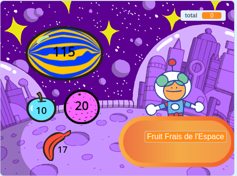

## Et ensuite ?

Si tu suis le parcours [Plus de Scratch](https://projects.raspberrypi.org/en/raspberrypi/more-scratch), tu peux passer au [Client suivant s'il vous plaît !](https://projects.raspberrypi.org/en/projects/next-customer-please), où tu créeras une boutique où les clients pourront acheter des articles et passer à la caisse.

--- print-only ---

--- /print-only ---

--- no-print ---

  <iframe allowtransparency="true" width="485" height="402" src="https://scratch.mit.edu/projects/embed/528696418/?autostart=false" frameborder="0"></iframe>

--- /no-print ---

Si tu veux t'amuser davantage en explorant Scratch, tu peux essayer l'un des [projets suivants](https://projects.raspberrypi.org/en/projects?software%5B%5D=scratch&curriculum%5B%5D=%201){:target="_blank"}.
