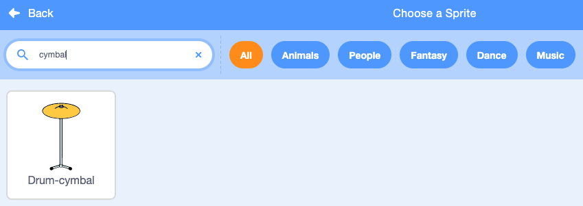

## स्टार्टर ड्रम

<div style="display: flex; flex-wrap: wrap">
<div style="flex-basis: 200px; flex-grow: 1; margin-right: 15px;">
आप एक **cymbal** स्प्राइट जोड़ेंगे जिसे क्लिक करके आप बीट्स अर्जित कर सकते हैं और ध्वनि बजा सकते हैं।
</div>
<div>
{:width="300px"}
</div>
</div>

--- task ---

**Choose a Sprite** पर क्लिक करें और `cymbal` खोजें। अपने प्रोजेक्ट में **Drum-cymbal** स्प्राइट जोड़ें।



--- /task ---

--- task ---

अपने cymbal (झांझ) को मंच पर जमाएँ:


--- /task ---

--- task ---

**Music extension** जोड़ें:

[[[generic-scratch3-add-music-extension]]]

--- /task ---

--- task ---

Cymbal को `switch costume`{:class="block3looks"} और `play a drum sound`{:class="block3extensions"} करने के लिए एक स्क्रिप्ट जोड़ें:


```blocks3
when this sprite clicked
switch costume to [drum-cymbal-b v] // सफल पोशाक
play drum [(5) Open High-Hat v] for [0.25] beats // ड्रम की ध्वनि
switch costume to [drum-cymbal-a v]  // पोशाक जो सफल नहीं है
```

--- /task ---

--- task ---

**टेस्ट:** अपने cymbal पर क्लिक करके उसका परीक्षण करें। सुनिश्चित करें कि आप एक ध्वनि सुनते हैं और पोशाक परिवर्तन देखते हैं।

--- /task ---

**Drum-cymbal** स्प्राइट पर हर बार क्लिक करने पर आप एक एक बीट अर्जित करेंगे।

--- task ---

एक `variable`{:class="block3variables"} बनाएँ जिसे `beats`:कहा जाता है:


--- /task ---

--- task ---

जब **Drum-cymbal** स्प्राइट पर क्लिक किया जाता है तो `change beats by 1`{:class="block3variables"} करने के लिए एक ब्लॉक जोड़ें


```blocks3
when this sprite clicked
+change [beats v] by [1]
switch costume to [drum-cymbal-b v]
play drum [(5) Open High-Hat v] for [0.25] beats 
switch costume to [drum-cymbal-a v]
```

--- /task ---

--- task ---

**टेस्ट:** **Drum-cymbal** पर क्लिक करके उसका परीक्षण करें और `beats`{:class="block3variables"} में वृद्धि देखें।

--- /task ---

जब आप कोई नया गेम शुरू करते हैं तो `beats`{:class="block3variables"} वेरिएबल को `0` से शुरू होना चाहिए

--- task ---

Stage पेन पर क्लिक करें और फिर और फिर Stage में कोड जोड़ने के लिए **Code** टैब पर

`set beats to`{:class="block3variables"} `0` में एक ब्लॉक जोड़ें:


```blocks3
when flag clicked
switch backdrop to (Bedroom 3 v) 
set [name v] to [???] 
+ set [beats v] to [0]
```
--- /task ---

--- task ---

**टेस्ट:** हरे झंडे पर क्लिक करें और सुनिश्चित करें कि आपका `beats`{:class="block3variables"} वेरिएबल `0` से शुरू होता है।

--- /task ---

--- save ---
