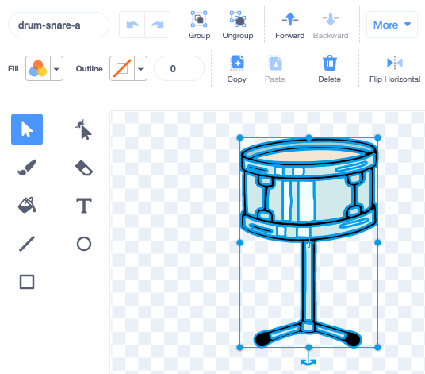

## Next drum

--- task ---

अपने प्रोजेक्ट में **Drum-snare** स्प्राइट जोड़ें और इसे Stage पर जमाएँ:


--- /task ---

--- task ---

`when this sprite clicked`{:class="block3events"} स्क्रिप्ट को **Drum-cymbal** स्प्राइट से **Drum-snare** स्प्राइट में खीचें

--- /task ---

--- task ---

Change the costume and the drum sound for the **Drum-snare** sprite.


```blocks3
when this sprite clicked
+switch costume to [drum-snare-b v] //hit costume
+play drum [(1) Snare Drum v] for [0.25] beats //drum sound
+switch costume to [drum-snare-a v] //not hit costume
```

--- /task ---

--- task ---

Change the number of beats earned to `2`:

```blocks3
when this sprite clicked
+change [beats v] by [2] //2 beats per click
switch costume to [drum-snare-b v] //hit costume
play drum [(1) Snare Drum v] for [0.25] beats //drum sound
switch costume to [drum-snare-a v] //not hit costume
```

--- /task ---

--- task ---

**टेस्ट:** अपने प्रोजेक्ट का परीक्षण करें।

You should you earn 2 beats when you click on the snare drum.

--- /task ---

The next drum is not available when you start the project. It has to be earned with beats.

--- task ---

Add a script to the **Drum-snare** sprite to hide it at the start of the project:

```blocks3
when flag clicked
hide
```

--- /task ---

Add a button to show which drum is the next and how many beats it will cost.

--- task ---

**Get** स्प्राइट को **Duplicate** करें:


--- /task ---

--- task ---

Change the visibility to **Show**. 

--- /task ---

--- task ---

Change its name to `Get snare`.

--- /task ---

--- task ---

इसे Stage के निचले-दाएँ कोने में रखें:


--- /task ---

--- task ---

**Drum-snare**स्प्राइट पर क्लिक करें **Costumes** टैब पर जाएं।


Use the **Select** (arrow) tool to highlight the 'not hit' costume of your drum. **Group** आइकन पर फिर **Copy** आइकन पर क्लिक करें:



--- /task ---

--- task ---

**Get snare** स्प्राइट पर क्लिक करें और स्नेयर कॉस्ट्यूम **Paste** करें । आपको अपने बटन को फिट करने के लिए इसका आकार बदलने और स्थिति बदलने की आवश्यकता हो सकती है:


--- /task ---

--- task ---

**Code** टैब पर क्लिक करें और प्रोजेक्ट की शुरुआत में **Get snare** स्प्राइट दिखाने के लिए एक स्क्रिप्ट जोड़ें:


```blocks3
when flag clicked
show
```

--- /task ---

The next drum can only be unlocked if the user has `10` or more beats.

--- task ---

Add this code to unlock the next drum `if`{:class="block3control"} the player has enough beats, or `say`{:class="block3looks"} `More beats needed!` if they do not have enough:

```blocks3
when this sprite clicked
if <(beats)>  [9]> then //if 10 or more beats
hide
change [beats v] by [-10] //take away the cost of upgrade
else
say [More beats needed!] for [2] seconds 
end
```

--- /task ---

--- task ---

Add a `broadcast`{:class="block3events"} block to send a new `snare` message:

```blocks3
when this sprite clicked
if <(beats)>  [9]> then // if 10 or more beats
hide
change [beats v] by [-10] // take away the cost of upgrade
+ broadcast (snare v) // your drum name
else
say [More beats needed!] for [2] seconds
end
```

--- /task ---

--- task ---

Click on the **Drum-snare** sprite.


Add this script:

```blocks3
when I receive [snare v]
show
```

--- /task ---

--- task ---

**Test:** Run your project.

You should not be able to unlock the next drum before you have enough beats.

--- /task ---

When you unlock new drums, you can play at bigger venues!

--- task ---

Add another backdrop. We chose **Chalkboard** to play our second gig at school.

**Tip:** Choose a venue that's a small step up from a bedroom. You want to save bigger venues for later!

--- /task ---

--- task ---

Click on the Stage.


Add code to the Stage to `switch backdrop`{:class="block3looks"} when the upgrade message is received:

```blocks3
when I receive [snare v]
switch backdrop to [Chalkboard v]
```

--- /task ---

--- task ---

**Test:** Run your project.

When you unlock the next drum: the snare should appear, the button disappears, the venue changes and the `beats`{:class="block3variables"} go down by `10`.

--- /task ---

--- save ---
