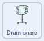
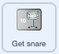

## पहला अपग्रेड

<div style="display: flex; flex-wrap: wrap">
<div style="flex-basis: 200px; flex-grow: 1; margin-right: 15px;">
आप अपना पहला अपग्रेड जोड़ेंगे। **Get snare** बटन शुरुआत में दिखाई देगा, ताकि खिलाड़ी को पता हो कि वे किस ड्रम की ओर काम कर रहे हैं।
</div>
<div>
{:width="300px"}
</div>
</div>

--- task ---

अपने प्रोजेक्ट में **Drum-snare** स्प्राइट जोड़ें और इसे Stage पर जमाएँ:


--- /task ---

--- task ---

`when this sprite clicked`{:class="block3events"} स्क्रिप्ट को **Drum-cymbal** स्प्राइट से **Drum-snare** स्प्राइट में खीचें

[[[scratch3-copy-code]]]

--- /task ---

--- task ---

परिधान और ढोल की ध्वनि बदलें।

अर्जित बीट्स की संख्या को `2` में बदलें:



```blocks3
when this sprite clicked
+change [beats v] by [2] //2 बीट्स प्रति क्लिक
+switch costume to [drum-snare-b v] //सफल पोशाक
+play drum [(1) Snare Drum v] for [0.25] beats //ड्रम की ध्वनि
+switch costume to [drum-snare-a v] //पोशाक जो सफल नहीं है
```

--- /task ---

--- task ---

**टेस्ट:** अपने प्रोजेक्ट का परीक्षण करें। स्नेयर ड्रम पर क्लिक करने पर सुनिश्चित करें कि आप 2 बीट अर्जित करते हैं।

--- /task ---

जब आप प्रोजेक्ट प्रारंभ करते हैं तो अपग्रेड उपलब्ध नहीं होते हैं। उन्हें बीट्स के साथ अर्जित करना होगा।

--- task ---

प्रोजेक्ट की शुरुआत में **drum** स्प्राइट को छिपाने के लिए एक स्क्रिप्ट जोड़ें:


```blocks3
when flag clicked
hide
```

--- /task ---

एक बटन दिखाएगा कि कौन सा ड्रम अगला अपग्रेड विकल्प है और इसकी लागत कितनी बीट्स होंगी।

--- task ---

**Get** स्प्राइट को **Duplicate** करें:


दृश्यता को **Show** में बदलें और उसका नाम `Get snare` बदलें। इसे Stage के निचले-दाएँ कोने में रखें:


--- /task ---

--- task ---

**Drum-snare**स्प्राइट पर क्लिक करें **Costumes** टैब पर जाएं। अपने ड्रम के पोशाक जो सफल नहीं है को हाइलाइट करने के लिए **Select** तीर का उपयोग करें **Group** आइकन पर फिर **Copy** आइकन पर क्लिक करें:


--- /task ---

--- task ---

**Get snare** स्प्राइट पर क्लिक करें और स्नेयर कॉस्ट्यूम **Paste** करें । आपको अपने बटन को फिट करने के लिए इसका आकार बदलने और स्थिति बदलने की आवश्यकता हो सकती है:




--- /task ---

--- task ---

**Code** टैब पर क्लिक करें और प्रोजेक्ट की शुरुआत में **Get snare** स्प्राइट दिखाने के लिए एक स्क्रिप्ट जोड़ें:


```blocks3
when flag clicked
show
```

--- /task ---

अपग्रेड केवल तभी खरीदा जा सकता है जब उपयोगकर्ता के पास `10` या अधिक बीट्स हों। [Grow a dragonfly](https://projects.raspberrypi.org/hi-IN/projects/grow-a-dragonfly){:target="_blank"}, में आपने `if`{:class="block3control"} ब्लॉक के साथ निर्णय लेने के बारे में सीखा।

एक `if ... else`{:class="block3control"} ब्लॉक का उपयोग निर्णय लेने के लिए किया जाता है और यदि कोई शर्त `true` या `false` है तो अलग-अलग काम करेगा।

<p style="border-left: solid; border-width:10px; border-color: #0faeb0; background-color: aliceblue; padding: 10px;">
हम निर्णय लेने के लिए हर समय <span style="color: #0faeb0">**if ... else**</span> का उपयोग करते हैं जब आप जागते हैं, तो आप जांचते हैं कि `if`{:class="block3control"} सुबह हो चुकी है। आप उठते हैं, या `else`{:class="block3control"} आप वापस सो जाते हैं। क्या आप अपने द्वारा लिए गए कोई `if ... else`{:class="block3control"} निर्णयों के बारे में सोच सकते हैं? 
</p>

--- task ---

अपग्रेड प्राप्त करने के लिए इस कोड को जोड़ें `if`{:class="block3control"} खिलाड़ी के पास पर्याप्त बीट्स हैं, या `say`{:class="block3looks"} `Not enough beats!`अगर वे अपग्रेड करने में सक्षम नहीं हैं:


```blocks3
when this sprite clicked
if <(beats)>  [9]> then //अगर बीट्स 10 या अधिक हैं
hide
change [beats v] by [-10] //लागत में हुए अपग्रेड को वापिस ले लो
else
say [Not enough beats!] for [2] seconds 
end
```

--- /task ---

अन्य स्प्राइट्स और Stage को बता दें कि स्नेयर अपग्रेड खरीदा गया है।

--- task ---

नया `snare` संदेश भेजने के लिए `broadcast`{:class="block3events"} ब्लॉक जोड़ें:


```blocks3
when this sprite clicked
if <(beats)>  [9]> then // अगर बीट्स 10 या अधिक हैं
hide
change [beats v] by [-10] // लागत में हुए अपग्रेड को वापिस ले लो
+ broadcast (snare v) // आपका ड्रम नाम
else
say [Not enough beats!] for [2] seconds 
end
```

--- /task ---

--- task ---

**Drum-snare** स्प्राइट पर क्लिक करें। इस स्क्रिप्ट को जोड़ें:


```blocks3
when I receive [snare v]
show
```

--- /task ---

जब आप अपने यंत्रों को अपग्रेड करते हैं, तो आप बड़े स्थानों पर बजाने में सक्षम होंगे।

--- task ---

एक और पृष्ठभूमि जोड़ें। हमने स्कूल में अपना दूसरा गिग चलाने के लिए **Chalkboard** का चयन करेंगे

जब अपग्रेड संदेश प्राप्त होता है, तो Stage में कोड `switch backdrop`{:class="block3looks"}
 को जोड़ें:


```blocks3
when I receive [snare v]
switch backdrop to [Chalkboard v]
```

**टिप:** ऐसा स्थान चुनें जो बेडरूम से थोड़ा बेहतर हो। आप बाद के लिए बड़े स्थानों को बचा कर रखना चाहते हैं।

--- /task ---

--- task ---

**टेस्ट:** अपने प्रोजेक्ट का परीक्षण करें। आपके पास पर्याप्त बीट्स होने से पहले कोशिश करें और स्नेयर अपग्रेड खरीद लें।

जब आप अपग्रेड चेक खरीदते हैं: स्नेयर दिखाई देता है, बटन गायब हो जाता है, स्थान बदल जाता है और `beats`{:class="block3variables"} `10`नीचे चला जाता है।

--- /task ---

--- save ---
