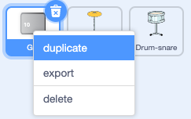

## पहला अपग्रेड

<div style="display: flex; flex-wrap: wrap">
<div style="flex-basis: 200px; flex-grow: 1; margin-right: 15px;">
आप अपना पहला अपग्रेड जोड़ेंगे। **Get snare** बटन शुरुआत में दिखाई देगा, ताकि खिलाड़ी को पता हो कि वे किस ड्रम की ओर काम कर रहे हैं।
</div>
<div>
{:width="300px"}
</div>
</div>

--- task ---

अपने प्रोजेक्ट में **Drum-snare** स्प्राइट जोड़ें और इसे Stage पर जमाएँ:


--- /task ---

--- task ---

`when this sprite clicked`{:class="block3events"} स्क्रिप्ट को **Drum-cymbal** स्प्राइट से **Drum-snare** स्प्राइट में खीचें

[[[scratch3-copy-code]]]

--- /task ---

--- task ---

परिधान और ढोल की ध्वनि बदलें।

अर्जित बीट्स की संख्या को `2` में बदलें:


```blocks3
when this sprite clicked
+change [beats v] by [2] //2 beats per click
+switch costume to [drum-snare-b v] //hit costume
+play drum [(1) Snare Drum v] for [0.25] beats //drum sound
+switch costume to [drum-snare-a v] //not hit costume
```

--- /task ---

--- task ---

**टेस्ट:** अपने प्रोजेक्ट का परीक्षण करें। स्नेयर ड्रम पर क्लिक करने पर सुनिश्चित करें कि आप 2 बीट अर्जित करते हैं।

--- /task ---

जब आप प्रोजेक्ट प्रारंभ करते हैं तो अपग्रेड उपलब्ध नहीं होते हैं। उन्हें बीट्स के साथ अर्जित करना होगा।

--- task ---

प्रोजेक्ट की शुरुआत में **drum** स्प्राइट को छिपाने के लिए एक स्क्रिप्ट जोड़ें:


```blocks3
when flag clicked
hide
```

--- /task ---

एक बटन दिखाएगा कि कौन सा ड्रम अगला अपग्रेड विकल्प है और इसकी लागत कितनी बीट्स होंगी।

--- task ---

**Get** स्प्राइट को **Duplicate** करें:



दृश्यता को **Show** में बदलें और उसका नाम `Get snare` बदलें। इसे Stage के निचले-दाएँ कोने में रखें:


--- /task ---

--- task ---

**Drum-snare**स्प्राइट पर क्लिक करें **Costumes** टैब पर जाएं। अपने ड्रम के पोशाक जो सफल नहीं है को हाइलाइट करने के लिए **Select** तीर का उपयोग करें **Group** आइकन पर फिर **Copy** आइकन पर क्लिक करें:


--- /task ---

--- task ---

**Get snare** स्प्राइट पर क्लिक करें और स्नेयर कॉस्ट्यूम **Paste** करें । आपको अपने बटन को फिट करने के लिए इसका आकार बदलने और स्थिति बदलने की आवश्यकता हो सकती है:


--- /task ---

--- task ---

**Code** टैब पर क्लिक करें और प्रोजेक्ट की शुरुआत में **Get snare** स्प्राइट दिखाने के लिए एक स्क्रिप्ट जोड़ें:


```blocks3
when flag clicked
show
```

--- /task ---

अपग्रेड केवल तभी खरीदा जा सकता है जब उपयोगकर्ता के पास `10` या अधिक बीट्स हों। [Grow a dragonfly](https://projects.raspberrypi.org/en/projects/grow-a-dragonfly){:target="_blank"}, में आपने `if`{:class="block3control"} ब्लॉक के साथ निर्णय लेने के बारे में सीखा।

एक `if ... else`{:class="block3control"} ब्लॉक का उपयोग निर्णय लेने के लिए किया जाता है और यदि कोई शर्त `true` या `false` है तो अलग-अलग काम करेगा।

<p style="border-left: solid; border-width:10px; border-color: #0faeb0; background-color: aliceblue; padding: 10px;">
हम निर्णय लेने के लिए हर समय <span style="color: #0faeb0">**if ... else**</span> का उपयोग करते हैं जब आप जागते हैं, तो आप जांचते हैं कि `if`{:class="block3control"} सुबह हो चुकी है। आप उठते हैं, या `else`{:class="block3control"} आप वापस सो जाते हैं। क्या आप अपने द्वारा लिए गए कोई `if ... else`{:class="block3control"} निर्णयों के बारे में सोच सकते हैं? 
</p>

--- task ---

Add this code to get the upgrade `if`{:class="block3control"} the player has enough beats, or `say`{:class="block3looks"} `More beats needed!` if they are not able to upgrade:


```blocks3
when this sprite clicked
if <(beats)>  [9]> then //if 10 or more beats
hide
change [beats v] by [-10] //take away the cost of upgrade
else
say [More beats needed!] for [2] seconds 
end
```

--- /task ---

Instead of only telling the player they need **more** beats, you can tell the player exactly **how many more** beats are needed to get the upgrade.

A `join`{:class="block3operators"} block is used to concatenate, or 'link' two values together.


--- task ---

Add this code to `join`{:class="block3operators"} the number of beats needed with the text you have used to tell the player they need more beats if they are not able to upgrade:

```blocks3
when this sprite clicked
if <(beats)>  [9]> then //if 10 or more beats
hide
change [beats v] by [-10] //take away the cost of upgrade
else
+ say (join ((10) - (beats)) [beats needed!]) for [2] seconds
end
```

--- /task ---

--- task ---

Add a `broadcast`{:class="block3events"} block to send a new `snare` message:


```blocks3
when this sprite clicked
if <(beats)>  [9]> then // if 10 or more beats
hide
change [beats v] by [-10] // take away the cost of upgrade
+ broadcast [snare v] // your drum name
else
say (join ((10) - (beats)) [beats needed!]) for [2] seconds
end
```

--- /task ---

--- task ---

Click on the **Drum-snare** sprite. Add this script:


```blocks3
when I receive [snare v]
show
```

--- /task ---

When you upgrade your equipment, you will be able to play at bigger venues.

--- task ---

Add another backdrop. We chose **Chalkboard** to play our second gig at school.

Add code to the Stage to `switch backdrop`{:class="block3looks"} when the upgrade message is received:


```blocks3
when I receive [snare v]
switch backdrop to [Chalkboard v]
```

**Tip:** Choose a venue that's a small step up from the bedroom. You want to save bigger venues for later.

--- /task ---

--- task ---

**Test:** Run your project. Try and buy the snare upgrade before you have enough beats.

When you buy the upgrade check: the snare appears, the button disappears, the venue changes and the `beats`{:class="block3variables"} go down by `10`.

--- /task ---

--- save ---
