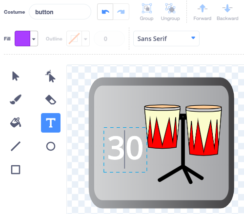

## दूसरा अपग्रेड

<div style="display: flex; flex-wrap: wrap">
<div style="flex-basis: 200px; flex-grow: 1; margin-right: 15px;">
आपके ड्रम बजाने के कौशल में सुधार हो रहा है। दूसरे अपग्रेड का समय! इस चरण में, आप चुनेंगे कि कौन सा ड्रम जोड़ना है।
</div>
<div>
{:width="300px"}
</div>
</div>

--- task ---

**Drum-snare** स्प्राइट को डुप्लिकेट करें:


--- /task ---

**Drum Costumes** स्प्राइट में आपके लिए चुनने के लिए बहुत सारे ड्रम कॉस्टयूम हैं।

--- task ---

**Drum Costumes** स्प्राइट पर क्लिक करें और **Costumes** टैब चुनें।

अगले अपग्रेड के लिए **चुनें:** ड्रम। हमनें **Conga** चुना है।

अपने ड्रम की 'hit' और 'not hit' पोशाकों को खीच के अपने नये **Drum-snare2** स्प्राइट पर लाएँ


--- /task ---

--- task ---

आपके द्वारा चुनी गई पोशाक से मेल खाने के लिए अपने ड्रम को नाम दें।


--- /task ---

--- task ---

**Code** टैब पर क्लिक करें। सही पोशाक का उपयोग करने के लिए कोड बदलें और अपने नए ड्रम के लिए ध्वनि चुनें।

नए ड्रम पर क्लिक करने पर होने वाली अर्जित बीट्स की संख्या को `5`बदलें:


```blocks3
when this sprite clicked
+change [beats v] by [5] //5 बीट्स प्रति क्लिक
+switch costume to [ v] //आपकी सफल पोशाक
+play drum [ v] for [0.25] beats //आपकी ड्रम की ध्वनि
+switch costume to [ v] //पोशाक जो सफल नहीं है
```

--- /task ---

--- task ---

अपने नये ड्रम को Stage पर जगह पर खीचें:


--- /task ---

इसके बाद, आपको एक बटन की आवश्यकता होगी ताकि खिलाड़ी इस नए ड्रम में अपग्रेड कर सकें।

--- task ---

**Drum-snare** स्प्राइट को डुप्लिकेट करें:

इसे Stage के निचले-दाएँ कोने में रखें: इसका नाम बदलकर `Get` कर दें और फिर अपने नए ड्रम का नाम रखें:


--- /task ---

--- task ---

बटन कॉस्ट्यूम से **snare drum** को हटा दें। अपने नए ड्रम के 'not hit' पोशाक को बटन कॉस्ट्यूम में कॉपी और पेस्ट करें।

**Text** टूल पर क्लिक करें और नए ड्रम की कीमत दिखाने के लिए संख्या को `30` में बदलें

आपका बटन इस तरह दिखना चाहिए:



--- /task ---


यह बटन शुरू में `hide`{:class="block3looks"} होना चाहिए, फिर `show`{:class="block3looks"} जब खिलाड़ी snare drum को अपग्रेड करे, ताकि वे जान सकें जो की वह किस ड्रम की दिशा में काम कर रहे हैं।

--- task ---


```blocks3
when flag clicked
- show
+ hide
```

**सुझाव:** किसी ब्लॉक को हटाने के लिए, उसे Blocks मेनू पर खींचें, या राइट-क्लिक करें और **Delete Block** चुनें। कंप्यूटर पर आप किसी ब्लॉक पर भी क्लिक कर सकते हैं और फिर किसी ब्लॉक को हटाने के लिए <kbd>Delete</kbd> पर टैप करें

--- /task ---

--- task ---

`when I recieve`{:class="block3events"} स्क्रिप्ट जोड़ें ताकि आपना नया ड्रम बटन नये अपग्रेड की तरह दिखे जब खिलाड़ी को **Drum-snare** ड्रम मिले


```blocks3
when I receive [snare v] // जब पिछला ड्रम खरीदा जाता है तो दिखाई देते हैं
show // अगले उपलब्ध ड्रम के लिए शो बटन
```

--- /task ---

--- task ---

इस ड्रम को खरीदने के लिए आवश्यक बीट्स की संख्या और खिलाड़ी को यह ड्रम मिलने पर निकाले जाने वाले बीट्स की संख्या बदलें।

संदेश यानी की `broadcast`{:class="block3events"} को भी खिलाड़ी को नया ड्रम मिलने पर बदलें अपने नए ड्रम के नाम से एक नया संदेश बनाएं:


```blocks3
when this sprite clicked
if <(beats)>  [29]> then // 29 में बदलें
hide
change [beats v] by [-30] // 30 में बदलें
broadcast [conga v] // अपने ड्रम नाम में बदलें
else
say [Not enough beats!] for [2] seconds 
end
```

--- /task ---

--- task ---

`when I receive snare`{:class="block3events"} स्क्रिप्ट को `broadcast`{:class="block3events"} आपके नए ड्रम का नाम में बदलें। जब खिलाड़ी नए ड्रम में अपग्रेड करता है तो ड्रम `show`{:class="block3looks"}


```blocks3
when I receive [conga v] // अपने ड्रम नाम में बदलें
show
```

--- /task ---

--- task ---

**Party** पृष्ठभूमि जोड़ें।

जब खिलाड़ी नए ड्रम में अपग्रेड करता है तो पृष्ठभूमि में बदलने के लिए के लिए Stage में एक स्क्रिप्ट जोड़ें:


```blocks3
when I receive [conga v] // अपने ड्रम नाम में बदलें
switch backdrop to (Party v)
```

--- /task ---

--- task ---

**टेस्ट:** खेल शुरू करने के लिए हरे झंडे पर क्लिक करें और परीक्षण करें कि आप अपना नया ड्रम प्राप्त करने के लिए पर्याप्त बीट्स कमा सकते हैं।

यदि आप पर्याप्त बीट अर्जित करने से पहले बटन पर क्लिक करते हैं तो क्या होगा?

--- /task ---

--- save ---
