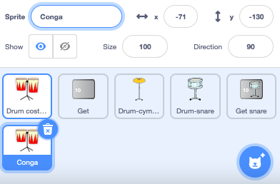
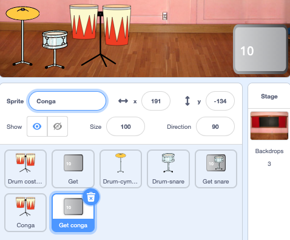

## More drums!

<div style="display: flex; flex-wrap: wrap">
<div style="flex-basis: 200px; flex-grow: 1; margin-right: 15px;">
इस चरण में, आप चुनेंगे कि कौन सा ड्रम जोड़ना है।
</div>
<div>
{:width="300px"}
</div>
</div>

--- task ---

**Drum-snare** स्प्राइट को डुप्लिकेट करें:


--- /task ---

--- task ---

**Drum Costumes** स्प्राइट पर क्लिक करें और **Costumes** टैब चुनें।

**Choose:** which drum to unlock next. हमनें **Conga** चुना है।


--- /task ---

--- task ---

अपने ड्रम की 'hit' और 'not hit' पोशाकों को खीच के अपने नये **Drum-snare2** स्प्राइट पर लाएँ


--- /task ---

--- task ---

Name the new drum to match the costumes you chose.



--- /task ---

--- task ---

**Code** टैब पर क्लिक करें। सही पोशाक का उपयोग करने के लिए कोड बदलें और अपने नए ड्रम के लिए ध्वनि चुनें।

नए ड्रम पर क्लिक करने पर होने वाली अर्जित बीट्स की संख्या को `5`बदलें:


```blocks3
when this sprite clicked
+change [beats v] by [5] //5 beats per click
+switch costume to [ v] //your hit costume
+play drum [ v] for [0.25] beats //your drum sound
+switch costume to [ v] //your not hit costume
```

--- /task ---

--- task ---

अपने नये ड्रम को Stage पर जगह पर खीचें:


--- /task ---

Add a button so that players can unlock the new drum.

--- task ---

Duplicate the **Get snare** sprite and position it in the bottom-right corner of the Stage.

--- /task ---

--- task ---

Change its name (for example `Get conga`):



--- /task ---

--- task ---

Delete the **snare drum** from the new 'Get' button costume.

--- /task ---

--- task ---

Copy the 'not hit' costume for your new drum and paste it to the new 'Get' button costume.

--- /task ---

--- task ---

**Text** टूल पर क्लिक करें और नए ड्रम की कीमत दिखाने के लिए संख्या को `30` में बदलें


--- /task ---

Your new 'Get' button should `hide`{:class="block3looks"} at the start.

--- task ---


```blocks3
when flag clicked
+ hide
```

--- /task ---

--- task ---

Add a `when I receive`{:class="block3events"} script that your new 'Get' button will `show`{:class="block3looks"} when the player unlocks the snare drum.

```blocks3
when I receive [snare v] // appear when previous drum is unlocked
show // show button to get the new drum
```

--- /task ---

--- task ---

Change:
- The number of beats needed to unlock this drum
- The number of beats that are removed when the player unlocks this drum.
- The message that is `broadcast`{:class="block3events"} when the player gets the new drum.

```blocks3
when this sprite clicked
if <(beats)>  [29]> then // change to 29
hide
change [beats v] by [-30] // change to -30
broadcast (conga v) // change to your drum name
else
say [More beats needed!] for [2] seconds 
end
```

--- /task ---

--- task ---

Click your new drum sprite and change the `when I receive snare`{:class="block3events"} script to show it when your new drum is unlocked:

```blocks3
when I receive [conga v] // change to your drum name
show
```

--- /task ---

--- task ---

**Party** पृष्ठभूमि जोड़ें।

--- /task ---

--- task ---

जब खिलाड़ी नए ड्रम में अपग्रेड करता है तो पृष्ठभूमि में बदलने के लिए के लिए Stage में एक स्क्रिप्ट जोड़ें:


```blocks3
when I receive [conga v] // change to your drum name
switch backdrop to (Party v)
```

--- /task ---

--- task ---

**Test:** Click the green flag to start the game.

You should get unlock your new drum if you earn enough beats.

What happens if you click the button before you have earned enough beats?

--- /task ---

--- save ---
