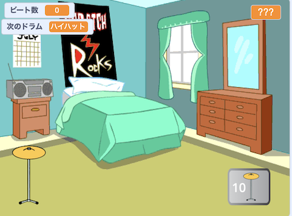

## What you will make

このプロジェクトでは、ビートを稼いで、大きな会場で新しいドラムを演奏するクリッカーゲームを作ります。

--- no-print ---

  
ドラムをクリックして、`ビート数`{:class="block3variables"} の数が上がるのを見てください。 十分なビートをゲットできたら、新しいドラムを手に入れてください。 

新しいドラムをクリックすると、いくつの `ビート数`{:class="block3variables"} をゲットできますか?

  <iframe allowtransparency="true" width="485" height="402" src="https://scratch.mit.edu/projects/embed/522323676/?autostart=false" frameborder="0"></iframe>

--- /no-print ---

--- print-only ---

--- /print-only ---
