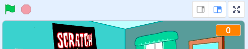

## ステージを作る

<div style="display: flex; flex-wrap: wrap">
<div style="flex-basis: 200px; flex-grow: 1; margin-right: 15px;">
このステップでは、最初の演奏会のステージを作り、ロックスターの名前を選びます。
</div>
<div>
{:width="300px"}
</div>
</div>

--- task ---

[ドラムスタースタータープロジェクト](https://scratch.mit.edu/projects/535783147/editor){:target="_blank"}を開きます。 Scratchはブラウザの別のタブで開きます。

[[[working-offline]]]

--- /task ---

<p style="border-left: solid; border-width:10px; border-color: #0faeb0; background-color: aliceblue; padding: 10px;">
<span style="color: #0faeb0">**DIY アーティスト**</span> と呼ばれるミュージシャンは、ベッドルームでレコーディングをはじめます。 彼らは自分たちの曲を自分たちで制作し、オンラインで公開してみんなに聴いてもらいます。 
</p>

このゲームはDIYアーティストのようにベッドルームからスタートします。

--- task ---

**背景を選ぶ** をクリックし、 `Bedroom`を検索（けんさく）しよう。

**選択：** すきなベッドルームをえらんでプロジェクトに追加します。 この例では`Bedroom 3`を選択しました。


--- /task ---

--- task ---

Scratch では、ステージにコードを追加することができます。

ステージペインからベッドルームの背景（はいけい）をクリックして、次のコードを追加しよう。


```blocks3
when flag clicked
switch backdrop to (Bedroom 3 v) //あなたの選んだ背景の名前
```

--- /task ---

ミュージシャンにはロックスターの名前が必要です。

**変数（へんすう）** を使うと、数字および/またはテキストを保存することが出来ます。 あなたのロックスター ネームは `変数`{:class="block3variables"} に保存されるため、いつでも使うことができます。

--- task ---

`変数`{:class="block3variables"} ブロックメニューから、**変数を作る** ボタンをクリックします。

新しい変数`名前`を作ります：


**注意:** 新しい `名前` という変数がステージの上にあらわれ、 `変数`{:class="block3variables"}ブロックの中で使うことができるようになりました。

--- /task ---

--- task ---

プロジェクトのスタート時には、あなたのロックスターにはまだ名前がついてません。

ブロックを追加して `名前を...にする`{:class="block3variables"}に `???`を入力します。


```blocks3
when flag clicked
switch backdrop to (Bedroom 3 v) //あなたの選んだ背景の名前
+ set [名前 v] to [???] //あなたのつけた変数名
```

--- /task ---

Scratch で `質問`{:class="block3sensing"} をして、 `変数`{:class="block3variables"} に`答え`{:class="block3sensing"}を保存することができます。

--- task ---

`調べる`{:class="block3sensing"} ブロック メニューをクリックして、コードに `...と聞いて待つ`{:class="block3sensing"} ブロックを追加します。


```blocks3
when flag clicked
switch backdrop to (Bedroom 3 v) //あなたの選んだ背景の名前
set [名前 v] to [???] //あなたのつけた変数名
+ ask [あなたのロックスター名は？] and wait //質問を入力
```

--- /task ---

--- task ---

`名前`{:class="block3sensing"} という `変数`{:class="block3variables"} に`答え`{:class="block3sensing"} をセットします。


```blocks3
when flag clicked
switch backdrop to (Bedroom 3 v) //あなたの選んだ背景の名前
set [名前 v] to [???] //あなたのつけた変数名
ask [あなたのロックスター名は？] and wait //質問を入力
+ set [名前 v] to (answer)
```

--- /task ---

ステージ上の `変数`{:class="block3variables"} の見た目を変更します。

--- task ---

ステージ上の `変数`{:class="block3variables"} を右クリックして、 **大きな表示**を選びます:


--- /task ---

--- task ---

`変数`{:class="block3variables"} をドラッグして、ステージの右上におきます:



--- /task ---

--- task ---

**テスト:** プロジェクトを実行して、 `変数`{:class="block3variables"} が `???`ではじまって、 次に、あなたの `答え`{:class="block3sensing"} にかわることを確認（かくにん）します。

--- /task ---

--- task ---

`変数`{:class="block3variables"} が `答え`{:class="block3sensing"} に変更されることをテストしたので、コードの最後の 2 ブロックをスクリプトの残りの部分からドラッグして外しておくことができます。 こうすることによって、プロジェクトをテストするたびに `答え`{:class="block3sensing"} を入力しなくてもよくなります。


```blocks3
when flag clicked
switch backdrop to (Bedroom 3 v) //あなたの選んだ背景の名前
set [名前 v] to [???] //あなたのつけた変数名
```

```blocks3
ask [あなたのロックスター名は？] and wait //質問を入力
set [名前 v] to (answer)
```

--- /task ---

--- save ---
