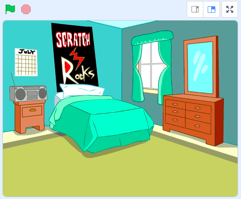

## ステージを作る

<div style="display: flex; flex-wrap: wrap">
<div style="flex-basis: 200px; flex-grow: 1; margin-right: 15px;">
このステップでは、最初の演奏会のステージを作り、ロックスターの名前を選びます。
</div>
<div>
{:width="300px"}
</div>
</div>

--- task ---

[ドラムスタースタータープロジェクト](https://scratch.mit.edu/projects/535783147/editor){:target="_blank"}を開きます。 Scratchはブラウザの別のタブで開きます。

--- /task ---

The drummer starts in a bedroom like a beginner!

--- task ---

**背景を選ぶ** をクリックし、 `Bedroom`を検索（けんさく）しよう。

Select a bedroom and add it to your project. この例では`Bedroom 3`を選択しました。



--- /task ---

Scratch では、ステージにコードを追加することができます。

--- task ---

ステージペインからベッドルームの背景（はいけい）をクリックして、次のコードを追加しよう。


```blocks3
when flag clicked
switch backdrop to (Bedroom 3 v) //your backdrop name
```

--- /task ---

ミュージシャンにはロックスターの名前が必要です。

**変数（へんすう）** を使うと、数字および/またはテキストを保存することが出来ます。 あなたのロックスター ネームは `変数`{:class="block3variables"} に保存されるため、いつでも使うことができます。

--- task ---

`変数`{:class="block3variables"} ブロックメニューから、**変数を作る** ボタンをクリックします。

新しい変数`名前`を作ります：


**注意:** 新しい `名前` という変数がステージの上にあらわれ、 `変数`{:class="block3variables"}ブロックの中で使うことができるようになりました。

--- /task ---

--- task ---

プロジェクトのスタート時には、あなたのロックスターにはまだ名前がついてません。

ブロックを追加して `名前を...にする`に {:class="block3variables"} `???`を入力します。


```blocks3
when flag clicked
switch backdrop to (Bedroom 3 v) //your backdrop name
+ set [name v] to [???] //your variable
```

--- /task ---

Scratch で `質問`{:class="block3sensing"} をして、 `変数`{:class="block3variables"} に`答え`{:class="block3sensing"}を保存することができます。

--- task ---

`調べる`{:class="block3sensing"} ブロック メニューをクリックして、コードに `...と聞いて待つ`{:class="block3sensing"} ブロックを追加します。

```blocks3
when flag clicked
switch backdrop to (Bedroom 3 v) //your backdrop name
set [name v] to [???] //your variable
+ ask [What's your rock star name?] and wait //your question
```

--- /task ---

--- task ---

`名前`{:class="block3sensing"} という `変数`{:class="block3variables"} に`答え`{:class="block3sensing"} をセットします。

```blocks3
when flag clicked
switch backdrop to (Bedroom 3 v) //your backdrop name
set [name v] to [???] //your variable
ask [What's your rock star name?] and wait //your question
+ set [name v] to (answer)
```

--- /task ---

--- task ---

ステージ上の `変数`{:class="block3variables"} を右クリックして、 **大きな表示**を選びます:


--- /task ---

--- task ---

Drag your `variable`{:class="block3variables"} to position it top-right of the Stage:


--- /task ---

--- task ---

**テスト:** プロジェクトを実行して、 `変数`{:class="block3variables"} が `???`ではじまって、 次に、あなたの `答え`{:class="block3sensing"} にかわることを確認（かくにん）します。

--- /task ---

You don't want to type an answer every time you test your project.

--- task ---

Drag the last two blocks of code away from the rest of the script.

```blocks3
when flag clicked
switch backdrop to (Bedroom 3 v) //your backdrop name
set [name v] to [???] //your variable
```

```blocks3
ask [What's your rock star name?] and wait //your question
set [name v] to (answer)
```

--- /task ---

--- save ---
