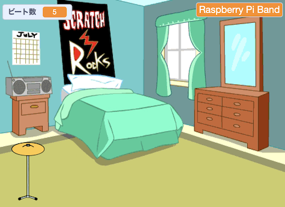
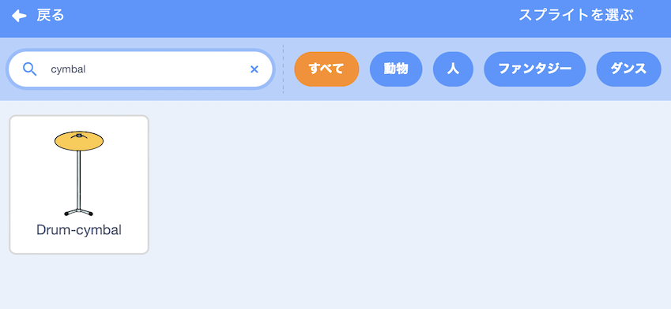

## スタータードラム

<div style="display: flex; flex-wrap: wrap">
<div style="flex-basis: 200px; flex-grow: 1; margin-right: 15px;">
**シンバル** スプライトを追加し、クリックするとビートをゲットして、音を鳴らせるようにします。
</div>
<div>
{:width="300px"}
</div>
</div>

--- task ---

**スプライトを選ぶ** をクリックし、 `cymbal`を検索（けんさく）します。 プロジェクトに **Drum-cymbal** のスプライトを追加します。



--- /task ---

--- task ---

シンバルをステージ上におきます。


--- /task ---

--- task ---

**音楽拡張機能**を追加します：

[[[generic-scratch3-add-music-extension]]]

--- /task ---

--- task ---

シンバル の`コスチュームを変え`{:class="block3looks"} 、 `ドラム 音を鳴らす`{:class="block3extensions"} スクリプトを追加します。


```blocks3
when this sprite clicked
switch costume to [drum-cymbal-b v] // hit costume
play drum [(5) Open High-Hat v] for [0.25] beats // drum sound
switch costume to [drum-cymbal-a v]  // not hit costume
```

--- /task ---

--- task ---

**テスト:** シンバルをクリックしてテストしましょう。 音を聞き、コスチュームが変わることを確認します。

--- /task ---

** Drum-cymbal** スプライトをクリックするたびに、1 ビートをゲットすることができます。

--- task ---

`ビート数`という名前の `変数`{:class="block3variables"} を作ります。


--- /task ---

--- task ---

**Drum-cymbal**スプライトをクリックしたときにビート数を`1ずつ変える`{:class="block3variables"} ブロックを追加します：


```blocks3
when this sprite clicked
+change [beats v] by [1]
switch costume to [drum-cymbal-b v]
play drum [(5) Open High-Hat v] for [0.25] beats 
switch costume to [drum-cymbal-a v]
```

--- /task ---

--- task ---

**テスト:** **Drum-cymbal** をクリックして、 `ビート数`{:class="block3variables"} の数がふえていくことを確認します。

--- /task ---

新しいゲームをスタートするとき、変数`ビート数`{:class="block3variables"} は、 `0` ビートからスタートする必要があります。

--- task ---

ステージ ペインをクリックし、**コード** タブでステージにコードを追加します。

ブロックを追加して `ビート数` {:class="block3variables"} を`0`にします:


```blocks3
when flag clicked
switch backdrop to (Bedroom 3 v) 
set [name v] to [???] 
+ set [beats v] to [0]
```
--- /task ---

--- task ---

**テスト:** 緑の旗をクリックして、 変数`ビート数`{:class="block3variables"} が `0`ではじまることを確認します。

--- /task ---

--- save ---
