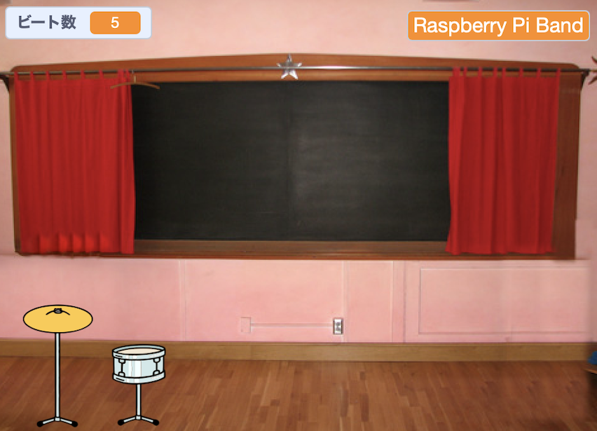
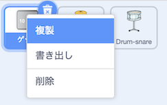
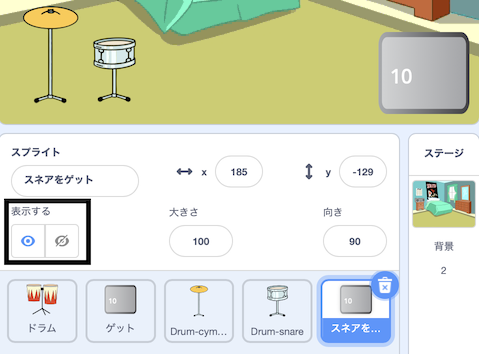
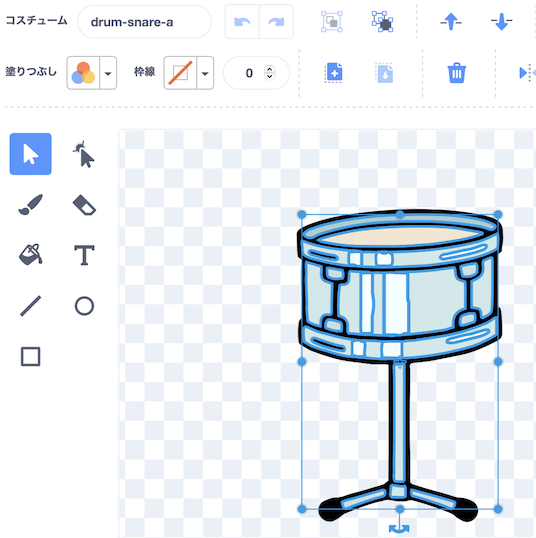
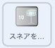
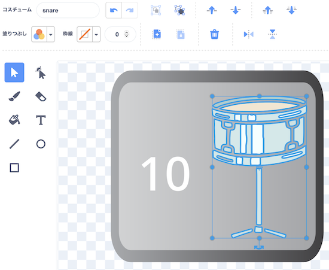

## アップグレード第一弾

<div style="display: flex; flex-wrap: wrap">
<div style="flex-basis: 200px; flex-grow: 1; margin-right: 15px;">
アップグレードの第一弾を作りましょう。 **スネアをゲット** ボタンが最初に表示されるため、プレーヤーはどのドラムをめざしてプレーをしているのかがわかります。
</div>
<div>
{:width="300px"}
</div>
</div>

--- task ---

プロジェクトに **Drum-snare** スプライトを追加して、ステージ上におきます。


--- /task ---

--- task ---

**Drum-cymbal**スプライトから `このスプライトが押されたとき`{:class="block3events"}を **Drum-snare**スプライトにドラッグします。

[[[scratch3-copy-code]]]

--- /task ---

--- task ---

コスチュームとドラムの音を変えます。

ゲットするビート数を `2`に変えます。


```blocks3
when this sprite clicked
+change [ビート数 v] by [2] //クリックするたび2ビートふやす
+switch costume to [drum-snare-b v] //たたいているコスチューム
+play drum [(1) Snare Drum v] for [0.25] beats //ドラム音
+switch costume to [drum-snare-a v] //たたいていないコスチューム
```

--- /task ---

--- task ---

**テスト：**プロジェクトを実行します。 スネアドラムをクリックしたときに 2 ビートをゲットできることを確認します。

--- /task ---

プロジェクトのスタート時には、アップグレードは使えないようにします。 ビートを稼いでゲットできるようにします。

--- task ---

プロジェクトのスタート時に、この **drum** スプライトを非表示にするスクリプトを追加します。


```blocks3
when flag clicked
hide
```

--- /task ---

ボタンには、次のアップグレードオプションであるドラムと、それにかかるビート数を表示します。

--- task ---

**ゲット**スプライト を **複製（ふくせい）**します:



表示/非表示を **表示** に変更し、名前を `スネアをゲット`に変えます。 ステージの右下におきます。



--- /task ---

--- task ---

**Drum-snare** スプライトをクリックしてから、**コスチューム** タブをクリックします。 **選択** (矢印) ツールを使って、ドラムの叩いていないコスチュームをハイライト（強調表示）します。 **グループ化**アイコンをクリックしてから**コピー**アイコンをクリックします。




--- /task ---

--- task ---

**スネアをゲット** スプライト をクリックし、 スネアのコスチュームを**貼り付け** ます。 ボタンに合わせてサイズや位置を調整しましょう。





--- /task ---

--- task ---

**コード** タブをクリックして、プロジェクトのスタート時に **スネアゲット** スプライトを表示するスクリプトを追加します。


```blocks3
when flag clicked
show
```

--- /task ---

アップグレードは、プレーヤーが `10` 以上のビートを持っているときだけにしか購入することができません。 [トンボを育てる](https://projects.raspberrypi.org/ja-JP/projects/grow-a-dragonfly){:target="_blank"} プロジェクトでは、`もし`{:class="block3control"} ブロックで決定を行うことについて学びました。

`もし ... でなければ`{:class="block3control"} ブロックは決定を行う時に使います。条件が `true（真）` か `false（偽）`によって別々の処理を実行します。

<p style="border-left: solid; border-width:10px; border-color: #0faeb0; background-color: aliceblue; padding: 10px;">
私たちは常に<span style="color: #0faeb0">**条件**</span>で判断しています。 起きたとき、朝'かどうか'{:class="block3control"}を確認します。 起き上がるか、 `でなければ`{:class="block3control"} また眠りに戻ります。 `もし... でなければ`{:class="block3control"} で行う決定は他に何か思いつきますか？ 
</p>

--- task ---

`もし`{:class="block3control"} プレーヤーに十分なビートがある場合、アップグレード を取得するには、このコードを追加します。  アップグレードできない場合は`もっとビートが必要です!` `と言ってください`{:class="block3looks"}:


```blocks3
when this sprite clicked
if <(ビート数)>  [9]> then //10ビート以上の場合
hide
change [ビート数 v] by [-10] //アップグレードにかかるコスト分へらす
else
say [ビート数がたりないよ！] for [2] seconds 
end
```

--- /task ---

ビートが**もっと**必要であることをプレイヤーに伝えるだけでなく、 **あと何回** ビートが必要かをプレイヤーに正確に伝えることでアップグレードを取得できます。

`何々と何々`{:class="block3operators"} ブロックは、2 つの値を連結、または「リンク」するために使用されます。


--- task ---

このコードを追加して、必要なビート数とアップグレードできない場合にプレーヤーにさらにビートが必要であることを伝えるために使用したテキストを`加える`{:class="block3operators"}。

```blocks3
when this sprite clicked
if <(ビート数)>  [9]> then //10ビート以上の場合
hide
change [ビート数 v] by [-10] //アップグレードにかかるコスト分へらす
else
+ say (join ((10) - (ビート数)) [beats needed!]) for [2] seconds
end
```

--- /task ---

--- task ---

`メッセージ`{:class="block3events"} ブロックを追加して、新しい `スネア` メッセージを送ります。


```blocks3
when this sprite clicked
if <(ビート数)>  [9]> then //10ビート以上の場合
hide
change [ビート数 v] by [-10] //アップグレードにかかるコスト分へらす
+ broadcast [スネア v] //あなたの選んだドラムの名前
else
say (join ((10) - (ビート数)) [beats needed!]) for [2] seconds
end
```

--- /task ---

--- task ---

**Drum-snare** のスプライトをクリックします。 このスクリプトを追加します。


```blocks3
when I receive [スネア v]
show
```

--- /task ---

機材（きざい）をアップグレードするとともに、より大きな会場でプレイができるようにします。

--- task ---

背景を追加します。 学校で 2 回目の演奏会を行うために、 **Chalkboard** を選びました。

アップグレードメッセージを受け取った時に、 `背景を..にする`{:class="block3looks"}コードをステージに追加します。


```blocks3
when I receive [スネア v]
switch backdrop to [Chalkboard v]
```

**ヒント:** ベッドルームから少しだけステップアップした会場を選びましょう。 より大きな会場は後で使うために取っておきましょう。

--- /task ---

--- task ---

**テスト：**プロジェクトを実行します。 十分なビートが得られる前に、スネアのアップグレードを購入してみましょう。

アップグレード を購入したときに、スネアが表示され、ボタンが消え、会場が変わり、 `ビート数`{:class="block3variables"} が `10`減ることを確認します。

--- /task ---

--- save ---
