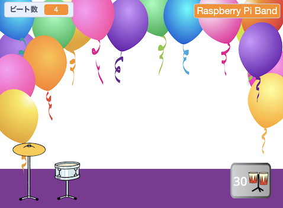
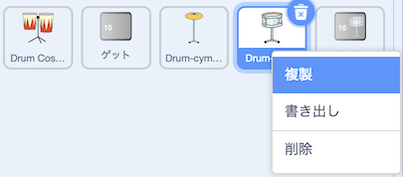
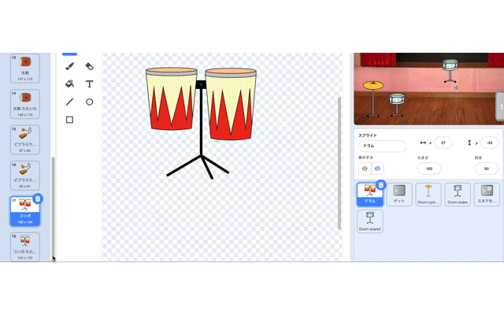
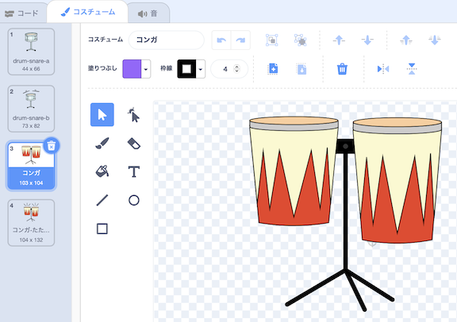
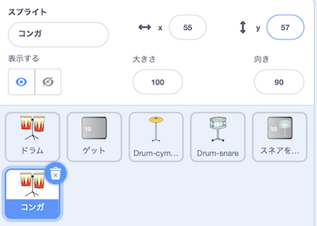
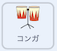
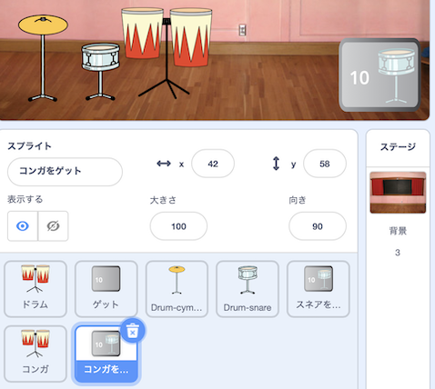
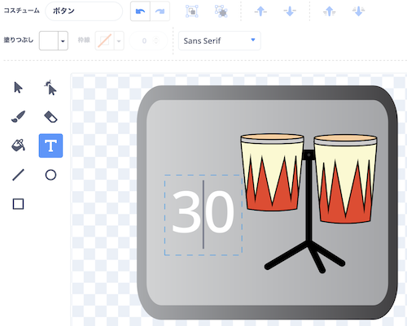
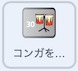

## アップグレード第二弾

<div style="display: flex; flex-wrap: wrap">
<div style="flex-basis: 200px; flex-grow: 1; margin-right: 15px;">
あなたのドラムスキルは向上しています。 アップグレード第二弾の時がきまして！ このステップでは、追加するドラムを選びます。
</div>
<div>
{:width="300px"}
</div>
</div>

--- task ---

**Drum-snare** スプライトを複製（ふくせい）します。



--- /task ---

** Drum Costumes** スプライトには、選択できるドラムコスチュームがたくさんあります。

--- task ---

**Drum Costumes** スプライトをクリックし、 **コスチューム** タブを選びます。

**選択:** 次のアップグレード用のドラム。 この例では、**Conga**を選びました。

選んだドラムの「たたいている」コスチュームと「たたいていない」コスチュームを新しい **Drum-snare2** スプライトにドラッグします。





--- /task ---

--- task ---

選んだコスチュームに合わせてドラムに名前をつけます。



--- /task ---

--- task ---

**コード**タブをクリックします。 コードを変更して、正しいコスチュームを使用し、新しいドラムのサウンドを選びます。

新しいドラムをクリックしたときにゲットするビート数を `5`に変えます。



```blocks3
when this sprite clicked
+change [beats v] by [5] //5 beats per click
+switch costume to [ v] //your hit costume
+play drum [ v] for [0.25] beats //your drum sound
+switch costume to [ v] //your not hit costume
```

--- /task ---

--- task ---

新しいドラムをステージ上の位置にドラッグします。


--- /task ---

次に、プレーヤーがこの新しいドラムにアップグレードできるようにするためのボタンが必要です。

--- task ---

**スネアをゲット/0> スプライトを複製します。</p>

ステージの右下におきます。 その名前を `ゲット` それに新しいドラムの名前に変更します。



--- /task ---

--- task ---

ボタンコスチュームから **snare drum** を消します。 新しいドラムの「たたいていない」コスチュームをコピーして、ボタンコスチュームに貼り付けます。

**Text** ツールをクリックし、数値を `30` に変更して、新しいドラムのコストを表示します。

ボタンはこんな感じになります：



--- /task ---


このボタンは、スタート時に `非表示`{:class="block3looks"} にし、プレーヤーがスネア ドラムにアップグレードしたときに `表示`{:class="block3looks"} するようにします。

--- task ---



```blocks3
when flag clicked
- show
+ hide
```

**ヒント:** ブロックを削除するには、ブロックをブロックメニューにドラッグするか、右クリックして **ブロックの削除**を選びます。 パソコンの場合、ブロックをクリックしてから <kbd>削除</kbd> をタップしてブロックを削除することもできます。

--- /task ---

--- task ---

Add a `when I receive`{:class="block3events"} script that your new drum button will show as the next upgrade when the player gets the **Drum-snare** drum:


```blocks3
when I receive [snare v] // appear when previous drum is bought
show // show button for next available drum
```

--- /task ---

--- task ---

このドラムをゲットするのに必要なビート数と、プレーヤーがこのドラムを手に入れたときに減らすビート数を変えます。

プレーヤーが新しいドラムをゲットしたときに `送る`{:class="block3events"} メッセージも変えます。 新しいドラムの名前を使って新しいメッセージを作成します。


```blocks3
when this sprite clicked
if <(beats)>  [29]> then // change to 29
hide
change [beats v] by [-30] // change to 30
broadcast [conga v] // change to your drum name
else
say (join ((30) - (beats)) [beats needed!]) for [2] seconds
end
```

--- /task ---

--- task ---

新しいドラムの名前の `メッセージを送る`{:class="block3events"}ように`スネアを受け取ったとき`{:class="block3events"} のスクリプトを変えていきます。 プレーヤーが新しいドラムにアップグレードすると、そのドラムが `表示`{:class="block3looks"} されます。


```blocks3
when I receive [conga v] // change to your drum name
show
```

--- /task ---

--- task ---

**Party** の背景を追加します。

プレーヤーが新しいドラムにアップグレードしたときに背景を切り替えるスクリプトをステージに追加します。


```blocks3
when I receive [conga v] // change to your drum name
switch backdrop to (Party v)
```

--- /task ---

--- task ---

**テスト:** 緑の旗をクリックしてゲームをスタートし、新しいドラムを手に入れるのに十分なビートを獲得できるかテストします。

十分なビートをゲットする前にボタンをクリックするとどうなりますか?

--- /task ---

--- save ---
