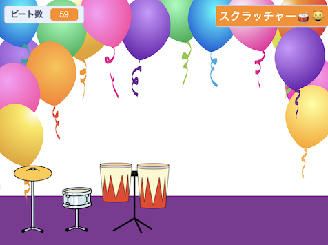

## 遊んでカスタマイズする

ゲームを思い通りに動作させる時がきました。

{:width="300px"}

--- task ---

ゲームをプレイしてビートをかせぎましょう。

変数`ビート数`{:class="block3variables"} の変化を見て、ビート数がどのようにドラムをクリックすると増え、新しいドラムを取得すると減るかを理解しながら確認しましょう。

各ドラムでかせげるビート数に満足していますか? 好きなように変えられます。

新しいドラムを手に入れるのにかかるビート数に満足していますか?

**ヒント:** プロジェクトを定期的にテストして、バグを見つけて修正できるようにしておきましょう。

--- /task ---

--- task ---

ステージ上で `...と聞いて待つ`{:class="block3sensing"} ブロックを離した場合は、元に戻してロックスターの名前を入れておきましょう。

ステージに表示される名前が変わることに注目してください。

--- /task ---

--- save ---
