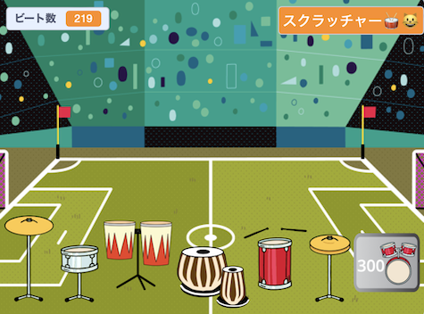

## Challenge

<div style="display: flex; flex-wrap: wrap">
<div style="flex-basis: 200px; flex-grow: 1; margin-right: 15px;">
より素晴らしい会場で演奏するにつれて、より多くのドラムとより多くの背景を使用してプロジェクトをアップグレードします。 
</div>
<div>
{:width="300px"}
</div>
</div>

### Add more drums

To add another drum to unlock, look back at the earlier steps of the project.

Here are some reminders if you need them.

--- collapse ---

---
title: For the drum
---

--- task ---

前の **ドラム** スプライトを複製し、コスチュームを 2 つ追加します。

--- /task ---

--- task ---

`このスプライトが押されたとき`{:class="block3events"} のスクリプトで使われてる `コスチューム`{:class="block3looks"} や `音`{:class="block3sound"} を変えます。

--- /task ---

--- task ---

`このスプライトが押されたとき`{:class="block3events"}のスクリプトのかせぐ`ビート数`{:class="block3variables"} の数を変えます。

--- /task ---

--- task ---

ドラム を`表示`{:class="block3looks"} させる`メッセージ`{:class="block3events"} を、**新しいドラム**のメッセージに変更します。

--- /task ---

--- /collapse ---

--- collapse ---

---
title: For the 'Get' button
---

--- task ---

前の**ゲット** スプライトを複製します。

--- /task ---

--- task ---

ボタンを表示させる `メッセージ`{:class="block3events"}を 、 **前のドラム**が`送る`{:class="block3events"} `メッセージ`{:class="block3events"} に変更します。

--- /task ---

--- task ---

新しいドラムのコストを含む、 `コスチューム`{:class="block3looks"} を変更します。

--- /task ---

--- task ---

Change the number of `beats`{:class="block3variables"} you must have to unlock this drum in the `if`{:class="block3events"} condition. Change the negative number of `beats`{:class="block3variables"} you `change by`{:class="block3variables"} when you unlock this drum. 減算する必要がある`ビート数`{:class="block3variables"} の数値を `何々と何々`{:class="block3operators"} ブロック内から減算する。 Change the message that is `broadcast`{:class="block3events"} to the name of the **new drum**.

--- /task ---

--- /collapse ---

--- collapse ---

---
title: For the venue
---

--- task ---

背景を追加します.

--- /task ---

--- task ---

Add a script to the Stage to `switch backdrop to`{:class="block3looks"} the new backdrop when the `message`{:class="block3events"} for this drum is received.

--- /task ---

ドラムを別の背景上の新しい位置に配置する必要があるかもしれません。

--- task ---

それぞれの**ドラム**スプライトに`背景が..になったとき`{:class="block3events"} から始まるスクリプトを追加して、場所を変更するために `...へいく` {:class="block3motion"} ブロックを追加します。

`フラグが押されたとき`{:class="block3events"} のスタート位置もセットする必要があります。

--- /task ---

--- /collapse ---

### Improve feedback to the player

Tell the player exactly **how many more** beats are needed to unlock the next drum.

--- task ---

Add this code to `join`{:class="block3operators"} the number of beats needed with the text you have used to tell the player they need more beats if they do not have enough to unlock the next drum:

```blocks3
when this sprite clicked
if <(beats)>  [9]> then //if 10 or more beats
hide
change [beats v] by [-10] //take away the cost of upgrade
else
+ say (join ((10) - (beats)) [beats needed!]) for [2] seconds
end
```

**Note**: Update the numbers to match those needed to unlock each drum.

--- /task ---

### Tidy your code

--- task ---

**Tidy:** If you have time, then it's a good idea to make sure the sprites in the sprite list are in a sensible order, starting with the drums in their locked order and then the buttons in order.

--- /task ---

--- task ---

### Stuck?

**デバッグ:** まず、ドラムとボタンがいつ表示されるべきか、そして `ビート数`{:class="block3variables"} 変数がどのように変化するべきかをよく理解していることを確認してください。 プロジェクトが何をすべきかが明確であれば、プロジェクトのデバッグがはるかに簡単になります。

--- collapse ---
---
title: My drum doesn't show/hide correctly
---

それが最初のドラムでない限り、ドラムには`緑の旗がクリックされた時`{:class="block3events"} 、`非表示`{:class="block3l時ooks"} になるスクリプトがあるはずです。

It should have a `when I receive`{:class="block3events"} `this drum` script to `show`{:class="block3looks"}.

このドラムの **ゲット** ボタンが 、同じメッセージを`送る`{:class="block3events"} ことを確認します。

--- /collapse ---

--- collapse ---
---
title: My Get button doesn't show/hide correctly
---

ボタンが最初のドラム用でない限り、 `緑の旗が押された時`{:class="block3events"}に `非表示`{:class="block3looks"} する必要があります。

It should `show`{:class="block3looks"} `when I receive`{:class="block3events"} the message for the **previous drum**.

The **Get** button should `show`{:class="block3looks"} to let the player know about the next drum they can unlock.

--- /collapse ---

--- collapse ---
---
title: I can unlock a drum when I don't have enough beats
---

そのドラムの**ゲット**ボタンのスクリプトを見て、 `このスプライトが押された時`{:class="block3events"} に必要としている`ビート数`{:class="block3variables"} を変えたかチェックしてみましょう。

--- /collapse ---

--- collapse ---
---
title: The number of beats doesn't change correctly when I unlock a new drum
---

そのドラムの**ゲット**ボタンのスクリプトを見て、`このスプライトが押され時`、`ずつ変える`{:class="block3variables"} のへらす数をいくつにしたかチェックしてみましょう。

これがドラムボタンコスチュームの数値と一致していることを確認してください.

--- /collapse ---

--- /task ---

**ヒント:** 本当に混乱した場合は、新しいドラムとそのボタンを削除して、最初からやり直しても問題ありません。 バグを見つけるのが難しい場合があります。

--- save ---
