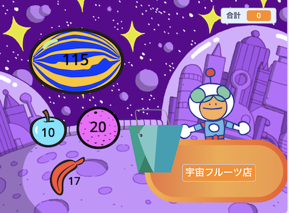

## 次は何をしますか？

[もっとScratch](https://projects.raspberrypi.org/ja-JP/raspberrypi/more-scratch)のパスをたどっている場合は、[次のお客様どうぞ！](https://projects.raspberrypi.org/ja-JP/projects/next-customer-please)のプロジェクトに進み、お客様が買い物をするお店を作ることができます。

--- print-only ---

--- /print-only ---

--- no-print ---

  <iframe allowtransparency="true" width="485" height="402" src="https://scratch.mit.edu/projects/embed/528696418/?autostart=false" frameborder="0"></iframe>

--- /no-print ---

Scratchのさまざまな機能を触ってみたい場合は[こちらのプロジェクト](https://projects.raspberrypi.org/ja-JP/projects?software%5B%5D=scratch&curriculum%5B%5D=%201){:target="_blank"}を試してみてください。

***

このプロジェクトは以下のボランティアによって翻訳されました。

酒井明子
Lyo Wakaizumi

ボランティアのおかげで、世界中の人々に母国語で学ぶ機会を与えることができます。翻訳を引き受けていただくことで、より多くの人々に手を差し伸べることができます。詳しくは [rpf.io/translate](https://rpf.io/translate) をご覧ください。
