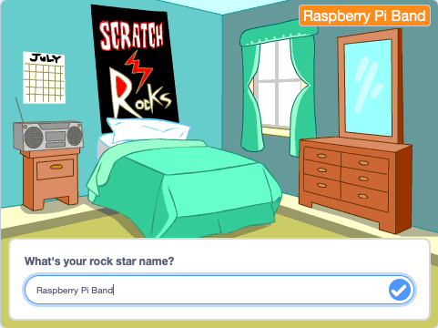
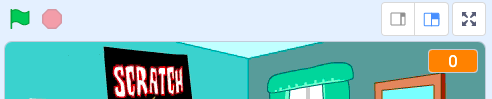

## ವೇದಿಕೆ ಸಿದ್ಧಪಡಿಸಿ

<div style="display: flex; flex-wrap: wrap">
<div style="flex-basis: 200px; flex-grow: 1; margin-right: 15px;">
ಈ ಹಂತದಲ್ಲಿ, ನೀವು ನಿಮ್ಮ ಮೊದಲ ಗಿಗ್‌ಗೆ ವೇದಿಕೆ ಸಿದ್ಧಪಡಿಸುವಿರಿ ಮತ್ತು ರಾಕ್‌ ಸ್ಟಾರ್‌ ಹೆಸರನ್ನು ಆಯ್ದುಕೊಳ್ಳುವಿರಿ.
</div>
<div>
{:width="300px"}
</div>
</div>

--- task ---

[ಡ್ರಮ್‌ ಸ್ಟಾರ್‌ ಪ್ರಾರಂಭಿಕ ಪ್ರಾಜೆಕ್ಟ್](https://scratch.mit.edu/projects/535783147/editor){:target="_blank"} ತೆರೆಯಿರಿ. ಸ್ಕ್ರಾಚ್ ಇನ್ನೊಂದು ಬ್ರೌಸರ್ ಟ್ಯಾಬ್‌ನಲ್ಲಿ ತೆರೆಯುತ್ತದೆ.

[[[working-offline]]]

--- /task ---

<p style="border-left: solid; border-width:10px; border-color: #0faeb0; background-color: aliceblue; padding: 10px;">
<span style="color: #0faeb0">**ಮನೆಯಲ್ಲಿ ಸಿದ್ಧರಾದ ಕಲಾಕಾರರು**</span> ಎನ್ನುವ ಸಂಗೀತಗಾರರು ತಮ್ಮ ಮಲಗುವ ಕೋಣೆಗಳಿಂದ ಸಂಗೀತವನ್ನು ರೆಕಾರ್ಡ್‌ ಮಾಡಲು ಪ್ರಾರಂಭಿಸುತ್ತಾರೆ. ಅವರು ತಮ್ಮದೇ ಸ್ವಂತ ಹಾಡುಗಳನ್ನು ತಾವೇ ತಯಾರಿಸುತ್ತಾರೆ ನಂತರ ಅವುಗಳನ್ನು ಆನ್‌ಲೈನಿನಲ್ಲಿ ಎಲ್ಲರಿಗೂ ಕೇಳಲು ಬಿಡುಗಡೆ ಮಾಡುತ್ತಾರೆ. 
</p>

ಆಟವು DIY ಕಲಾವಿದರಂತೆ ಮಲಗುವ ಕೋಣೆಯಲ್ಲಿ ಪ್ರಾರಂಭವಾಗುತ್ತದೆ.

--- task ---

**Choose a Backdrop** ಕ್ಲಿಕ್‌ ಮಾಡಿ ಮತ್ತು `bedroom` ಗಾಗಿ ಹುಡುಕಿ.

**ಆಯ್ಕೆ:** ಮಲಗುವ ಕೋಣೆಯನ್ನು ಆಯ್ಕೆ ಮಾಡಿ ನಿಮ್ಮ ಪ್ರಾಜೆಕ್ಟ್‌ಗೆ ಸೇರಿಸಿ. ನಾವು `Bedroom 3` ಆಯ್ದುಕೊಂಡಿದ್ದೇವೆ.


--- /task ---

--- task ---

Scratch ನಲ್ಲಿ, ನೀವು Stage ಗೆ ಕೋಡ್‌ ಸೇರಿಸಬಹುದು.

Stage ಫಲಕದಿಂದ ನಿಮ್ಮ ಮಲಗುವ ಕೋಣೆಯ ಬ್ಯಾಕ್‌ಡ್ರಾಪ್‌ ಮೇಲೆ ಕ್ಲಿಕ್‌ ಮಾಡಿ ಮತ್ತು ಈ ಕೋಡ್‌ನ್ನು ಸೇರಿಸಿ:


```blocks3
when flag clicked
switch backdrop to (Bedroom 3 v) //ನಿಮ್ಮ ಹಿನ್ನೆಲೆಯ ಹೆಸರು
```

--- /task ---

ಪ್ರತಿ ಸಂಗೀತಗಾರ ರಾಕ್ ಸ್ಟಾರ್ ಹೆಸರನ್ನು ಆಯ್ಕೆ ಮಾಡಿಕೊಳ್ಳಬೇಕು.

**ವೇರಿಯೇಬಲ್** ಎಂದರೆ ಸಂಖ್ಯೆಗಳನ್ನು ಮತ್ತು/ಅಥವಾ ಪಠ್ಯಗಳನ್ನು ಸಂಗ್ರಹಣೆ ಮಾಡುವ ವಿಧಾನ. ನಿಮ್ಮ ರಾಕ್‌ ಸ್ಟಾರ್‌ ಹೆಸರು `variable`{:class="block3variables"}ನಲ್ಲಿ ಸಂಗ್ರಹಣೆಯಾಗುತ್ತದೆ, ಅದನ್ನು ಯಾವಾಗ ಬೇಕಾದರೂ ಉಪಯೋಗಿಸಬಹುದು.

--- task ---

`Variables`{:class="block3variables"} ಬ್ಲಾಕ್‌ಗಳ ಮೆನುನಿಂದ, **Make a Variable** ಬಟನ್‌ ಕ್ಲಿಕ್‌ ಮಾಡಿ.

ನಿಮ್ಮ ಹೊಸ ವೇರಿಯೇಬಲ್‌ `name` ಕರೆಯಿರಿ:


**ಸೂಚನೆ:** ಹೊಸ `name` ವೇರಿಯೇಬಲ್‌ Stage ಮೇಲೆ ಕಾಣಿಸುತ್ತದೆ ಮತ್ತು ಅದನ್ನು `Variable`{:class="block3variables"} ಬ್ಲಾಕ್‌ಗಳಲ್ಲಿ ಉಪಯೋಗಿಸಬಹುದು.

--- /task ---

--- task ---

ಪ್ರಾಜೆಕ್ಟ್‌ ಪ್ರಾರಂಭದಲ್ಲಿ, ನಿಮ್ಮ ರಾಕ್‌ ಸ್ಟಾರ್‌ ಹೆಸರು ಗೊತ್ತಿಲ್ಲ.

ಹೆಸರನ್ನು ಹೊಂದಿಸಲು `set name to`{:class="block3variables"} `???` ಬ್ಲಾಕ್‌ನ್ನು ಸೇರಿಸಿ:


```blocks3
when flag clicked
switch backdrop to (Bedroom 3 v) //ನಿಮ್ಮ ಹಿನ್ನೆಲೆಯ ಹೆಸರು
+ set [name v] to [???] //ನಿಮ್ಮ ವೇರಿಯೇಬಲ್
```

--- /task ---

ನೀವು Scratch ನಲ್ಲಿ `ask`{:class="block3sensing"} ಪ್ರಶ್ನೆಯನ್ನು ಕೇಳಬಹುದು, ನಂತರ `answer`{:class="block3sensing"}ಸಂಗ್ರಹಿಸಲು `variable`{:class="block3variables"} ಉಪಯೋಗಿಸಬಹುದು.

--- task ---

`Sensing`{:class="block3sensing"} ಬ್ಲಾಕ್‌ಗಳ ಮೆನು ಮೇಲೆ ಕ್ಲಿಕ್‌ ಮಾಡಿ ಮತ್ತು `ask`{:class="block3sensing"} ಬ್ಲಾಕ್‌ನ್ನು ನಿಮ್ಮ ಕೋಡ್‌ಗೆ ಸೇರಿಸಿ:


```blocks3
when flag clicked
switch backdrop to (Bedroom 3 v) //ನಿಮ್ಮ ಹಿನ್ನೆಲೆಯ ಹೆಸರು
set [name v] to [???] //ನಿಮ್ಮ ವೇರಿಯೇಬಲ್
+ ask [What's your rock star name?] and wait //ನಿಮ್ಮ ಪ್ರಶ್ನೆ
```

--- /task ---

--- task ---

`name`{:class="block3variables"} `variable`{:class="block3variables"}ನ್ನು `answer`{:class="block3sensing"}ಗೆ ಹೊಂದಿಸಿ:


```blocks3
when flag clicked
switch backdrop to (Bedroom 3 v) //ನಿಮ್ಮ ಹಿನ್ನೆಲೆಯ ಹೆಸರು
set [name v] to [???] //ನಿಮ್ಮ ವೇರಿಯೇಬಲ್
ask [What's your rock star name?] and wait //ನಿಮ್ಮ ಪ್ರಶ್ನೆ
+ set [name v] to (answer)
```

--- /task ---

Stage ಮೇಲೆ ನಿಮ್ಮ `variable`{:class="block3variables"} ಹೇಗೆ ಕಾಣಿಸುತ್ತದೆ ಎಂಬುವುದನ್ನು ಬದಲಾಯಿಸಿ.

--- task ---

Stage ಮೇಲಿನ `variable`{:class="block3variables"} ಮೇಲೆ‌ ರೈಟ್- ಕ್ಲಿಕ್ ಮಾಡಿ ಮತ್ತು **large readout** ಆಯ್ಕೆ ಮಾಡಿಕೊಳ್ಳಿ:


--- /task ---

--- task ---

ನಿಮ್ಮ `variable`{:class="block3variables"}ನ್ನು ಎಳೆದು Stage ಮೇಲಿನ-ಬಲಭಾಗಕ್ಕೆ ಇರಿಸಿ:



--- /task ---

--- task ---

**ಪರೀಕ್ಷೆ:** `variable`{:class="block3variables"} `???` ಎಂದು ಪ್ರಾರಂಭವಾಗುತ್ತದೆ ನಂತರ ನಿಮ್ಮ `answer`{:class="block3sensing"}ಕ್ಕೆ ಅಪ್‌ಡೇಟ್‌ ಮಾಡುತ್ತದೆ ಎಂದು ಖಚಿತಪಡಿಸಿಕೊಳ್ಳಲು ನಿಮ್ಮ ಪ್ರಾಜೆಕ್ಟ್‌ನ್ನು ರನ್‌ ಮಾಡಿ.

--- /task ---

--- task ---

ಈಗ ನೀವು `variable`{:class="block3variables"} `answer`{:class="block3sensing"}ಗೆ ಬದಲಾಗುತ್ತದೆ ಎಂದು ಪರೀಕ್ಷೆ ಮಾಡಿರುವುದರಿಂದ, ನೀವು ಕೋಡ್‌ನ ಕೊನೆಯ 2 ಬ್ಲಾಕ್‌ಗಳನ್ನು ಉಳಿದ ಬರಹಗಳಿಂದ ದೂರ ಎಳೆಯಬಹುದು. ಅದರ ಅರ್ಥ ನೀವು ಪ್ರತಿಬಾರಿ ನಿಮ್ಮ ಪ್ರಾಜೆಕ್ಟ್‌ನ್ನು ಪರೀಕ್ಷಿಸಿದಾಗ `answer`{:class="block3sensing"} ಟೈಪ್‌ ಮಾಡಬೇಕಾಗಿಲ್ಲ:


```blocks3
when flag clicked
switch backdrop to (Bedroom 3 v) //ನಿಮ್ಮ ಹಿನ್ನೆಲೆಯ ಹೆಸರು
set [name v] to [???] //ನಿಮ್ಮ ವೇರಿಯೇಬಲ್
```

```blocks3
ask [What's your rock star name?] and wait //ನಿಮ್ಮ ಪ್ರಶ್ನೆ
set [name v] to (answer)
```

--- /task ---

--- save ---
