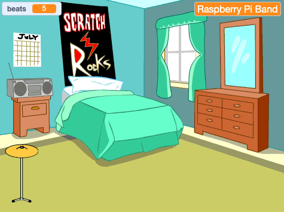

## ಸ್ಟಾರ್ಟರ್ ಡ್ರಮ್

<div style="display: flex; flex-wrap: wrap">
<div style="flex-basis: 200px; flex-grow: 1; margin-right: 15px;">
ನೀವು ಕ್ಲಿಕ್ ಮಾಡಿ ಹೊಡೆತಗಳನ್ನು ಗಳಿಸಬಹುದಾದ ಮತ್ತು ಧ್ವನಿಯನ್ನು ನುಡಿಸಬಹುದಾದ **cymbal** ಸ್ಪ್ರೈಟ್‌ ಸೇರಿಸುತ್ತೀರಿ.
</div>
<div>
{:width="300px"}
</div>
</div>

--- task ---

**Choose a Sprite** ಕ್ಲಿಕ್‌ ಮಾಡಿ ಮತ್ತು `cymbal` ಹುಡುಕಿ. ನಿಮ್ಮ ಪ್ರಾಜೆಕ್ಟ್‌ಗೆ **Drum-cymbal** ಸ್ಪ್ರೈಟ್‌ ಸೇರಿಸಿ.


--- /task ---

--- task ---

ನಿಮ್ಮ ಸಿಂಬಲ್‌ನ್ನು Stage ಮೇಲೆ ಇರಿಸಿ:


--- /task ---

--- task ---

**Music extension**ನ್ನು ಸೇರಿಸಿ:

[[[generic-scratch3-add-music-extension]]]

--- /task ---

--- task ---

ಸಿಂಬಲ್‌ `switch costume`{:class="block3looks"} ಮತ್ತು `play a drum sound`{:class="block3extensions"} ಮಾಡುವಂತೆ ಮಾಡಲು ಬರಹ ಸೇರಿಸಿ:


```blocks3
when this sprite clicked
switch costume to [drum-cymbal-b v] // hit costume
play drum [(5) Open High-Hat v] for [0.25] beats // drum sound
switch costume to [drum-cymbal-a v]  // not hit costume
```

--- /task ---

--- task ---

**ಪರೀಕ್ಷೆ:** ನಿಮ್ಮ ಸಿಂಬಲ್‌ನ್ನು ಅದರ ಮೇಲೆ ಕ್ಲಿಕ್‌ ಮಾಡಿ ಪರೀಕ್ಷೆ ಮಾಡಿ. ನೀವು ಧ್ವನಿ ಕೇಳಿಸಿಕೊಳ್ಳುವುದನ್ನು ಮತ್ತು ಉಡುಪು ಬದಲಾವಣೆ ನೋಡುವುದನ್ನು ಖಚಿತಪಡಿಸಿಕೊಳ್ಳಿ.

--- /task ---

ನೀವು ಪ್ರತಿಬಾರಿ ಅದನ್ನು ಕ್ಲಿಕ್‌ ಮಾಡಿದಾಗ **Drum-cymbal** ಸ್ಪ್ರೈಟ್‌ ನಿಮಗೆ ಒಂದು ಹೊಡೆತವನ್ನು ಗಳಿಸುತ್ತದೆ.

--- task ---

`beats` ಎನ್ನುವ `variable`{:class="block3variables"} ರಚಿಸಿ:


--- /task ---

--- task ---

**Drum-cymbal** ಸ್ಪ್ರೈಟ್‌ನ್ನು ಕ್ಲಿಕ್‌ ಮಾಡಿದಾಗ `change beats by 1`{:class="block3variables"}ನ್ನು ಮಾಡಲು ಬ್ಲಾಕ್‌ಗಳನ್ನು ಸೇರಿಸಿ:


```blocks3
when this sprite clicked
+change [beats v] by [1]
switch costume to [drum-cymbal-b v]
play drum [(5) Open High-Hat v] for [0.25] beats 
switch costume to [drum-cymbal-a v]
```

--- /task ---

--- task ---

**ಪರೀಕ್ಷೆ:** **Drum-cymbal** ಮೇಲೆ ಕ್ಲಿಕ್‌ ಮಾಡಿ ಅದನ್ನು ಪರೀಕ್ಷಿಸಿ ಮತ್ತು `beats`{:class="block3variables"} ಹೆಚ್ಚಾಗುವುದನ್ನು ಗಮನಿಸಿ.

--- /task ---

`beats`{:class="block3variables"} ವೇರಿಯೇಬಲ್ `0` ಹೊಡೆತದಲ್ಲಿ ಹೊಸ ಆಟವನ್ನು ಪ್ರಾರಂಭಿಸಬೇಕು.

--- task ---

Stage ಪೇನ್‌ ಮೇಲೆ ಕ್ಲಿಕ್‌ ಮಾಡಿ ಮತ್ತು ನಂತರ Stage ಗೆ ಕೋಡ್‌ ಸೇರಿಸಲು **Code** ಟ್ಯಾಬ್‌ ಕ್ಲಿಕ್‌ ಮಾಡಿ.

`set beats to`{:class="block3variables"} `0` ಮಾಡಲು ಬ್ಲಾಕ್‌ ಸೇರಿಸಿ:


```blocks3
when flag clicked
switch backdrop to (Bedroom 3 v) 
set [name v] to [???] 
+ set [beats v] to [0]
```
--- /task ---

--- task ---

**ಪರೀಕ್ಷೆ:** ಹಸಿರು ಬಾವುಟ ಕ್ಲಿಕ್‌ ಮಾಡಿ ಮತ್ತು ನಿಮ್ಮ `beats`{:class="block3variables"} ವೇರಿಯೇಬಲ್ `0`ದಲ್ಲಿ ಪ್ರಾರಂಭವಾಗುತ್ತದೆ ಎಂದು ಖಚಿತಪಡಿಸಿಕೊಳ್ಳಿ.

--- /task ---

--- save ---
