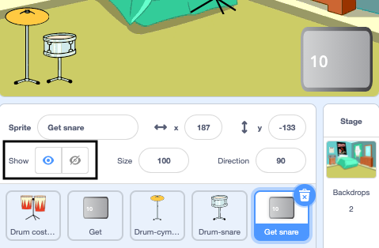
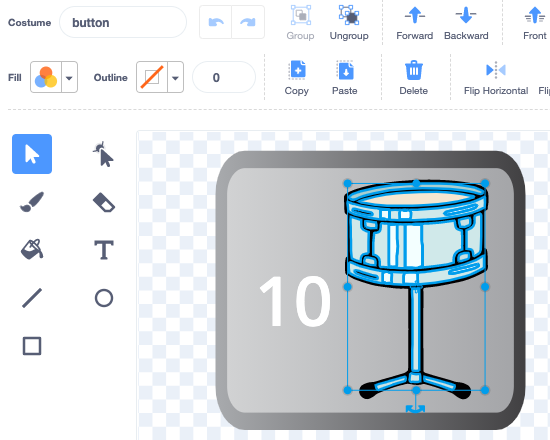

## ಮೊದಲನೆಯ ಅಪ್‌ಗ್ರೇಡ್

<div style="display: flex; flex-wrap: wrap">
<div style="flex-basis: 200px; flex-grow: 1; margin-right: 15px;">
ನೀವು ನಿಮ್ಮ ಮೊದಲನೆಯ ಅಪ್‌ಗ್ರೇಡ್‌ ಸೇರಿಸುತ್ತೀರಿ. ಪ್ರಾರಂಭದಲ್ಲಿ **Get snare** ಬಟನ್‌ ತೋರಿಸುತ್ತದೆ, ಅದರಿಂದ ಆಟಗಾರನಿಗೆ ಅವರು ಯಾವ ಡ್ರಮ್‌ನೆಡೆಗೆ ಕೆಲಸಮಾಡುತ್ತಾರೆ ಎಂದು ತಿಳಿಯುತ್ತದೆ.
</div>
<div>
{:width="300px"}
</div>
</div>

--- task ---

**Drum-snare** ಸ್ಪ್ರೈಟ್‌ನ್ನು ನಿಮ್ಮ ಪ್ರಾಜೆಕ್ಟ್‌ಗೆ ಸೇರಿಸಿ ಮತ್ತು ಅದನ್ನು Stage ಮೇಲೆ ಇರಿಸಿ:


--- /task ---

--- task ---

**Drum-cymbal** ಸ್ಪ್ರೈಟ್‌ನಿಂದ `when this sprite clicked`{:class="block3events"} ಬರಹವನ್ನು **Drum-snare** ಸ್ಪ್ರೈಟ್‌ಗೆ ಎಳೆಯಿರಿ.

[[[scratch3-copy-code]]]

--- /task ---

--- task ---

ಉಡುಪುಗಳನ್ನು ಮತ್ತು ಡ್ರಮ್‌ ಧ್ವನಿಯನ್ನು ಬದಲಾಯಿಸಿ.

ಗಳಿಸಿದ ಬೀಟ್‌ಗಳ ಸಂಖ್ಯೆಯನ್ನು `2` ಕ್ಕೆ ಬದಲಾಯಿಸಿ:


```blocks3
when this sprite clicked
+change [beats v] by [2] //ಪ್ರತಿ ಕ್ಲಿಕ್‌ಗೆ 2 ಹೊಡೆತಗಳು
+switch costume to [drum-snare-b v] //hit ಉಡುಪು
+play drum [(1) Snare Drum v] for [0.25] beats //ಡ್ರಮ್‌ ಧ್ವನಿ
+switch costume to [drum-snare-a v] //not hit ಉಡುಪು
```

--- /task ---

--- task ---

**ಪರೀಕ್ಷೆ:** ನಿಮ್ಮ ಪ್ರಾಜೆಕ್ಟ್‌ನ್ನು ಪ್ರಯತ್ನಿಸಿ. ಸ್ನೇರ್‌ ಡ್ರಮ್‌ ಮೇಲೆ ಕ್ಲಿಕ್‌ ಮಾಡಿದಾಗ ನೀವು 2 ಹೊಡೆತ ಗಳಿಸುವುದನ್ನು ಖಚಿತಪಡಿಸಿಕೊಳ್ಳಿ.

--- /task ---

ನೀವು ಪ್ರಾಜೆಕ್ಟ್‌ನ್ನು ಪ್ರಾರಂಭಿಸಿದಾಗ ಅಪ್‌ಗ್ರೇಡ್‌ಗಳು ಲಭ್ಯವಿರುವುದಿಲ್ಲ. ಅವುಗಳನ್ನು ಹೊಡೆತಗಳ ಜೊತೆಗೆ ಗಳಿಸಬೇಕು.

--- task ---

ಪ್ರಾಜೆಕ್ಟ್‌ನ ಪ್ರಾರಂಭದಲ್ಲಿ ಈ **drum** ಸ್ಪ್ರೈಟ್‌ನ್ನು ಮರೆಮಾಚಲು ಬರಹವನ್ನು ಸೇರಿಸಿ:


```blocks3
when flag clicked
hide
```

--- /task ---

ಮುಂದಿನ ಅಪ್‌ಗ್ರೇಡ್‌ ಯಾವ ಡ್ರಮ್‌ ಮತ್ತು ಅದರ ಬೆಲೆ ಎಷ್ಟು ಹೊಡೆತಗಳು ಎಂದು ಒಂದು ಬಟನ್‌ ತೋರಿಸುತ್ತದೆ.

--- task ---

**Get** ಸ್ಪ್ರೈಟ್‌ನ್ನು **Duplicate** ಮಾಡಿ:


ಅದರ ಕಾಣುವಿಕೆಯನ್ನು **Show** ಗೆ ಬದಲಾಯಿಸಿ ಮತ್ತು ಅದರ ಹೆಸರನ್ನು `Get snare` ಗೆ ಬದಲಾಯಿಸಿ. ಅದನ್ನು Stage ನ ಕೆಳ ಬಲ ಮೂಲೆಯಲ್ಲಿ ಇಡಿ:



--- /task ---

--- task ---

**Drum-snare** ಸ್ಪ್ರೈಟ್‌ ಮೇಲೆ ಕ್ಲಿಕ್‌ ಮಾಡಿ ಮತ್ತು **Costumes** ಟ್ಯಾಬ್‌ಗೆ ಹೋಗಿ. ನಿಮ್ಮ ಡ್ರಮ್‌ಗೆ ಹೊಡೆತ ಆಗದೇ ಇರುವ ಉಡುಪನ್ನು ಹೈಲೈಟ್‌ ಮಾಡಲು **Select** (ಬಾಣ) ಟೂಲ್‌ ಉಪಯೋಗಿಸಿ. **Group** iಐಕಾನ್‌ ಮೇಲೆ ಕ್ಲಿಕ್‌ ಮಾಡಿ ಮತ್ತು ನಂತರ **Copy** ಐಕಾನ್:


--- /task ---

--- task ---

ನಿಮ್ಮ **Get snare** ಸ್ಪ್ರೈಟ್‌ ಮೇಲೆ ಕ್ಲಿಕ್‌ ಮಾಡಿ ಮತ್ತು ಸ್ನೇರ್‌ ಉಡುಪನ್ನು **Paste** ಮಾಡಿ. ನಿಮ್ಮ ಬಟನ್‌ಗೆ ಸರಿಹೊಂದಲು ಅದರ ಗಾತ್ರ ಬದಲಾವಣೆ ಮತ್ತು ಸ್ಥಾನ ಬದಲಾವಣೆಯನ್ನು ಮಾಡಬೇಕಾಗಬಹುದು:




--- /task ---

--- task ---

**Code** ಟ್ಯಾಬ್‌ ಮೇಲೆ ಕ್ಲಿಕ್‌ ಮಾಡಿ ಮತ್ತು ಪ್ರಾಜೆಕ್ಟ್‌ ಪ್ರಾರಂಭದಲ್ಲಿ **Get snare** ಸ್ಪ್ರೈಟ್‌ ತೋರಿಸಲು ಬರಹ ಸೇರಿಸಿ:


```blocks3
when flag clicked
show
```

--- /task ---

ಬಳಕೆದಾರ `10` ಅಥವಾ ಹೆಚ್ಚು ಹೊಡೆತಗಳನ್ನು ಹೊಂದಿದ್ದರೆ ಮಾತ್ರ ಅಪ್‌ಗ್ರೇಡ್‌ನ್ನು ಖರೀದಿಸಬಹುದು. [Grow a dragonfly](https://projects.raspberrypi.org/kn-IN/projects/grow-a-dragonfly){:target="_blank"}ರಲ್ಲಿ, ನೀವು `if`{:class="block3control"} ಬ್ಲಾಕ್‌ಗಳೊಂದಿಗೆ ತೀರ್ಮಾನ ಮಾಡುವುದರ ಬಗೆಗೆ ಕಲಿತಿದ್ದೀರಿ.

`if ... else`{:class="block3control"} ಬ್ಲಾಕ್‌ನ್ನು ತೀರ್ಮಾನ ಮಾಡಲು ಉಪಯೋಗಿಸಿದರೆ ಮತ್ತು ಷರತ್ತು `true` ಅಥವಾ `false` ಆದರೆ ವಿಭಿನ್ನ ಸಂಗತಿಗಳನ್ನು ಮಾಡುತ್ತದೆ.

<p style="border-left: solid; border-width:10px; border-color: #0faeb0; background-color: aliceblue; padding: 10px;">
ನಾವು <span style="color: #0faeb0">**if ... else**</span> ನ್ನು ತೀರ್ಮಾನ ಮಾಡಲು ಯಾವಾಗಲೂ ಉಪಯೋಗಿಸುತ್ತೇವೆ. ನೀವು ನಿದ್ದೆಯಿಂದ ಎದ್ದಾಗ, ನೀವು `if`{:class="block3control"} ಇದು ಮುಂಜಾನೆಯೇ ಎಂದು ಪರಿಶೀಲಿಸುತ್ತೀರಿ. ನೀವು ಎದ್ದೇಳುತ್ತೀರಿ, ಅಥವಾ `else`{:class="block3control"} ನೀವು ಮತ್ತೆ ಮಲಗಲು ಹೋಗುತ್ತೀರಿ. ನೀವು ಮಾಡುವ ಯಾವುದಾದರೂ `if ... else`{:class="block3control"} ತೀರ್ಮಾನಗಳ ಬಗೆಗೆ ಯೋಚಿಸಬಹುದೇ? 
</p>

--- task ---

ಆಟಗಾರ ಸಾಕಷ್ಟು ಹೊಡೆತಗಳನ್ನು ಹೊಂದಿದ್ದರೆ ಅಪ್‌ಗ್ರೇಡ್‌ ಪಡೆಯಲು ಈ ಕೋಡ್ `if`{:class="block3control"} ಸೇರಿಸಿ ಅಥವಾ ಅವರು ಅಪ್‌ಗ್ರೇಡ್‌ ಮಾಡಲು ಸಾಧ್ಯವಾಗದಿದ್ದರೆ `say`{:class="block3looks"} `Not enough beats!`:


```blocks3
when this sprite clicked
if <(beats)>  [9]> then //10 ಅಥವಾ ಅದಕ್ಕಿಂತ ಹೆಚ್ಚು ಹೊಡೆತಗಳಿದ್ದರೆ
hide
change [beats v] by [-10] //ಅಪ್‌ಗ್ರೇಡ್‌ ಬೆಲೆಯನ್ನು ತೆಗೆದುಹಾಕಿ
else
say [Not enough beats!] for [2] seconds 
end
```

--- /task ---

ಉಳಿದ ಸ್ಪ್ರೈಟ್‌ಗಳು ಮತ್ತು Stage ಗೆ ಸ್ನೇರ್‌ ಅಪ್‌ಗ್ರೇಡ್‌ ಖರೀದಿಸಲಾಗಿದೆ ಎಂದು ತಿಳಿಯಲಿ.

--- task ---

ಹೊಸ `snare` ಸಂದೇಶ ಕಳುಹಿಸಲು `broadcast`{:class="block3events"} ಬ್ಲಾಕ್‌ ಸೇರಿಸಿ:


```blocks3
when this sprite clicked
if <(beats)>  [9]> then // 10 ಅಥವಾ ಅದಕ್ಕಿಂತ ಹೆಚ್ಚು ಹೊಡೆತಗಳಿದ್ದರೆ
hide
change [beats v] by [-10] // ಅಪ್‌ಗ್ರೇಡ್‌ ಬೆಲೆಯನ್ನು ತೆಗೆದುಹಾಕಿ
+ broadcast [snare v] // ನಿಮ್ಮ ಡ್ರಮ್‌ ಹೆಸರು
else
say [Not enough beats!] for [2] seconds 
end
```

--- /task ---

--- task ---

**Drum-snare** ಸ್ಪ್ರೈಟ್‌ ಮೇಲೆ ಕ್ಲಿಕ್‌ ಮಾಡಿ. ಈ ಬರಹವನ್ನು ಸೇರಿಸಿ:


```blocks3
when I receive [snare v]
show
```

--- /task ---

ನೀವು ನಿಮ್ಮ ಉಪಕರಣ ಅಪ್‌ಗ್ರೇಡ್‌ ಮಾಡಿದಾಗ, ನೀವು ದೊಡ್ಡ ದೊಡ್ಡ ವೇದಿಕೆಗಳಲ್ಲಿ ನುಡಿಸಲು ಸಾಧ್ಯ.

--- task ---

ಇನ್ನೊಂದು ಹಿನ್ನೆಲೆಯನ್ನು ಸೇರಿಸಿ. ನಾವು ಶಾಲೆಯಲ್ಲಿ ನಮ್ಮ ಎರಡನೆಯ ಗಿಗ್‌ ನಡೆಸಲು **Chalkboard** ಆಯ್ಕೆ ಮಾಡಿಕೊಂಡಿದ್ದೇವೆ.

ಅಪ್‌ಗ್ರೇಡ್‌ ಸಂದೇಶ ಸ್ವೀಕರಿಸಲ್ಪಟ್ಟಾಗ Stage ಗೆ `switch backdrop`{:class="block3looks"} ಮಾಡಲು ಕೋಡ್‌ ಸೇರಿಸಿ:


```blocks3
when I receive [snare v]
switch backdrop to [Chalkboard v]
```

**ಸಲಹೆ:** ಮಲಗುವ ಕೋಣೆಯಿಂದ ಸಣ್ಣ ಸೆಟ್‌ಅಪ್‌ ವೇದಿಕೆಯನ್ನು ಆಯ್ಕೆ ಮಾಡಿಕೊಳ್ಳಿ. ನೀವು ದೊಡ್ಡ ವೇದಿಕೆಗಳನ್ನು ನಂತರದವುಗಳಿಗೆ ಉಳಿಸಿಕೊಳ್ಳ ಬಯಸುವಿರಿ.

--- /task ---

--- task ---

**ಪರೀಕ್ಷಿಸಿ:** ನಿಮ್ಮ ಪ್ರಾಜೆಕ್ಟ್‌ನ್ನು ರನ್‌ ಮಾಡಿ. ನಿಮ್ಮ ಬಳಿ ಸಾಕಷ್ಟು ಹೊಡೆತಗಳು ಇರುವ ಮೊದಲು ಸ್ನೇರ್‌ ಅಪ್‌ಗ್ರೇಡ್‌ ಪ್ರಯತ್ನಿಸಿ ಮತ್ತು ಖರೀದಿಸಿ.

ನೀವು ಅಪ್‌ಗ್ರೇಡ್‌ ಖರೀದಿಸಿದಾಗ ಪರಿಶೀಲಿಸಿ: ಸ್ನೇರ್‌ ಕಣ್ಮರೆಯಾಗುತ್ತದೆ, ಬಟನ್‌ ಕಣ್ಮರೆಯಾಗುತ್ತದೆ, ವೇದಿಕೆ ಬದಲಾಗುತ್ತದೆ ಮತ್ತು `beats`{:class="block3variables"} `10`ರಷ್ಟು ಕಡಿಮೆಯಾಗುತ್ತದೆ.

--- /task ---

--- save ---
