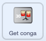

## ಎರಡನೆಯ ಅಪ್‌ಗ್ರೇಡ್

<div style="display: flex; flex-wrap: wrap">
<div style="flex-basis: 200px; flex-grow: 1; margin-right: 15px;">
ನಿಮ್ಮ ಡ್ರಮ್ ಕೌಶಲ್ಯಗಳು ಸುಧಾರಿಸುತ್ತಿವೆ. ಎರಡನೆಯ ಅಪ್‌ಗ್ರೇಡ್‌ ಸಮಯ! ಈ ಹಂತದಲ್ಲಿ, ನೀವು ಯಾವ ಡ್ರಮ್‌ ಸೇರಿಸಬೇಕೆಂದು ಆಯ್ಕೆ ಮಾಡುತ್ತೀರಿ.
</div>
<div>
{:width="300px"}
</div>
</div>

--- task ---

**Drum-snare** ಸ್ಪ್ರೈಟ್‌ ನಕಲು ಮಾಡಿ:


--- /task ---

ನಿಮಗೆ ಅವುಗಳಿಂದ ಆಯ್ಕೆ ಮಾಡಿಕೊಳ್ಳಲು **Drum Costumes** ಸ್ಪ್ರೈಟ್‌ ಬಹಳಷ್ಟು ಡ್ರಮ್‌ ಉಡುಪುಗಳನ್ನು ಹೊಂದಿದೆ.

--- task ---

**Drum Costumes** ಸ್ಪ್ರೈಟ್‌ ಕ್ಲಿಕ್‌ ಮಾಡಿ ಮತ್ತು **Costumes** ಟ್ಯಾಬ್‌ ಆಯ್ಕೆ ಮಾಡಿ.

**ಆಯ್ಕೆಮಾಡಿಕೊಳ್ಳಿ:** ಮುಂದಿನ ಅಪ್‌ಗ್ರೇಡ್‌ಗೆ ಡ್ರಮ್‌. ನಾವು **Conga** ಆಯ್ದುಕೊಂಡಿದ್ದೇವೆ.

ನಿಮ್ಮ ಆಯ್ಕೆಯ ಡ್ರಮ್‌ನ 'hit' ಮತ್ತು 'not hit'ಉಡುಪುಗಳನ್ನು ನಿಮ್ಮ ಹೊಸ **Drum-snare2** ಸ್ಪ್ರೈಟ್‌ಗೆ ಎಳೆಯಿರಿ:


--- /task ---

--- task ---

ನಿಮ್ಮ ಡ್ರಮ್‌ನ್ನು ನೀವು ಆಯ್ಕೆ ಮಾಡಿರುವ ಉಡುಪುಗಳಿಗೆ ಹೊಂದುವಂತೆ ಹೆಸರಿಸಿ.


--- /task ---

--- task ---

**Code** ಟ್ಯಾಬ್ ಮೇಲೆ ಕ್ಲಿಕ್ ಮಾಡಿ. ಸರಿಯಾದ ಉಡುಪುಗಳನ್ನು ಉಪಯೋಗಿಸಲು ಕೋಡ್‌ ಬದಲಾಯಿಸಿ ಮತ್ತು ನಿಮ್ಮ ಹೊಸ ಡ್ರಮ್‌ಗೆ ಶಬ್ದವನ್ನು ಆಯ್ಕೆ ಮಾಡಿಕೊಳ್ಳಿ.

ಹೊಸ ಡ್ರಮ್‌ನ್ನು `5`ಗೆ ಕ್ಲಿಕ್‌ ಮಾಡಿ ನೀವು ಗಳಿಸುವ ಹೊಡೆತಗಳ ಸಂಖ್ಯೆಯನ್ನು ಬಸಲಾಯಿಸಿ:


```blocks3
when this sprite clicked
+change [beats v] by [5] //ಪ್ತತಿ ಕ್ಲಿಕ್‌ಗೆ 5 ಹೊಡೆತಗಳು
+switch costume to [ v] //ನಿಮ್ಮ hit ಉಡುಪು
+play drum [ v] for [0.25] beats //ನಿಮ್ಮ ಡ್ರಮ್‌ ಶಬ್ದ
+switch costume to [ v] //ನಿಮ್ಮ not hit ಉಡುಪು
```

--- /task ---

--- task ---

ನಿಮ್ಮ ಹೊಸ ಡ್ರಮ್‌ನ್ನು Stage ಮೇಲೆ ಸ್ಥಾನಕ್ಕೆ ಎಳೆಯಿರಿ:


--- /task ---

ನಂತರ, ಆಟಗಾರರು ಈ ಹೊಸ ಡ್ರಮ್‌ಗೆ ಅಪ್‌ಗ್ರೇಡ್‌ ಮಾಡಿಕೊಳ್ಳಲು ನಿಮಗೆ ಒಂದು ಬಟನ್‌ ಬೇಕು.

--- task ---

**Get snare** ಸ್ಪ್ರೈಟ್‌ನ್ನು ನಕಲು ಮಾಡಿ.

ಅದನ್ನು Stage ನ ಕೆಳ ಬಲ ಮೂಲೆಯಲ್ಲಿ ಇಡಿ. ಅದರ ಹೆಸರನ್ನು `Get` ಗೆ ಬದಲಾಯಿಸಿ ಮತ್ತು ನಂತರ ನಿಮ್ಮ ಹೊಸ ಡ್ರಮ್‌ನ ಹೆಸರು:


--- /task ---

--- task ---

**snare drum** ನ್ನು ಬಟನ್‌ ಉಡುಪಿನಿಂದ ಅಳಿಸಿ. ನಿಮ್ಮ ಹೊಸ ಡ್ರೆಮ್‌ಗೆ 'not hit' ಉಡುಪನ್ನು button ಉಡುಪಿಗೆ ನಕಲು ಮಾಡಿ ಅಂಟಿಸಿ.

**Text** ಟೂಲ್‌ ಮೇಲೆ ಕ್ಲಿಕ್‌ ಮಾಡಿ ಮತ್ತು ಹೊಸ ಡ್ರಮ್‌ನ ಬೆಲೆಯನ್ನು ತೋರಿಸಲು ಸಂಖ್ಯೆಯನ್ನು`30` ಕ್ಕೆ ಬದಲಾಯಿಸಿ.

ನಿಮ್ಮ ಬಟನ್‌ ಈ ರೀತಿ ಕಾಣಬೇಕು:


--- /task ---


ಈ ಬಟನ್‌ ಪ್ರಾರಂಭದಲ್ಲಿ `hide`{:class="block3looks"} ಅಗಬೇಕು, ನಂತರ ಆಟಗಾರ ಸ್ನೇರ್‌ ಡ್ರಮ್‌ಗೆ ಅಪ್‌ಗ್ರೇಡ್‌ ಆದಾಗ `show`{:class="block3looks"}ಆಗಬೇಕು, ಅದರಿಂದ ಅವರಿಗೆ ಅವರು ಯಾವ ಡ್ರಮ್‌ನೆಡೆಗೆ ಕೆಲಸ ಮಾಡುತ್ತಿದ್ದಾರೆ ಎಂದು ತಿಳಿಯುತ್ತದೆ.

--- task ---



```blocks3
when flag clicked
- show
+ hide
```

**ಸಲಹೆ:** ಬ್ಲಾಕ್‌ನ್ನು ಅಳಿಸಲು, ಅದನ್ನು Blocks ಮೆನುಗೆ ಎಳೆಯಿರಿ, ಅಥವಾ ರೈಟ್‌-ಕ್ಲಿಕ್‌ ಮಾಡಿ **Delete Block** ಆಯ್ದುಕೊಳ್ಳಿ. ಕಂಪ್ಯೂಟರ್‌ನಲ್ಲಿ, ನೀವು ಬ್ಲಾಕ್‌ ಮೇಲೆ ಸಹ ಕ್ಲಿಕ್‌ ಮಾಡಬಹುದು ಮತ್ತು ನಂತರ ಬ್ಲಾಕ್‌ ತೆಗೆದುಹಾಕಲು <kbd>Delete</kbd> ಟ್ಯಾಪ್‌ ಮಾಡಬಹುದು.

--- /task ---

--- task ---

ಆಟಗಾರ **Drum-snare** ಡ್ರಮ್‌ ಪಡೆದಾಗ, ನಿಮ್ಮ ಹೊಸ ಡ್ರಮ್‌ ಬಟನ್‌ ಮುಂದಿನ ಅಪ್‌ಗ್ರೇಡ್‌ ಎಂದು ತೋರಿಸುವ ಬರಹವನ್ನು `when I receive`{:class="block3events"} ಸೇರಿಸಿ:


```blocks3
when I receive [snare v] // ಹಿಂದಿನ ಡ್ರಮ್‌ನ್ನು ಖರೀದಿಸಿದಾಗ ಕಾಣುತ್ತದೆ
show // ಲಭ್ಯವಿರುವ ಮುಂದಿನ ಡ್ರಮ್‌ ತೋರಿಸುವ ಬಟನ್
```

--- /task ---

--- task ---

ಈ ಡ್ರಮ್‌ನ್ನು ಖರೀದಿಸಲು ಬೇಕಾದ ಹೊಡೆತಗಳ ಸಂಖ್ಯೆಯನ್ನು ಮತ್ತು ಆಟಗಾರ ಈ ಡ್ರಮ್‌ ಪಡೆದಾಗ, ತೆಗದುಹಾಕಲಾಗುವ ಹೊಡೆತಗಳ ಸಂಖ್ಯೆಯನ್ನು ಬದಲಾಯಿಸಿ.

ಆಟಗಾರ ಹೊಸ ಡ್ರಮ್‌ ಪಡೆದಾಗ, `broadcast`{:class="block3events"} ಆಗುವ ಸಂದೇಶವನ್ನೂ ಸಹ ಬದಲಾಯಿಸಿ. ನಿಮ್ಮ ಹೊಸ ಡ್ರಮ್‌ನ ಹೆಸರಿನಿಂದ ಹೊಸ ಸಂದೇಶವನ್ನು ರಚಿಸಿ:


```blocks3
when this sprite clicked
if <(beats)>  [29]> then // 29‌ ಕ್ಕೆ ಬದಲಾಯಿಸಿ
hide
change [beats v] by [-30] // 30 ಕ್ಕೆ ಬದಲಾಯಿಸಿ
broadcast [conga v] // ನಿಮ್ಮ ಡ್ರಮ್‌ ಹೆಸರಿಗೆ ಬದಲಾಯಿಸಿ
else
say [Not enough beats!] for [2] seconds 
end
```

--- /task ---

--- task ---

`when I receive snare`{:class="block3events"} ಬರಹವನ್ನು `broadcast`{:class="block3events"} ಗೆ ನಿಮ್ಮ ಹೊಸ ಡ್ರಮ್‌ನ ಹೆಸರಿಗೆ ಬದಲಾಯಿಸಿ. ಆಟಗಾರ ಹೊಸ ಡ್ರಮ್‌ಗೆ ಅಪ್‌ಗ್ರೇಡ್‌ ಆದಾಗ, ಡ್ರಮ್ `show`{:class="block3looks"} ತೋರಿಸುತ್ತದೆ:


```blocks3
when I receive [conga v] // ನಿಮ್ಮ ಡ್ರಮ್‌ ಹೆಸರಿಗೆ ಬದಲಾಯಿಸಿ
show
```

--- /task ---

--- task ---

**Party** ಹಿನ್ನೆಲೆಯನ್ನು ಸೇರಿಸಿ.

ಆಟಗಾರ ಹೊಸ ಡ್ರಮ್‌ಗೆ ಅಪ್‌ಗ್ರೇಡ್‌ ಆದಾಗ ಹಿನ್ನೆಲೆ ಬದಲಾಯಿಸಲು Stage ಗೆ ಬರಹ ಸೇರಿಸಿ:


```blocks3
when I receive [conga v] // ನಿಮ್ಮ ಡ್ರಮ್‌ ಹೆಸರಿಗೆ ಬದಲಾಯಿಸಿ
switch backdrop to (Party v)
```

--- /task ---

--- task ---

**ಪರೀಕ್ಷೆ:** ಆಟವನ್ನು ಪ್ರಾರಂಭಿಸಲು ಹಸರು ಬಾವುಟವನ್ನು ಕ್ಲಿಕ್‌ ಮಾಡಿ ಮತ್ತು ನೀವು ನಿಮ್ಮ ಹೊಸ ಡ್ರಮ್‌ ಪಡೆಯಲು ಸಾಕಷ್ಟು ಹೊಡೆತ ಗಳಿಸುವುದನ್ನು ಪರೀಕ್ಷಿಸಿ.

ನೀವು ಸಾಕಷ್ಟು ಹೊಡೆತಗಳನ್ನು ಗಳಿಸುವ ಮೊದಲೇ ಬಟನ್‌ ಕ್ಲಿಕ್‌ ಮಾಡಿದರೆ ಏನಾಗುತ್ತದೆ?

--- /task ---

--- save ---
