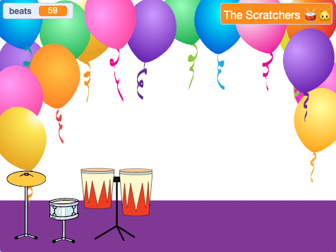

## ನುಡಿಸಿ ಮತ್ತು ಬೇಕಾದಂತೆ ಮಾರ್ಪಾಡು ಮಾಡಿ

ಇದು ನಿಮ್ಮ ಆಟವು ನೀವು ಬಯಸಿದಂತೆ ಕೆಲಸಮಾಡುವಂತೆ ಮಾಡುವ ಸಮಯ.

{:width="300px"}

--- task ---

ನಿಮ್ಮ ಆಟವನ್ನು ಆಡಿ ಮತ್ತು ಹೊಡೆತಗಳನ್ನು ಗಳಿಸಿ.

`beats`{:class="block3variables"} ವೇರಿಯೇಬಲ್‌ ಬದಲಾಗುವುದನ್ನು ಗಮನಿಸಿ ಮತ್ತು ನೀವು ಡ್ರಮ್‌ಗಳನ್ನು ಕ್ಲಿಕ್‌ ಮಾಡಿದಾಗ ಹೊಡೆತಗಳು ಹೇಗೆ ಹೆಚ್ಚುತ್ತವೆ ಮತ್ತು ನೀವು ಹೊಸ ಡ್ರಮ್‌ ಪಡೆದಾಗ ಕಡಿಮೆಯಾಗುತ್ತವೆ ಎಂಬುವುದನ್ನು ಸರಿಯಾಗಿ ಅರ್ಥಮಾಡಿಕೊಳ್ಳಿ.

ಪ್ರತಿಯೊಂದು ಡ್ರಮ್‌ನಿಂದ ನೀವು ಎಷ್ಟು ಹೊಡೆತಗಳನ್ನು ಗಳಿಸುತ್ತೀರಿ ಎನ್ನುವುದು ನಿಮಗೆ ಸಂತೋಷವಾಗಿದೆಯೇ? ನೀವು ಬಯಸಿದರೆ ಇದನ್ನು ಬದಲಾಯಿಸಬಹುದು.

ಹೊಸ ಡ್ರಮ್‌ ಪಡೆಯಲು ಎಷ್ಟು ಹೊಡೆತಗಳು ಬೇಕಾಗುತ್ತವೆ ಎನ್ನುವುದು ನಿಮಗೆ ಸಂತೋಷವಾಗಿದೆಯೇ?

**ಸಲಹೆ:** ನಿಮ್ಮ ಪ್ರಾಜೆಕ್ಟ್‌ನ್ನು ನಿಯಮಿತವಾಗಿ ಪರೀಕ್ಷಿಸಿ, ಇದರಿಂದ ಯಾವುದೇ ದೋಷವನ್ನು(ಬಗ್‌ಗಳನ್ನು) ನೀವು ಹುಡುಕಿ ಸರಿಪಡಿಸಬಹುದು.

--- /task ---

--- task ---

ನೀವು Stage ಮೇಲೆ `ask`{:class="block3sensing"} ಬ್ಲಾಕ್‌ನ್ನು ಪ್ರತ್ಯೇಕಿಸಿದ್ದರೆ, ಅದನ್ನು ಮರಳಿ ಇಡಿ ಮತ್ತು ನಿಮ್ಮ ರಾಕ್‌ ಸ್ಟಾರ್‌ ಹೆಸರು ಹೊಂದಿಸಿ.

Stage ಮೇಲೆ ಪ್ರದರ್ಶಿಸಲ್ಪಡುವ ಹೆಸರು ಬದಲಾಗುವುದನ್ನು ಗಮನಿಸಿ.

--- /task ---

--- save ---
