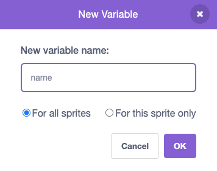

## Stage सेट करा

<div style="display: flex; flex-wrap: wrap">
<div style="flex-basis: 200px; flex-grow: 1; margin-right: 15px;">
या टप्प्यात, तुम्ही तुमच्या पहिल्या गिग साठी stage तयार कराल आणि रॉक स्टारचे नाव निवडाल.
</div>
<div>
{:width="300px"}
</div>
</div>

--- task ---

[ड्रम स्टार स्टार्टर प्रोजेक्ट](https://scratch.mit.edu/projects/535783147/editor){:target="_blank"} उघडा. Scratch दुसऱ्या ब्राऊजर टॅबमध्ये उघडेल.

--- /task ---

The drummer starts in a bedroom like a beginner!

--- task ---

**Choose a Backdrop** वर क्लिक करा आणि `bedroom` सर्च करा.

Select a bedroom and add it to your project. आम्ही `Bedroom 3` निवडली.


--- /task ---

Scratch मध्ये, तुम्ही Stage वर कोड जोडू शकता.

--- task ---

Stage pane मधून तुमच्या बेडरूम बॅकड्रॉप वर क्लिक करा आणि हा कोड जोडा:


```blocks3
when flag clicked
switch backdrop to (Bedroom 3 v) //your backdrop name
```

--- /task ---

प्रत्येक म्युझिशीयन्सने रॉक स्टारचे नाव निवडण्याची आवश्यकता आहे.

**व्हेरिएबल** हा संख्या आणि/किंवा टेक्स्ट स्टोअर करण्याचा मार्ग आहे. तुमचे रॉकस्टार नाव `variable`{:class="block3variables"} मध्ये स्टोअर केले जाईल त्यामुळे ते कोणत्याही वेळी वापरले जाऊ शकते.

--- task ---

`Variables`{:class="block3variables"} ब्लॉक्स मेनूमधून, **Make a Variable** बटनवर क्लिक करा.

तुमचे नवीन व्हेरिएबल `name` म्हणा:



**सूचना:** नवीन `name` व्हेरिएबल Stage वर दिसतो आणि तो आता `Variable`{:class="block3variables"} ब्लॉक्समध्ये वापरला जाऊ शकतो.

--- /task ---

--- task ---

प्रोजेक्टच्या सुरूवातीला, तुमचे रॉकस्टार नाव अज्ञात आहे.

`set name to`{:class="block3variables"} `???` ला ब्लॉक जोडा:


```blocks3
when flag clicked
switch backdrop to (Bedroom 3 v) //your backdrop name
+ set [name v] to [???] //your variable
```

--- /task ---

तुम्ही Scratch मध्ये प्रश्न `ask`{:class="block3sensing"} शकता, त्यानंतर `answer`{:class="block3sensing"} स्टोअर करण्यासाठी `variable`{:class="block3variables"} वापरू शकता.

--- task ---

`Sensing`{:class="block3sensing"} ब्लॉक्स मेनूवर क्लिक करा आणि तुमच्या कोडला `ask`{:class="block3sensing"} ब्लॉक जोडा:

```blocks3
when flag clicked
switch backdrop to (Bedroom 3 v) //your backdrop name
set [name v] to [???] //your variable
+ ask [What's your rock star name?] and wait //your question
```

--- /task ---

--- task ---

`answer`{:class="block3sensing"} ला `name`{:class="block3variables"} `variable`{:class="block3variables"} सेट करा:

```blocks3
when flag clicked
switch backdrop to (Bedroom 3 v) //your backdrop name
set [name v] to [???] //your variable
ask [What's your rock star name?] and wait //your question
+ set [name v] to (answer)
```

--- /task ---

--- task ---

Stage वरील `variable`{:class="block3variables"} वर राईट-क्लिक करा आणि **large readout** निवडा:


--- /task ---

--- task ---

Drag your `variable`{:class="block3variables"} to position it top-right of the Stage:


--- /task ---

--- task ---

**चाचणी:** `variable`{:class="block3variables"} हा `???` म्हणून चालू होतो याची खात्री करण्यासाठी तुमचा प्रोजेक्ट रन करा त्यानंतर तुमचे `answer`{:class="block3sensing"} अपडेट करा.

--- /task ---

You don't want to type an answer every time you test your project.

--- task ---

Drag the last two blocks of code away from the rest of the script.

```blocks3
when flag clicked
switch backdrop to (Bedroom 3 v) //your backdrop name
set [name v] to [???] //your variable
```

```blocks3
ask [What's your rock star name?] and wait //your question
set [name v] to (answer)
```

--- /task ---

--- save ---
