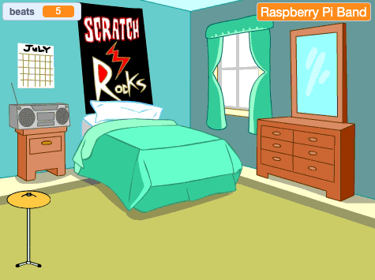

## स्टार्टर ड्रम

<div style="display: flex; flex-wrap: wrap">
<div style="flex-basis: 200px; flex-grow: 1; margin-right: 15px;">
**cymbal** स्प्राईट तुम्ही जोडाल जो तुम्ही बीट्स मिळवण्यासाठी आणि साऊंड प्ले करण्यासाठी क्लिक करू शकता.
</div>
<div>
{:width="300px"}
</div>
</div>

--- task ---

Click **Choose a Sprite** and search `cymbal`.


--- /task ---

--- task ---

Add the **Drum-cymbal** sprite and position it on the Stage:


--- /task ---

--- task ---

**Music extension** जोडा:

[[[generic-scratch3-add-music-extension]]]

--- /task ---

--- task ---

Cymbal `switch costume`{:class="block3looks"} आणि `play a drum sound`{:class="block3extensions"} तयार करण्यासाठी स्क्रिप्ट जोडा:


```blocks3
when this sprite clicked
switch costume to [drum-cymbal-b v] // hit costume
play drum [(5) Open High-Hat v] for [0.25] beats // drum sound
switch costume to [drum-cymbal-a v]  // not hit costume
```

--- /task ---

--- task ---

**चाचणी:** तुमच्या cymbal वर क्लिक त्याची तपासणी करा.

You should hear a sound and see the costume change.

--- /task ---

**Drum-cymbal** स्प्राईट तुम्हाला प्रत्येक वेळी तुम्ही क्लिक केल्यावर एक बीट मिळवून देईल.

--- task ---

Create a `variable`{:class="block3variables"} (for all sprites) called `beats`:


--- /task ---

--- task ---

**Drum-cymbal** स्प्राईट क्लिक केल्यावर `change beats by 1`{:class="block3variables"} मध्ये ब्लॉक जोडा:

```blocks3
when this sprite clicked
+change [beats v] by [1]
switch costume to [drum-cymbal-b v]
play drum [(5) Open High-Hat v] for [0.25] beats 
switch costume to [drum-cymbal-a v]
```

--- /task ---

--- task ---

**Test:** Test the **Drum-cymbal** by clicking on it.

You should see the `beats`{:class="block3variables"} increase.

--- /task ---

तुम्ही नवीन गेम चालू केल्यावर `beats`{:class="block3variables"} व्हेरिएबल `0` बीट्सला चालू व्हायला हवा.

--- task ---

Click on the Stage pane and then the **Code** tab.

`set beats to`{:class="block3variables"} `0` ला ब्लॉक जोडा:


```blocks3
when flag clicked
switch backdrop to (Bedroom 3 v) 
set [name v] to [???] 
+ set [beats v] to [0]
```
--- /task ---

--- task ---

**चाचणी:** हिरव्या झेंड्यावर क्लिक करा आणि तुमचा `beats`{:class="block3variables"} व्हेरिएबल`0` ला चालू होतो का याची खात्री करा.

--- /task ---

--- save ---
