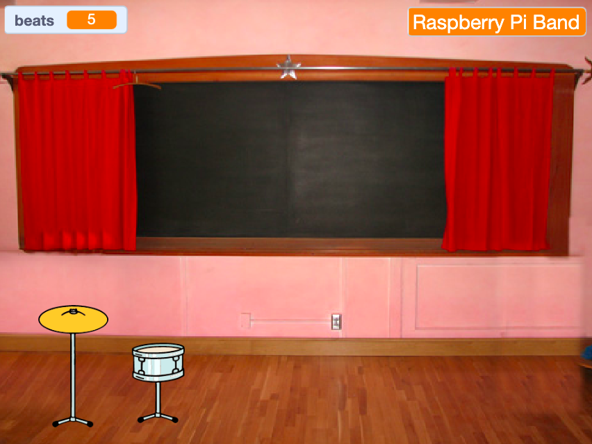

## प्रथम अपग्रेड

<div style="display: flex; flex-wrap: wrap">
<div style="flex-basis: 200px; flex-grow: 1; margin-right: 15px;">
तुम्ही तुमचे पहिले अपग्रेड जोडाल. **Get snare** बटन सुरूवातील दाखवेल, ज्यामुळे प्लेयरला माहिती असेल की ते कोणत्या ड्रमसाठी कार्य करत आहेत.
</div>
<div>
{:width="300px"}
</div>
</div>

--- task ---

तुमच्या प्रोजेक्टमध्ये **Drum-snare** स्प्राईट जोडा आणि तो Stage वर पोजिशन करा:


--- /task ---

--- task ---

`when this sprite clicked`{:class="block3events"} स्क्रिप्ट **Drum-cymbal** स्प्राईटमधून **Drum-snare** स्प्राईटला ड्रॅग करा.

[[[scratch3-copy-code]]]

--- /task ---

--- task ---

कॉश्चुम आणि ड्रम साऊंड बदला.

बीट्सची मिळवलेली संख्या `2` ला बदला:


```blocks3
when this sprite clicked
+change [beats v] by [2] //2 beats per click
+switch costume to [drum-snare-b v] //hit costume
+play drum [(1) Snare Drum v] for [0.25] beats //drum sound
+switch costume to [drum-snare-a v] //not hit costume
```

--- /task ---

--- task ---

**चाचणी:** तुमच्या प्रोजेक्टचा प्रयत्न करा. तुम्ही snare ड्रमवर क्लिक केल्यावर तुम्हाला 2 बीट्स मिळाल्याची खात्री करा.

--- /task ---

तुम्ही प्रोजेक्ट सुरू केल्यावर अपग्रेड्स उपलब्ध नाहीत. त्यांनी बीट्स मिळवायला हवे.

--- task ---

प्रोजेक्टच्या सुरूवातीला हा **drum** स्प्राईट लपवण्यासाठी स्क्रिप्ट जोडा:


```blocks3
when flag clicked
hide
```

--- /task ---

कोणता ड्रम पुढील अपग्रेड पर्याय आणि किती बीट्सला किंमत आहे हे बटन दाखवेल.

--- task ---

**Get** स्प्राईट **Duplicate** करा:


**Show** ला व्हिजीबिलीटी बदला आणि त्याचे नाव `Get snare` असे बदला. Stage च्या खालच्या उजव्या कोपऱ्यात त्याला पोजिशन करा:


--- /task ---

--- task ---

**Drum-snare** स्प्राईटवर क्लिक करा आणि **Costumes** टॅबवर क्लिक करा. तुमच्या ड्रमचा नॉट हिट कॉश्चुम हायलाईट करण्यासाठी **Select** (ऍरो) टूल वापरा. **Group** आयकॉनवर क्लिक करा त्यानंतर **Copy** आयकॉनवर क्लिक करा:


--- /task ---

--- task ---

तुमच्या **Get snare** स्प्राईटवर क्लिक करा आणि snare कॉश्चुम **Paste** करा. तुम्ही कदाचीत रीसाईज करण्याची आणि तुमचे बटन फिट करण्यासाठी ते पोजीशन करण्याची आवश्यकता असू शकते:


--- /task ---

--- task ---

**Code** टॅबवर क्लिक करा आणि प्रोजेक्टच्या सुरूवातीला **Get snare** स्प्राईट दाखवण्यासाठी स्क्रिप्ट जोडा:


```blocks3
when flag clicked
show
```

--- /task ---

यूजरकडे `10` किंवा अधिक बीट्स असल्यासच केवळ अपग्रेड खरेदी केले जाऊ शकते. [ड्रॅगनफ्लाय वाढवा](https://projects.raspberrypi.org/en/projects/grow-a-dragonfly){:target="_blank"} मध्ये, तुम्ही `if`{:class="block3control"} ब्लॉक्ससह निर्णय घेण्याबद्दल शिकलात.

`if ... else`{:class="block3control"} ब्लॉक निर्णय घेण्यासाठी वापरला जातो आणि स्थिती `बरोबर` किंवा `चूक` असल्यास वेगवेगळ्या गोष्टी केल्या जातील.

<p style="border-left: solid; border-width:10px; border-color: #0faeb0; background-color: aliceblue; padding: 10px;">
सर्ववेळी निर्णय घेण्यासाठी आपण <span style="color: #0faeb0">**if ... else**</span> वापरतो. तुम्ही उठता तेव्हा, तुम्ही तपासता `if`{:class="block3control"} सकाळ आहे का. तुम्ही उठता, किंवा `else`{:class="block3control"} तुम्ही परत झोपी जाता. तुम्ही घेतलेल्या कोणत्या `if ... else`{:class="block3control"} निर्णयाबद्दल तुम्ही विचार करू शकता का? 
</p>

--- task ---

Add this code to get the upgrade `if`{:class="block3control"} the player has enough beats, or `say`{:class="block3looks"} `More beats needed!` if they are not able to upgrade:


```blocks3
when this sprite clicked
if <(beats)>  [9]> then //if 10 or more beats
hide
change [beats v] by [-10] //take away the cost of upgrade
else
say [More beats needed!] for [2] seconds 
end
```

--- /task ---

Instead of only telling the player they need **more** beats, you can tell the player exactly **how many more** beats are needed to get the upgrade.

A `join`{:class="block3operators"} block is used to concatenate, or 'link' two values together.


--- task ---

Add this code to `join`{:class="block3operators"} the number of beats needed with the text you have used to tell the player they need more beats if they are not able to upgrade:

```blocks3
when this sprite clicked
if <(beats)>  [9]> then //if 10 or more beats
hide
change [beats v] by [-10] //take away the cost of upgrade
else
+ say (join ((10) - (beats)) [beats needed!]) for [2] seconds
end
```

--- /task ---

--- task ---

Add a `broadcast`{:class="block3events"} block to send a new `snare` message:


```blocks3
when this sprite clicked
if <(beats)>  [9]> then // if 10 or more beats
hide
change [beats v] by [-10] // take away the cost of upgrade
+ broadcast [snare v] // your drum name
else
say (join ((10) - (beats)) [beats needed!]) for [2] seconds
end
```

--- /task ---

--- task ---

Click on the **Drum-snare** sprite. Add this script:


```blocks3
when I receive [snare v]
show
```

--- /task ---

When you upgrade your equipment, you will be able to play at bigger venues.

--- task ---

Add another backdrop. We chose **Chalkboard** to play our second gig at school.

Add code to the Stage to `switch backdrop`{:class="block3looks"} when the upgrade message is received:


```blocks3
when I receive [snare v]
switch backdrop to [Chalkboard v]
```

**Tip:** Choose a venue that's a small step up from the bedroom. You want to save bigger venues for later.

--- /task ---

--- task ---

**Test:** Run your project. Try and buy the snare upgrade before you have enough beats.

When you buy the upgrade check: the snare appears, the button disappears, the venue changes and the `beats`{:class="block3variables"} go down by `10`.

--- /task ---

--- save ---
