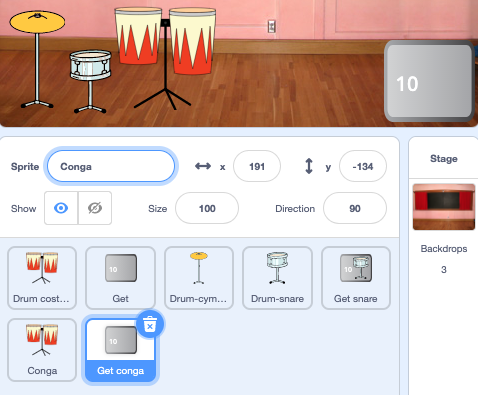

## दुसरे अपग्रेड

<div style="display: flex; flex-wrap: wrap">
<div style="flex-basis: 200px; flex-grow: 1; margin-right: 15px;">
तुमचे ड्रम कौशल्य सुधारत आहे. दुसऱ्या अपग्रेडसाठी वेळ! या टप्प्यात, तुम्ही कोणता ड्रम जोडायचा ते निवडाल.
</div>
<div>
{:width="300px"}
</div>
</div>

--- task ---

**Drum-snare** स्प्राईट डुप्लीकेट करा:


--- /task ---

**Drum Costumes** स्प्राईटला तुम्ही त्यातुन निवडू शकाल असे भरपूर ड्रम कॉश्चुम आहेत.

--- task ---

**Drum Costumes** स्प्राईटवर क्लिक करा आणि **Costumes** टॅब निवडा.

**निवडा:** पुढील अपग्रेडसाठी ड्रम. आम्ही **Conga** निवडले.

तुमच्या निवडलेल्या ड्रमच्या 'hit' आणि 'not hit' कॉश्चुमला तुमच्या नवीन **Drum-snare2** स्प्राईटला ड्रॅग करा:


--- /task ---

--- task ---

तुम्ही निवडलेले कॉश्चुम जुळवण्यासाठी तुमच्या ड्रमला नाव द्या.


--- /task ---

--- task ---

**Code** टॅबवर क्लिक करा. योग्य कॉश्चुम वापरण्यासाठी आणि तुमच्या नवीन ड्रमसाठी साऊंड निवडण्यासाठी कोड बदला.

नवीन ड्रमला `5` वर क्लिक करून तुम्ही मिळवलेल्या बीट्सची संख्या बदला:


```blocks3
when this sprite clicked
+change [beats v] by [5] //5 beats per click
+switch costume to [ v] //your hit costume
+play drum [ v] for [0.25] beats //your drum sound
+switch costume to [ v] //your not hit costume
```

--- /task ---

--- task ---

तुमचा नवीन ड्रम Stage वर पोजिशन करा:


--- /task ---

पुढे, तुम्हाला बटनची आवश्यकता आहे जेणेकरून प्लेयर्स या नवीन ड्रमला अपग्रेड करू शकतात.

--- task ---

**Get snare** स्प्राईटला डुप्लीकेट करा.

त्याला Stage च्या खालच्या उजव्या कोपऱ्यात पोजिशन करा. त्याचे नाव `Get` ला बदला आणि त्यानंतर तुमच्या नवीन ड्रमला नाव द्या:



--- /task ---

--- task ---

बटन कॉश्चुम मधून **snare drum** डिलीट करा. तुमच्या नवीन ड्रम ते बटन कॉश्चुमसाठी 'not hit' कॉश्चुम कॉपी आणि पेस्ट करा.

**Text** टूलवर क्लिक करा आणि नवीन ड्रमची किंमत दाखवण्यासाठी संख्या `30` ने बदला.

तुमचे बटन याप्रमाणे दिसायला हवे:


--- /task ---


हे बटन सुरूवातीला `hide`{:class="block3looks"} करायला हवे, त्यानंतर प्लेयर snare ड्रम केव्हा अपड्रेट करतो ते `show`{:class="block3looks"} हवे, त्यामुळे त्यांना कोणत्या ड्रमवर ते कार्य करत आहे हे त्यांना समजेल.

--- task ---


```blocks3
when flag clicked
- show
+ hide
```

**टीप:** ब्लॉक डिलीट करण्यासाठी, तो Blocks menu मध्ये ड्रॅग करा, राईट क्लिक करून **Delete Block** निवडा. कंप्युटरवर, तुम्ही ब्लॉकवर सुद्धा क्लिक करू शकता आणि त्यानंतर ब्लॉक काढण्यासाठी <kbd>Delete</kbd> वर टॅप करू शकता.

--- /task ---

--- task ---

Add a `when I receive`{:class="block3events"} script that your new drum button will show as the next upgrade when the player gets the **Drum-snare** drum:


```blocks3
when I receive [snare v] // appear when previous drum is bought
show // show button for next available drum
```

--- /task ---

--- task ---

प्लेयरला हा ड्रम मिळाल्यावर हा ड्रम खरेदी करण्यास आवश्यक असलेल्या बीट्सची आणि काढलेल्या बीट्सची संख्या बदला.

प्लेयरला नवीन ड्रम मिळाल्यावर `broadcast`{:class="block3events"} हा मेसेज सुद्धा बदला. तुमच्या नवीन ड्रमच्या नावासह नवीन मेसेज तयार करा:


```blocks3
when this sprite clicked
if <(beats)>  [29]> then // change to 29
hide
change [beats v] by [-30] // change to 30
broadcast [conga v] // change to your drum name
else
say (join ((30) - (beats)) [beats needed!]) for [2] seconds
end
```

--- /task ---

--- task ---

तुमच्या नवीन ड्रमचे नाव `when I receive snare`{:class="block3events"} स्क्रिप्ट ते `broadcast`{:class="block3events"} बदला. प्लेयर नवीन ड्रम अपग्रेड करतो तेव्हा ड्रम `show`{:class="block3looks"} करेल:


```blocks3
when I receive [conga v] // change to your drum name
show
```

--- /task ---

--- task ---

**Party** बॅकड्रॉप जोडा.

प्लेयर नवीन ड्रमला अपग्रेड करतांना बॅकड्रॉप बदलण्यासाठी Stage ला स्क्रिप्ट जोडा:


```blocks3
when I receive [conga v] // change to your drum name
switch backdrop to (Party v)
```

--- /task ---

--- task ---

**चाचणी:** गेम चालू करण्यासाठी हिरव्या झेंड्यावर क्लिक करा आणि तुमचा नवीन ड्रम मिळवण्यासाठी तुम्ही पुरेसे बीट्स मिळवलेत का ते तपासा.

तुम्ही पुरेसे बीट्स मिळवण्याआधी तुम्ही बटनवर क्लिक केल्यास काय घडते?

--- /task ---

--- save ---
