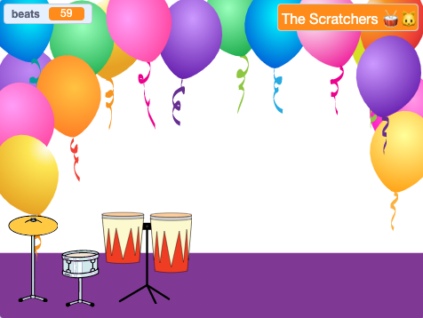

## खेळा आणि कस्टमाइज करा

तुमचा गेम तुम्हाला हवा तसा काम करण्याची वेळ आली आहे.

{:width="300px"}

--- task ---

तुमचा गेम खेळा आणि बीट्स मिळवा.

`beats`{:class="block3variables"} व्हेरिएबल बदल पहा आणि तुम्ही ड्रमवर क्लिक करता तेव्हा बीट्स कसे वाढतात आणि नवीन ड्रम मिळाल्यावर कमी कसे होतात हे तुम्हाला समजते आहे याची खात्री करा.

प्रत्येक ड्रमसाठी तुम्ही किती बीट्स मिळवता याबद्दल तुम्ही आनंदी आहात का? तुम्हाला आवडल्यास तुम्ही ते बदलू शकता.

नवीन ड्रम मिळवण्यासाठी किती बीट्स मिळवता याबद्दल तुम्ही आनंदी आहात का?

**टीप:** तुमचा प्रोजेक्ट नियमीतपणे तपासा जेणेकरून काही त्रुटी असल्यास त्या आढळतील आणि तुम्ही त्या ठीक करू शकाल.

--- /task ---

--- task ---

तुम्ही Stage वर `ask`{:class="block3sensing"} ब्लॉक वेगळा केल्यास, तो परत ठेवा आणि तुमचे रॉक स्टार नाव सेट करा.

Stage वर दाखवलेले नाव बदलते हे लक्षात घ्या.

--- /task ---

--- save ---
