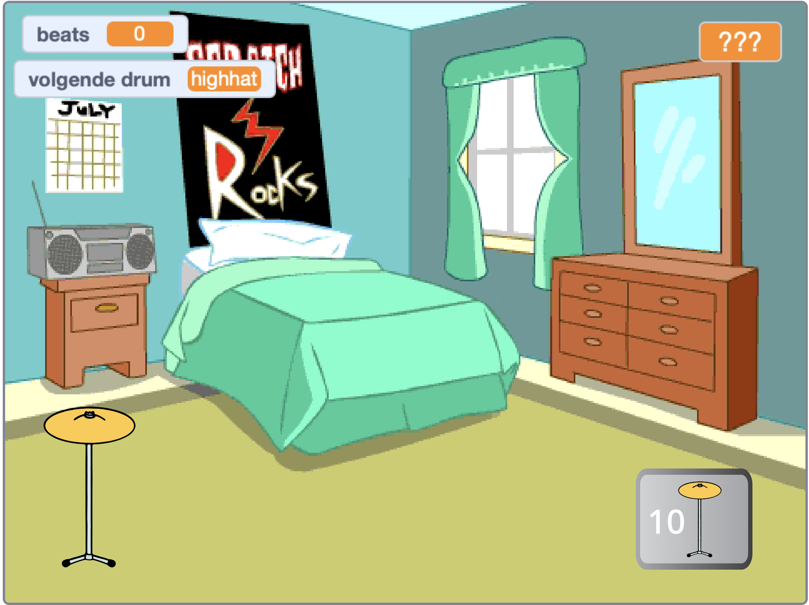

## Inleiding

Maak een clicker spel waar je beats verdient om nieuwe drums op grotere locaties te spelen.

Je gaat:
+ Gebruik `variabelen`{:class="block3variables"} om getallen en tekst (woorden) op te slaan en te wijzigen
+ `stel`{:class="block3sensing"} een vraag en gebruik het `antwoord`{:class="block3sensing"} om het spel aan te passen
+ Gebruik `als...dan`{:class="block3control"} blokken om beslissingen te nemen

Er zijn veel **clicker games** waar je moet klikken om vooruitgang te boeken en upgrades kopen die je helpen sneller te gaan. Heb je ooit een clicker-spel gespeeld? Er zijn ook **idle games** die doorgaan, zelfs als je ze niet speelt. Deze games zijn leuk zolang je niet te veel tijd aan het spelen ervan besteedt!

--- no-print --- --- task ---

### Probeer het uit

  
Klik op de trommel en kijk hoe het aantal 'slagen'{:class="block3variables"} omhoog gaat. Pak een nieuwe trommel als je genoeg beats hebt. 

Hoeveel 'beats'{:class="block3variables"} verdien je als je op de nieuwe drum klikt?

  <iframe allowtransparency="true" width="485" height="402" src="https://scratch.mit.edu/projects/embed/522323676/?autostart=false" frameborder="0"></iframe>

--- /task --- --- /no-print ---

--- print-only ---

--- /print-only ---
