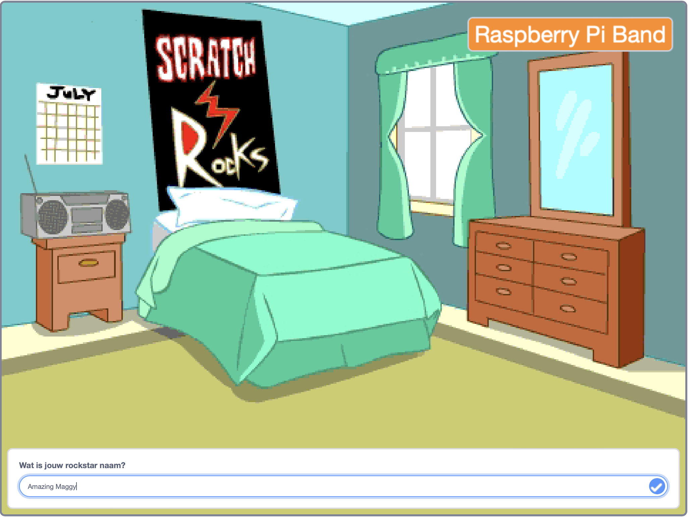
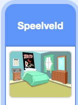
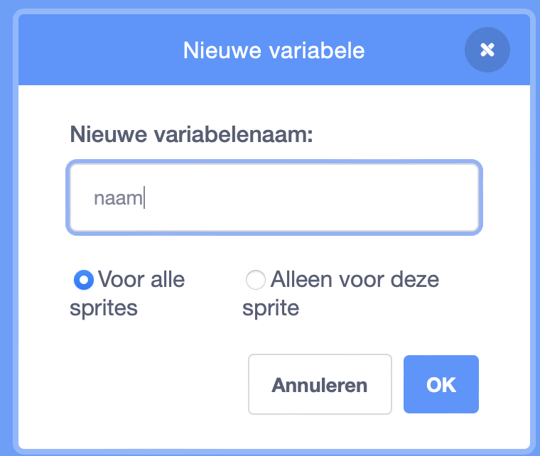
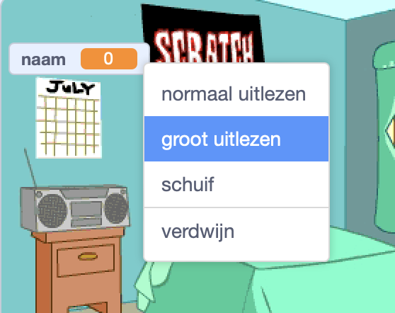

## Maak het speelveld

<div style="display: flex; flex-wrap: wrap">
<div style="flex-basis: 200px; flex-grow: 1; margin-right: 15px;">
In deze stap zet je het podium voor je eerste optreden en kies je een naam voor je rockster.
</div>
<div>
{:width="300px"}
</div>
</div>

--- task ---

Open het [Drum star starter project](https://scratch.mit.edu/projects/535783147/editor){:target="_blank"}. Scratch wordt in een nieuw browsertabblad geopend.

--- /task ---

The drummer starts in a bedroom like a beginner!

--- task ---

Klik op **Kies een achtergrond** en zoek naar `slaapkamer`.

Select a bedroom and add it to your project. We kozen `Slaapkamer 3`.


--- /task ---

In Scratch kun je code toevoegen aan het speelveld.

--- task ---

Klik op de achtergrond van je slaapkamer in het deelvenster Speelveld en voeg deze code toe:



```blocks3
when flag clicked
switch backdrop to (Bedroom 3 v) //your backdrop name
```

--- /task ---

Elke muzikant moet een rockster naam kiezen.

Een **variabele** is een manier om getallen en/of tekst op te slaan. Je rockstar-naam wordt opgeslagen in een `variabele`{:class="block3variables"} zodat deze op elk gewenst moment kan worden gebruikt.

--- task ---

Klik op het `Variabelen`{:class="block3variables"} blokkenmenu en selecteer de **Maak een variabele** knop.

Noem je nieuwe variabele `naam`:



**Opmerking:** de nieuwe `naam` variabele verschijnt op het speelveld en kan nu worden gebruikt in de `variabele`{:class="block3variables"} blokken.

--- /task ---

--- task ---

Aan het begin van het project is de naam van je rockster onbekend.

Voeg een blok toe aan `Stel naam in op`{:class="block3variables"} `???`:


```blocks3
when flag clicked
switch backdrop to (Bedroom 3 v) //your backdrop name
+ set [name v] to [???] //your variable
```

--- /task ---

Je kunt `een vraag stellen`{:class="block3sensing"} in Scratch en vervolgens een `variabele`{:class="block3variables"} gebruiken om het `antwoord`{:class="block3sensing"} op te slaan.

--- task ---

Klik op het blokken menu `Waarnemen`{:class="block3sensing"} en voeg een `Vraag`{:class="block3sensing"} blok toe aan je code:

```blocks3
when flag clicked
switch backdrop to (Bedroom 3 v) //your backdrop name
set [name v] to [???] //your variable
+ ask [What's your rock star name?] and wait //your question
```

--- /task ---

--- task ---

Stel de `naam`{:class="block3variables"} `variabele`{:class="block3variables"} in op het `antwoord`{:class="block3sensing"}:

```blocks3
when flag clicked
switch backdrop to (Bedroom 3 v) //your backdrop name
set [name v] to [???] //your variable
ask [What's your rock star name?] and wait //your question
+ set [name v] to (answer)
```

--- /task ---

--- task ---

Klik met de rechtermuisknop op de `variabele`{:class="block3variables"} op het podium en kies **groot uitlezen**:



--- /task ---

--- task ---

Drag your `variable`{:class="block3variables"} to position it top-right of the Stage:


--- /task ---

--- task ---

**Test:** Voer je project uit om ervoor te zorgen dat de `variabele`{:class="block3variables"} begint als `???` en vervolgens wordt bijgewerkt naar je `antwoord`{:class="block3sensing"}.

--- /task ---

You don't want to type an answer every time you test your project.

--- task ---

Drag the last two blocks of code away from the rest of the script.

```blocks3
when flag clicked
switch backdrop to (Bedroom 3 v) //your backdrop name
set [name v] to [???] //your variable
```

```blocks3
ask [What's your rock star name?] and wait //your question
set [name v] to (answer)
```

--- /task ---

--- save ---
