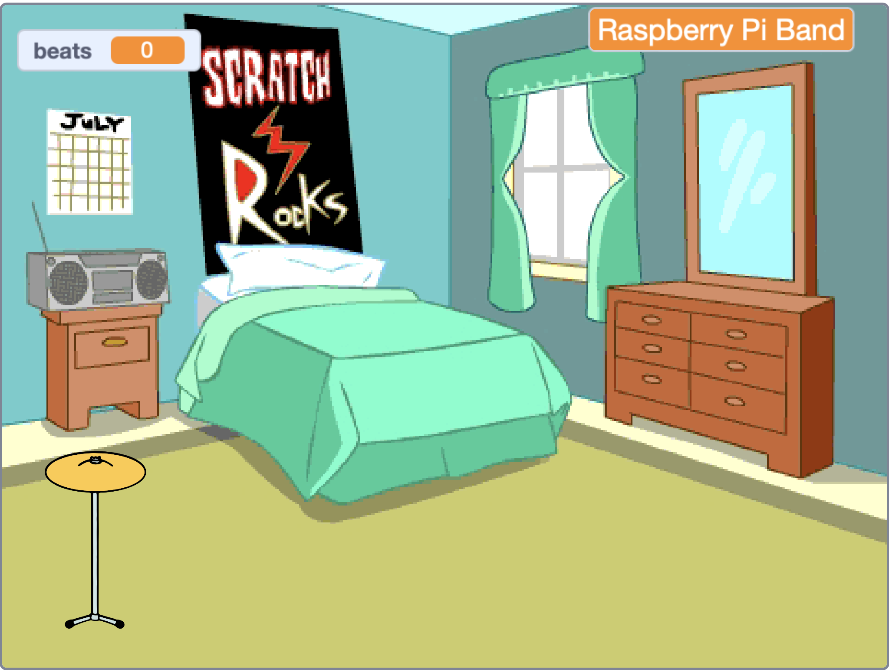
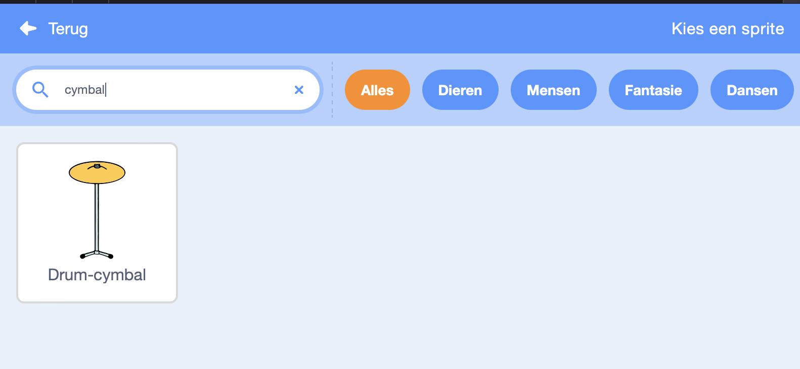
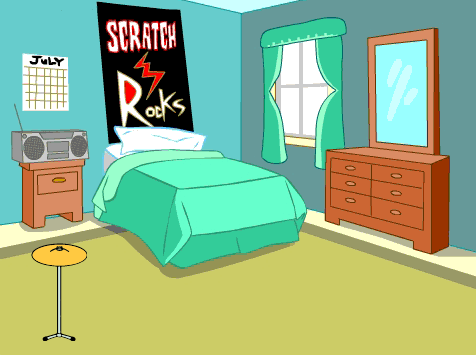

## Starttrommel

<div style="display: flex; flex-wrap: wrap">
<div style="flex-basis: 200px; flex-grow: 1; margin-right: 15px;">
Je voegt een **cymbal** sprite toe waarop je kunt klikken om beats te verdienen en een geluid te spelen.
</div>
<div>
{:width="300px"}
</div>
</div>

--- task ---

Klik op **Kies een Sprite** en zoek `cymbal`. Voeg de sprite **Drum-cymbal** toe aan je project.



--- /task ---

--- task ---

Plaats je cymbaal op het speelveld:



--- /task ---

--- task ---

Voeg de **Muziek-extensie** toe:

[[[generic-scratch3-add-music-extension]]]

--- /task ---

--- task ---

Voeg een script toe om het cymbal een `ander uiterlijk`{:class="block3looks"} te geven en `speel een trommelgeluid`{:class="block3extensions"}:


```blocks3
when this sprite clicked
switch costume to [drum-cymbal-b v] // raak uiterlijk
play drum [(5) Open High-Hat v] for [0.25] beats // drumgeluid
switch costume to [drum-cymbal-a v]  // niet geraakt uiterlijk
```

--- /task ---

--- task ---

**Test:** Test je bekkens door erop te klikken. Zorg ervoor dat je een geluid hoort en het uiterlijk ziet veranderen.

--- /task ---

Iedere keer dat je klikt op de **drum-cymbal** sprite verdien je één slag.

--- task ---

Maak een `variabele`{:class="block3variables"} met de naam `beats`:


--- /task ---

--- task ---

Voeg een blok toe aan `verander beats met 1`{:class="block3variables"} wanneer op de **Drum-cymbal** sprite wordt geklikt:


```blocks3
when this sprite clicked
+change [beats v] by [1]
switch costume to [drum-cymbal-b v]
play drum [(5) Open High-Hat v] for [0.25] beats 
switch costume to [drum-cymbal-a v]
```

--- /task ---

--- task ---

**Test:** Test de **Drum-cymbal** door erop te klikken en de `slagen`{:class="block3variables"} te zien toenemen.

--- /task ---

De `slagen`{:class="block3variables"} variabele moet beginnen bij `0` slagen wanneer je een nieuw spel start.

--- task ---

Klik op het venster Speelveld en vervolgens op het tabblad **Code** om code toe te voegen aan het speelveld.

Voeg een blok toe aan `zet slagen op`{:class="block3variables"} `0`:


```blocks3
when flag clicked
switch backdrop to (Bedroom 3 v) 
set [naam v] to [???] 
+ set [beats v] to [0]
```
--- /task ---

--- task ---

**Test:** Klik op de groene vlag en zorg ervoor dat je `slagen`{:class="block3variables"} variabele begint op `0`.

--- /task ---

--- save ---
