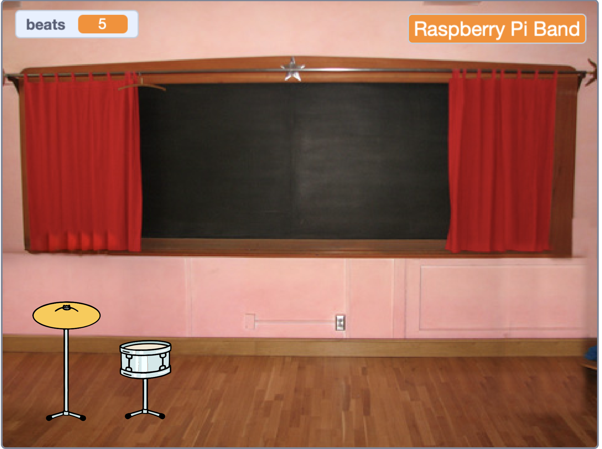
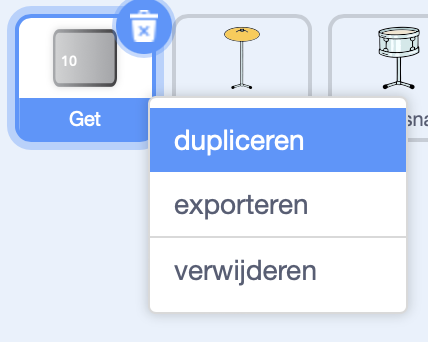
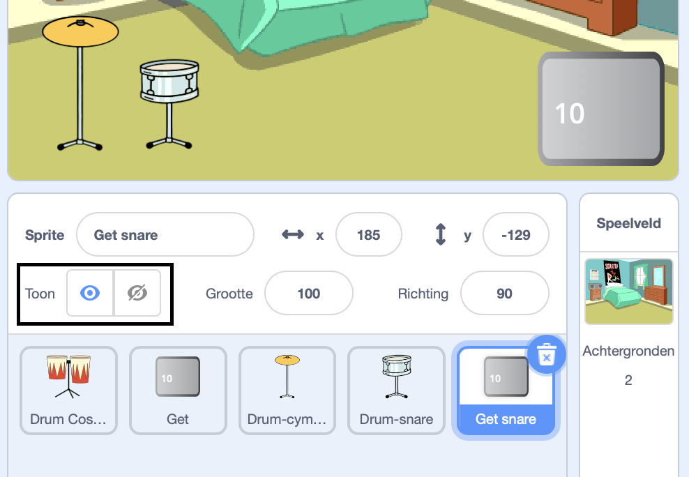
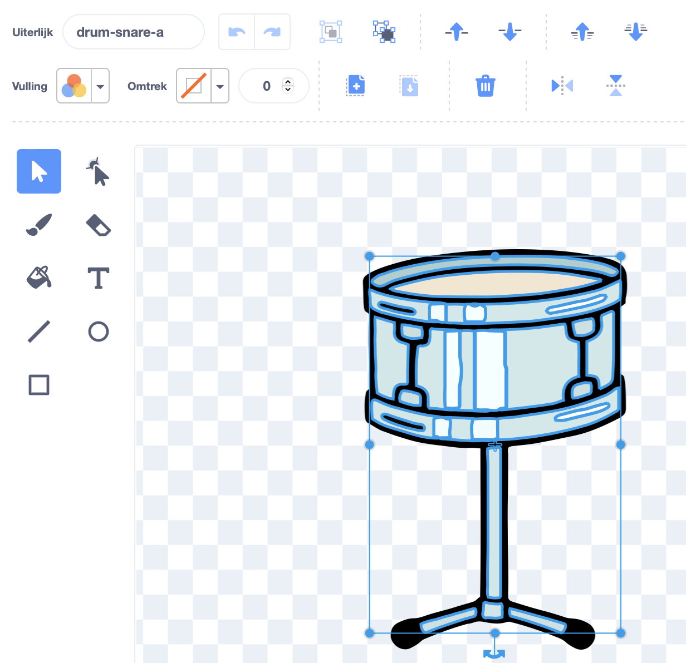
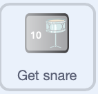
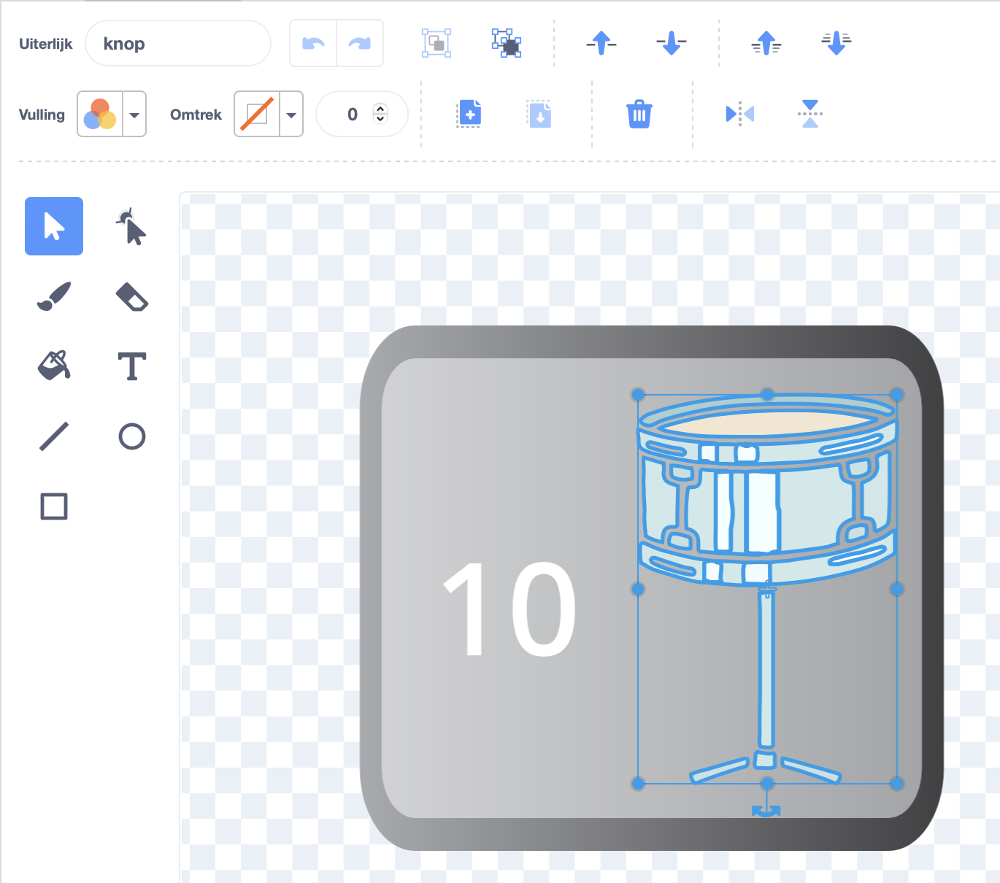
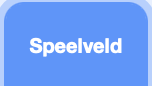

## Eerste uitbreiding

<div style="display: flex; flex-wrap: wrap">
<div style="flex-basis: 200px; flex-grow: 1; margin-right: 15px;">
Je voegt je eerste uitbreiding toe. De **Get snare** knop zal aan het begin getoond worden, zodat de speler weet naar welke trommel ze werken.
</div>
<div>
{:width="300px"}
</div>
</div>

--- task ---

Voeg de **Drum-snare** sprite toe aan je project en plaats deze op het speelveld:


--- /task ---

--- task ---

Sleep het `wanneer deze sprite klikt`{:class="block3events"} script van de **Drum-cymbal** sprite naar de **Drum-snare** sprite.

[[[scratch3-copy-code]]]

--- /task ---

--- task ---

Verander de uiterlijken en het trommelgeluid.

Wijzig het aantal slagen dat wordt verdiend in `2`:


```blocks3
when this sprite clicked
+change [beats v] by [2] //2 beats per click
+switch costume to [drum-snare-b v] //hit costume
+play drum [(1) Snare Drum v] for [0.25] beats //drum sound
+switch costume to [drum-snare-a v] //not hit costume
```

--- /task ---

--- task ---

**Test:** Probeer je project uit. Zorg ervoor dat je 2 slagen verdient wanneer je op de snare drum klikt.

--- /task ---

Uitbreidingen zijn niet beschikbaar wanneer je het project start. Ze moeten worden verdiend met beats.

--- task ---

Voeg een script toe om deze **drum** sprite aan het begin van het project te verbergen:


```blocks3
when flag clicked
hide
```

--- /task ---

Een knop laat zien welke drum de volgende upgrade-optie is en hoeveel slagen het zal kosten.

--- task ---

**Dupliceer** de **Get** sprite:



Wijzig de zichtbaarheid in **Toon** en wijzig de naam in `Get snare`. Plaats het in de rechterbenedenhoek van het speelveld:



--- /task ---

--- task ---

Klik op de **Drum-snare** sprite en ga naar het tabblad **Uiterlijken**. Gebruik de **Selecteren** (pijl) tool om het niet geraakt uiterlijk van je drum te markeren. Klik op het pictogram **Groeperen** en vervolgens op het pictogram **Kopiëren**:




--- /task ---

--- task ---

Klik op je **Get snare** sprite en **Plak** het snare uiterlijk. Mogelijk moet je de grootte en de positie aanpassen zodat het op je knop past:





--- /task ---

--- task ---

Klik op het tabblad **Code** en voeg een script toe om de **Get snare** sprite aan het begin van het project weer te geven:


```blocks3
when flag clicked
show
```

--- /task ---

De upgrade kan alleen worden gekocht als de gebruiker `10` of meer slagen heeft. In [Laat een libel groeien](https://projects.raspberrypi.org/en/projects/grow-a-dragonfly){:target="_blank"} heb je geleerd over het nemen van beslissingen met `als`{:class="block3control"} blokken.

Een `als ... dan`{:class="block3control"} blok wordt gebruikt om een beslissing te nemen en zal verschillende dingen doen als een voorwaarde `waar` of `onwaar` is.

<p style="border-left: solid; border-width:10px; border-color: #0faeb0; background-color: aliceblue; padding: 10px;">
We gebruiken <span style="color: #0faeb0">**als ... dan**</span> de hele tijd om beslissingen te nemen. Wanneer je wakker wordt, vink je 'als'{:class="block3control"} het is ochtend aan. Je staat op, of 'anders'{:class="block3control"} je gaat terug naar de slaap. Kun je denken aan een andere 'als ... anders'{:class="block3control"} beslissing die je neemt? 
</p>

--- task ---

Add this code to get the upgrade `if`{:class="block3control"} the player has enough beats, or `say`{:class="block3looks"} `More beats needed!` if they are not able to upgrade:


```blocks3
when this sprite clicked
if <(beats)>  [9]> then //if 10 or more beats
hide
change [beats v] by [-10] //take away the cost of upgrade
else
say [More beats needed!] for [2] seconds 
end
```

--- /task ---

Instead of only telling the player they need **more** beats, you can tell the player exactly **how many more** beats are needed to get the upgrade.

A `join`{:class="block3operators"} block is used to concatenate, or 'link' two values together.


--- task ---

Add this code to `join`{:class="block3operators"} the number of beats needed with the text you have used to tell the player they need more beats if they are not able to upgrade:

```blocks3
when this sprite clicked
if <(beats)>  [9]> then //if 10 or more beats
hide
change [beats v] by [-10] //take away the cost of upgrade
else
+ say (join ((10) - (beats)) [beats needed!]) for [2] seconds
end
```

--- /task ---

--- task ---

Add a `broadcast`{:class="block3events"} block to send a new `snare` message:


```blocks3
when this sprite clicked
if <(beats)>  [9]> then // if 10 or more beats
hide
change [beats v] by [-10] // take away the cost of upgrade
+ broadcast [snare v] // your drum name
else
say (join ((10) - (beats)) [beats needed!]) for [2] seconds
end
```

--- /task ---

--- task ---

Click on the **Drum-snare** sprite. Add this script:


```blocks3
when I receive [snare v]
show
```

--- /task ---

When you upgrade your equipment, you will be able to play at bigger venues.

--- task ---

Add another backdrop. We chose **Chalkboard** to play our second gig at school.

Add code to the Stage to `switch backdrop`{:class="block3looks"} when the upgrade message is received:



```blocks3
when I receive [snare v]
switch backdrop to [Chalkboard v]
```

**Tip:** Choose a venue that's a small step up from the bedroom. You want to save bigger venues for later.

--- /task ---

--- task ---

**Test:** Run your project. Try and buy the snare upgrade before you have enough beats.

When you buy the upgrade check: the snare appears, the button disappears, the venue changes and the `beats`{:class="block3variables"} go down by `10`.

--- /task ---

--- save ---
