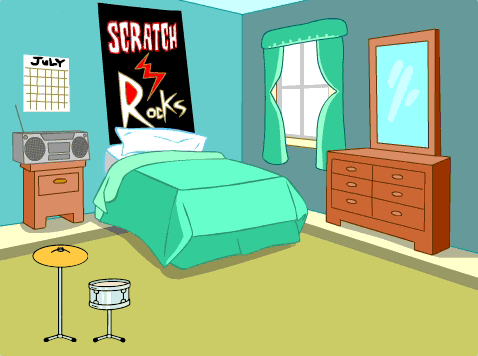
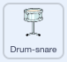
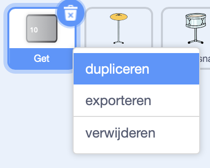
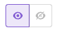
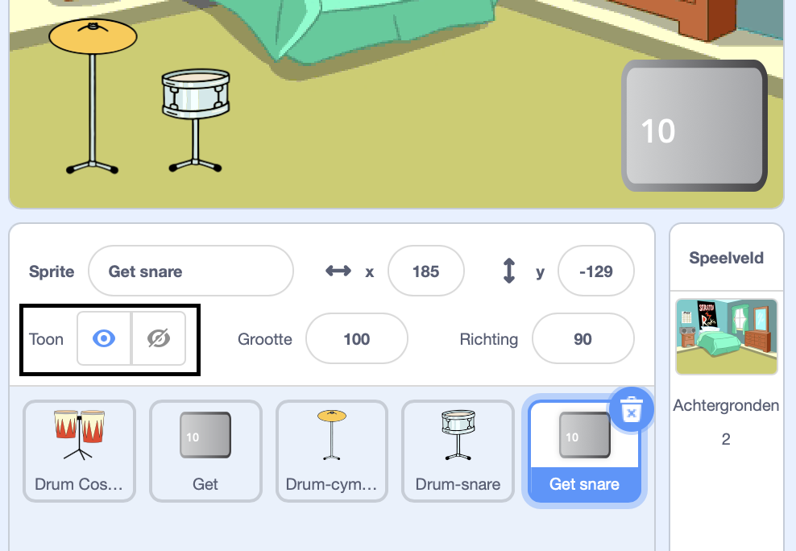
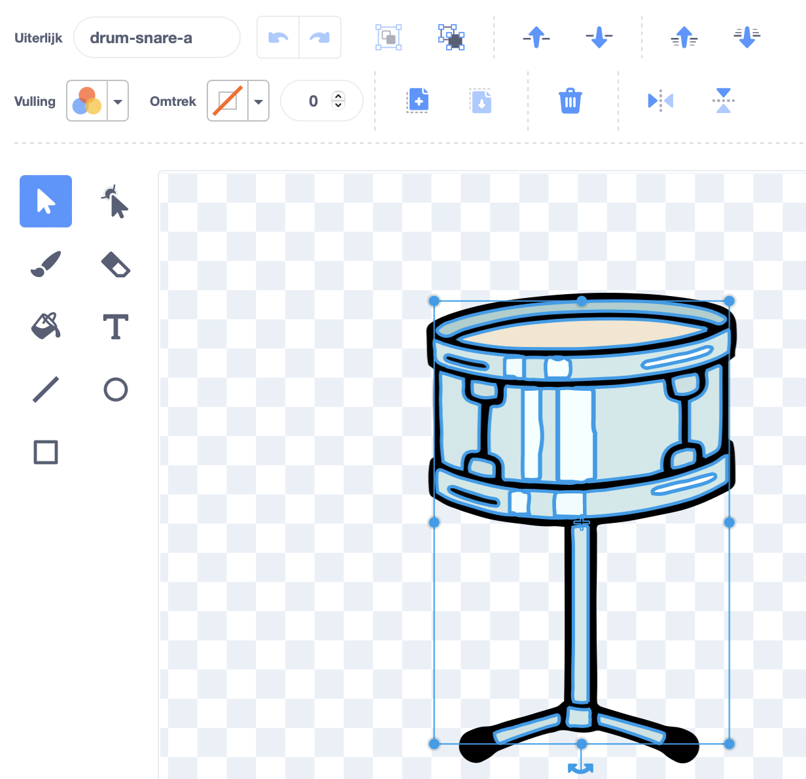
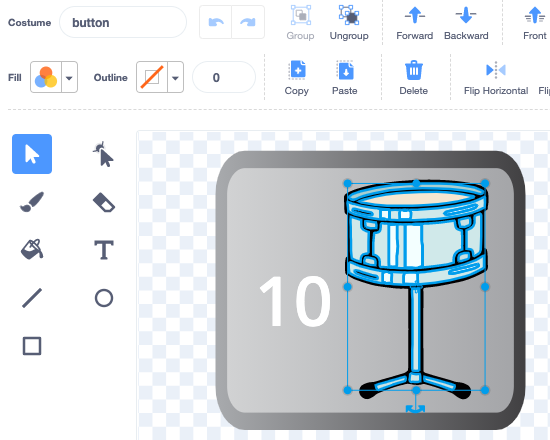
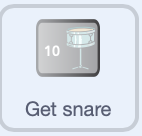

## Volgende trommel

--- task ---

Voeg de **Drum-snare** sprite toe aan je project en plaats deze op het speelveld:



--- /task ---

--- task ---

Sleep het `wanneer deze sprite klikt`{:class="block3events"} script van de **Drum-cymbal** sprite naar de **Drum-snare** sprite.

--- /task ---

--- task ---

Verander het uiterlijk en het drumgeluid voor de **Drum-snare** sprite.



```blocks3
when this sprite clicked
+switch costume to [drum-snare-b v] //hit costume
+play drum [(1) Snare Drum v] for [0.25] beats //drum sound
+switch costume to [drum-snare-a v] //not hit costume
```

--- /task ---

--- task ---

Wijzig het aantal beats dat wordt verdiend in `2`:

```blocks3
when this sprite clicked
+change [beats v] by [2] //2 beats per click
switch costume to [drum-snare-b v] //hit costume
play drum [(1) Snare Drum v] for [0.25] beats //drum sound
switch costume to [drum-snare-a v] //not hit costume
```

--- /task ---

--- task ---

**Test:** Probeer je project uit.

Zorg ervoor dat je 2 beats verdient wanneer je op de snare drum klikt.

--- /task ---

De volgende drum is niet beschikbaar wanneer je het project start. Ze moeten worden verdiend met slagen.

--- task ---

Voeg een script toe aan de **Drum-snare** sprite om deze aan het begin van het project te verbergen:

```blocks3
when flag clicked
hide
```

--- /task ---

Voeg een knop toe om te laten zien welke drum de volgende is en hoeveel beats die kost.

--- task ---

**Dupliceer** de **Get** sprite:



--- /task ---

--- task ---

Wijzig de zichtbaarheid naar **Toon**. 

--- /task ---

--- task ---

Wijzig de naam naar `Krijg snare`.

--- /task ---

--- task ---

Plaats het in de rechterbenedenhoek van het speelveld:



--- /task ---

--- task ---

Klik op de **Drum-snare** sprite en ga naar het tabblad **Uiterlijken**.


Gebruik de **Selecteren** (pijl) tool om het 'niet geraakt' uiterlijk van je drum te markeren. Klik op het pictogram **Groeperen** en vervolgens op het pictogram **Kopiëren**:



--- /task ---

--- task ---

Klik op je **Get snare** sprite en **Plak** het snare uiterlijk. Mogelijk moet je de grootte en de positie aanpassen zodat het op je knop past:



--- /task ---

--- task ---

Klik op het tabblad **Code** en voeg een script toe om de **Get snare** sprite aan het begin van het project weer te geven:



```blocks3
when flag clicked
show
```

--- /task ---

De volgende trommel kan alleen worden ontgrendeld als de gebruiker `10` of meer beats heeft.

--- task ---

Voeg deze code toe om de volgende drum te ontgrendelen `als`{:class="block3control"} de speler genoeg slagen heeft, of `zeg`{:class="block3looks"} `Meer slagen nodig!` als ze er niet genoeg hebben:

```blocks3
when this sprite clicked
if <(beats)>  [9]> then //if 10 or more beats
hide
change [beats v] by [-10] //take away the cost of upgrade
else
say [More beats needed!] for [2] seconds 
end
```

--- /task ---

--- task ---

Voeg een `zend signaal`{:class="block3events"} blok toe om een nieuw `snare` bericht te verzenden:

```blocks3
when this sprite clicked
if <(beats)>  [9]> then // if 10 or more beats
hide
change [beats v] by [-10] // take away the cost of upgrade
+ broadcast (snare v) // your drum name
else
say [More beats needed!] for [2] seconds
end
```

--- /task ---

--- task ---

Klik op de **Drum-snare** sprite.


Voeg dit script toe:

```blocks3
when I receive [snare v]
show
```

--- /task ---

--- task ---

**Test:** Voer je project uit.

Je zou de volgende drum niet moeten kunnen ontgrendelen voordat je genoeg beats hebt.

--- /task ---

Als je nieuwe drums ontgrendelt, kun je in grotere zalen spelen!

--- task ---

Voeg nog een achtergrond toe. We kozen **Chalkboard** om ons tweede optreden op school te spelen.

**Tip:** Kies een locatie die een kleine verbetering is ten opzichte van de slaapkamer. Je wilt grotere locaties bewaren voor later.

--- /task ---

--- task ---

Klik op het speelveld.


Voeg code toe aan het speelveld om `de achtergrond te veranderen`{:class="block3looks"} wanneer het upgradebericht wordt ontvangen:

```blocks3
when I receive [snare v]
switch backdrop to [Chalkboard v]
```

--- /task ---

--- task ---

**Test:** Voer je project uit.

Wanneer je de volgende drum ontgrendelt: de snare verschijnt, de knop verdwijnt, de locatie verandert en de `slagen`{:class="block3variables"} gaan met `10`omlaag.

--- /task ---

--- save ---
