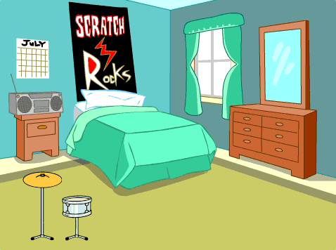

## Eerste uitbreiding

<div style="display: flex; flex-wrap: wrap">
<div style="flex-basis: 200px; flex-grow: 1; margin-right: 15px;">
Je voegt je eerste uitbreiding toe. De **Get snare** knop zal aan het begin getoond worden, zodat de speler weet naar welke trommel ze werken.
</div>
<div>
{:width="300px"}
</div>
</div>

--- task ---

Voeg de **Drum-snare** sprite toe aan je project en plaats deze op het speelveld:



--- /task ---

--- task ---

Sleep het `wanneer deze sprite klikt`{:class="block3events"} script van de **Drum-cymbal** sprite naar de **Drum-snare** sprite.

[[[scratch3-copy-code]]]

--- /task ---

--- task ---

Verander de uiterlijken en het trommelgeluid.

Wijzig het aantal slagen dat wordt verdiend in `2`:


```blocks3
when this sprite clicked
+change [beats v] by [2] //2 beats per klik
+switch costume to [drum-snare-b v] //raak uiterlijk
+play drum [(1) Snare Drum v] for [0.25] beats //drumgeluid
+switch costume to [drum-snare-a v] //niet geraakt uiterlijk
```

--- /task ---

--- task ---

**Test:** Probeer je project uit. Zorg ervoor dat je 2 slagen verdient wanneer je op de snare drum klikt.

--- /task ---

Uitbreidingen zijn niet beschikbaar wanneer je het project start. Ze moeten worden verdiend met beats.

--- task ---

Voeg een script toe om deze **drum** sprite aan het begin van het project te verbergen:


```blocks3
when flag clicked
hide
```

--- /task ---

Een knop laat zien welke drum de volgende upgrade-optie is en hoeveel slagen het zal kosten.

--- task ---

**Dupliceer** de **Get** sprite:


Wijzig de zichtbaarheid in **Toon** en wijzig de naam in `Get snare`. Plaats het in de rechterbenedenhoek van het speelveld:


--- /task ---

--- task ---

Klik op de **Drum-snare** sprite en ga naar het tabblad **Uiterlijken**. Gebruik de **Selecteren** (pijl) tool om het niet geraakt uiterlijk van je drum te markeren. Klik op het pictogram **Groeperen** en vervolgens op het pictogram **Kopiëren**:


--- /task ---

--- task ---

Klik op je **Get snare** sprite en **Plak** het snare uiterlijk. Mogelijk moet je de grootte en de positie aanpassen zodat het op je knop past:


--- /task ---

--- task ---

Klik op het tabblad **Code** en voeg een script toe om de **Get snare** sprite aan het begin van het project weer te geven:


```blocks3
when flag clicked
show
```

--- /task ---

De upgrade kan alleen worden gekocht als de gebruiker `10` of meer slagen heeft. In [Laat een libel groeien](https://projects.raspberrypi.org/nl-NL/projects/grow-a-dragonfly){:target="_blank"} heb je geleerd over het nemen van beslissingen met `als`{:class="block3control"} blokken.

Een `als ... dan`{:class="block3control"} blok wordt gebruikt om een beslissing te nemen en zal verschillende dingen doen als een voorwaarde `waar` of `onwaar` is.

<p style="border-left: solid; border-width:10px; border-color: #0faeb0; background-color: aliceblue; padding: 10px;">
We gebruiken <span style="color: #0faeb0">**als ... dan**</span> de hele tijd om beslissingen te nemen. Wanneer je wakker wordt, vink je 'als'{:class="block3control"} het is ochtend aan. Je staat op, of 'anders'{:class="block3control"} je gaat terug naar de slaap. Kun je denken aan een andere 'als ... anders'{:class="block3control"} beslissing die je neemt? 
</p>

--- task ---

Voeg deze code toe om de upgrade te krijgen `als`{:class="block3control"} de speler genoeg beats heeft, of `zeg`{:class="block3looks"} `niet genoeg beats!` als ze niet in staat zijn om te upgraden:


```blocks3
when this sprite clicked
if <(beats)>  [9]> then //als 10 of meer beats
hide
change [beats v] by [-10] //neem de kostenupgrade weg
else
say [Niet genoeg beats!] for [2] seconds 
end
```

--- /task ---

Laat andere sprites en het Speelveld weten dat de snare-upgrade is gekocht.

--- task ---

Voeg een `zend signaal`{:class="block3events"} blok toe om een nieuw `snare` bericht te verzenden:


```blocks3
when this sprite clicked
if <(beats)>  [9]> then // als 10 of meer beats
hide
change [beats v] by [-10] // neem de kostenupgrade weg
+ broadcast [snare v] // je drumnaam
else
say [Niet genoeg beats!] for [2] seconds 
end
```

--- /task ---

--- task ---

Klik op de **Drum-snare** sprite. Voeg dit script toe:


```blocks3
when I receive [snare v]
show
```

--- /task ---

Wanneer je je apparatuur opwaardeert, kun je op grotere locaties spelen.

--- task ---

Voeg nog een achtergrond toe. We kozen **Chalkboard** om ons tweede optreden op school te spelen.

Voeg code toe aan het speelveld om `de achtergrond te wisselen`{:class="block3looks"} wanneer het upgradebericht wordt ontvangen:


```blocks3
when I receive [snare v]
switch backdrop to [Chalkboard v]
```

**Tip:** Kies een locatie die een kleine verbetering is ten opzichte van de slaapkamer. Je wilt grotere locaties bewaren voor later.

--- /task ---

--- task ---

**Test:** Voer je project uit. Probeer de snare-upgrade te kopen voordat je genoeg beats hebt.

Wanneer je de upgrade-check koopt: verschijnt de snare, verdwijnt de knop, verandert de locatie en gaan de `beats`{:class="block3variables"} omlaag met `10`.

--- /task ---

--- save ---
