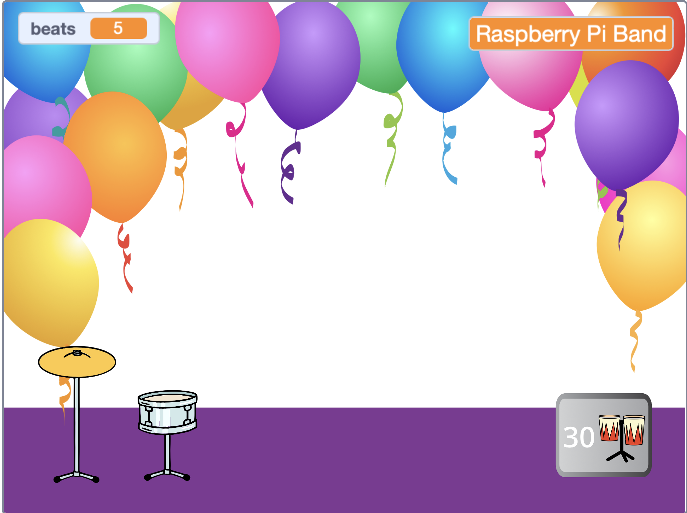
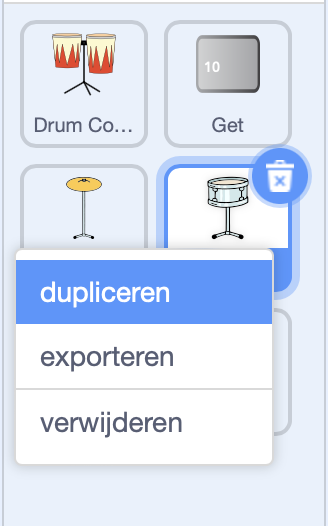
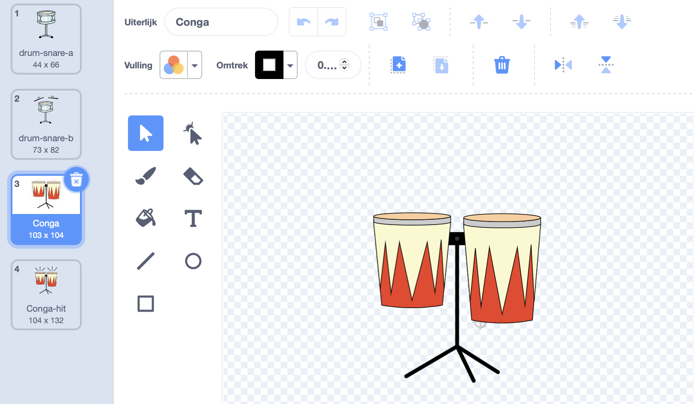
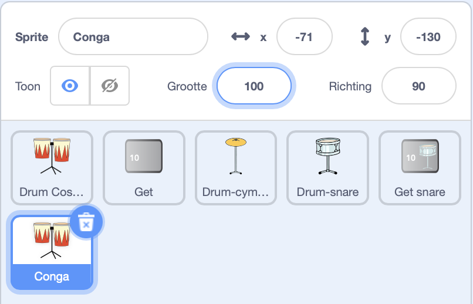
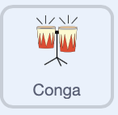
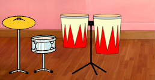
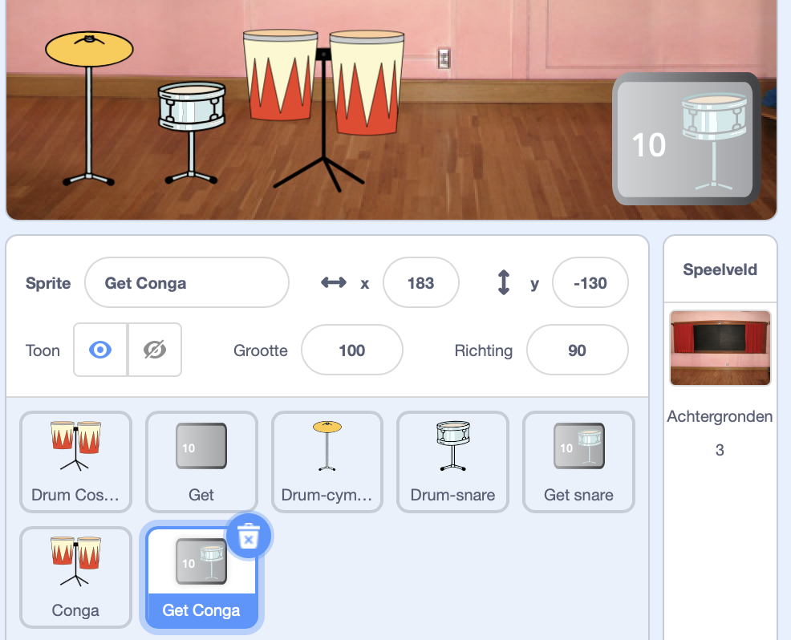
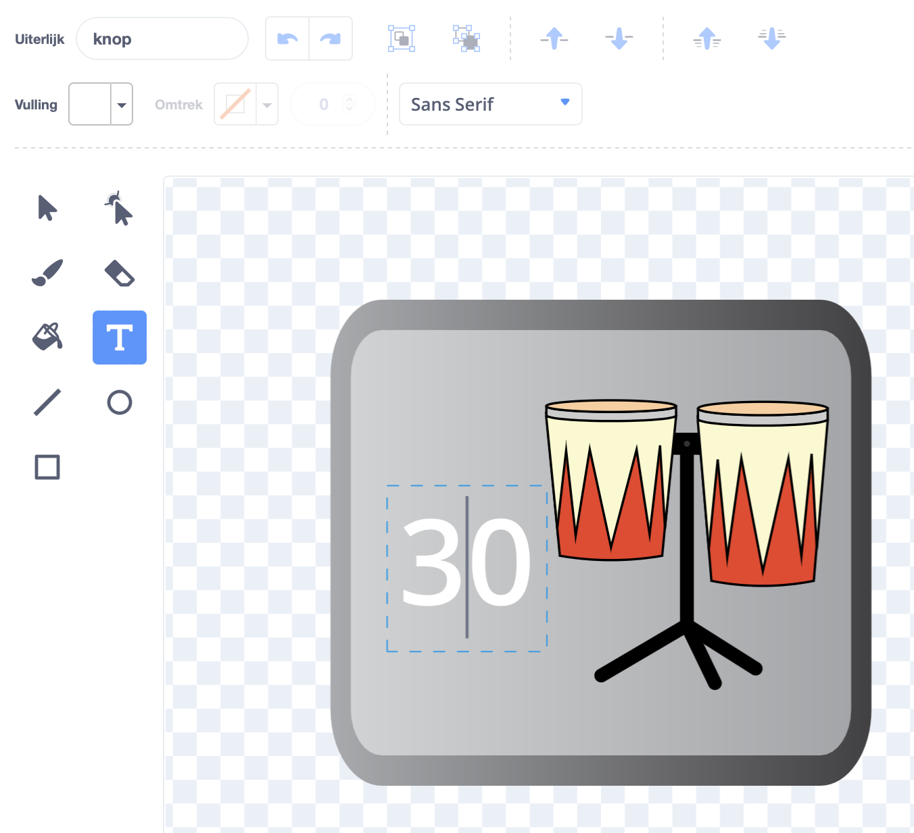
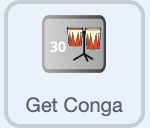

## Tweede upgrade

<div style="display: flex; flex-wrap: wrap">
<div style="flex-basis: 200px; flex-grow: 1; margin-right: 15px;">
Je drumskills verbeteren. Tijd voor een tweede upgrade! In deze stap kies je welke drum je wilt toevoegen.
</div>
<div>
{:width="300px"}
</div>
</div>

--- task ---

Dupliceer de **Drum-snare** sprite:



--- /task ---

De **Drum uiterlijk** sprite heeft veel drum uiterlijken waar je uit kunt kiezen.

--- task ---

Klik op de **Drum Uiterlijken** sprite en selecteer het tabblad **Uiterlijken**.

**Kies:** een drum voor de volgende upgrade. We kozen voor **Conga**.

Sleep de 'geraakt'- en 'niet geraakt'-uiterlijken van de door jou gekozen drum naar je nieuwe **Drum-snare2** sprite:




--- /task ---

--- task ---

Geef je drum een naam die past bij het uiterlijk dat je hebt gekozen.



--- /task ---

--- task ---

Klik op het **Code** tabblad. Wijzig de code om de juiste uiterlijken te gebruiken en kies een geluid voor je nieuwe drum.

Wijzig het aantal slagen dat je verdient door op de nieuwe drum te klikken in `5`:



```blocks3
when this sprite clicked
+change [beats v] by [5] //5 beats per click
+switch costume to [ v] //your hit costume
+play drum [ v] for [0.25] beats //your drum sound
+switch costume to [ v] //your not hit costume
```

--- /task ---

--- task ---

Sleep je nieuwe drum naar de juiste positie op het speelveld:



--- /task ---

Vervolgens heb je een knop nodig zodat spelers naar deze nieuwe drum kunnen upgraden.

--- task ---

Dupliceer de **Get snare** sprite.

Plaats het in de rechterbenedenhoek van het speelveld. Wijzig de naam in `Get` en vervolgens de naam van je nieuwe drum:



--- /task ---

--- task ---

Verwijder de **snare drum** uit het knop uiterlijk. Kopieer en plak het 'niet geraakt' uiterlijk van je nieuwe drum in het uiterlijk van je knop.

Klik op de **Tekst** tool en wijzig het getal in `30` om de kosten van de nieuwe drum weer te geven.

Je knop zou er als volgt uit moeten zien:



--- /task ---


Deze knop moet `verbergen`{:class="block3looks"} aan het begin, dan `tonen`{:class="block3looks"} wanneer de speler een upgrade uitvoert naar de snare drum, zodat ze weten naar welke drum ze werken.

--- task ---



```blocks3
when flag clicked
- show
+ hide
```

**Tip:** om een blok te verwijderen, sleep je hem naar het blokken menu, of klik je met de rechtermuisknop en kies je**Blok verwijderen**. Op een computer kun je ook op een blok klikken en vervolgens op <kbd>Delete</kbd> tikken om een blok te verwijderen.

--- /task ---

--- task ---

Add a `when I receive`{:class="block3events"} script that your new drum button will show as the next upgrade when the player gets the **Drum-snare** drum:


```blocks3
when I receive [snare v] // appear when previous drum is bought
show // show button for next available drum
```

--- /task ---

--- task ---

Wijzig het aantal slagen dat nodig is om deze drum te kopen, en het aantal slagen dat wordt verwijderd wanneer de speler deze drum krijgt.

Wijzig ook het bericht dat `zend signaal`{:class="block3events"} verstuurt wanneer de speler de nieuwe drum krijgt. Maak een nieuw bericht met de naam van je nieuwe drum:


```blocks3
when this sprite clicked
if <(beats)>  [29]> then // change to 29
hide
change [beats v] by [-30] // change to 30
broadcast [conga v] // change to your drum name
else
say (join ((30) - (beats)) [beats needed!]) for [2] seconds
end
```

--- /task ---

--- task ---

Verander het `wanneer ik snare ontvang`{:class="block3events"} script om de naam van je nieuwe drum te`zenden`{:class="block3events"}. De drum `wordt getoond`{:class="block3looks"} wanneer de speler een upgrade uitvoert naar de nieuwe drum:


```blocks3
when I receive [conga v] // change to your drum name
show
```

--- /task ---

--- task ---

Voeg de **Feest** achtergrond toe.

Voeg een script toe aan het speelveld om de achtergrond te veranderen wanneer de speler een upgrade uitvoert naar de nieuwe drum:


```blocks3
when I receive [conga v] // change to your drum name
switch backdrop to (Party v)
```

--- /task ---

--- task ---

**Test:** Klik op de groene vlag om het spel te starten en test dat je genoeg slagen kunt verdienen om je nieuwe trommel te krijgen.

Wat gebeurt er als je op de knop klikt voordat je genoeg slagen hebt verdiend?

--- /task ---

--- save ---
