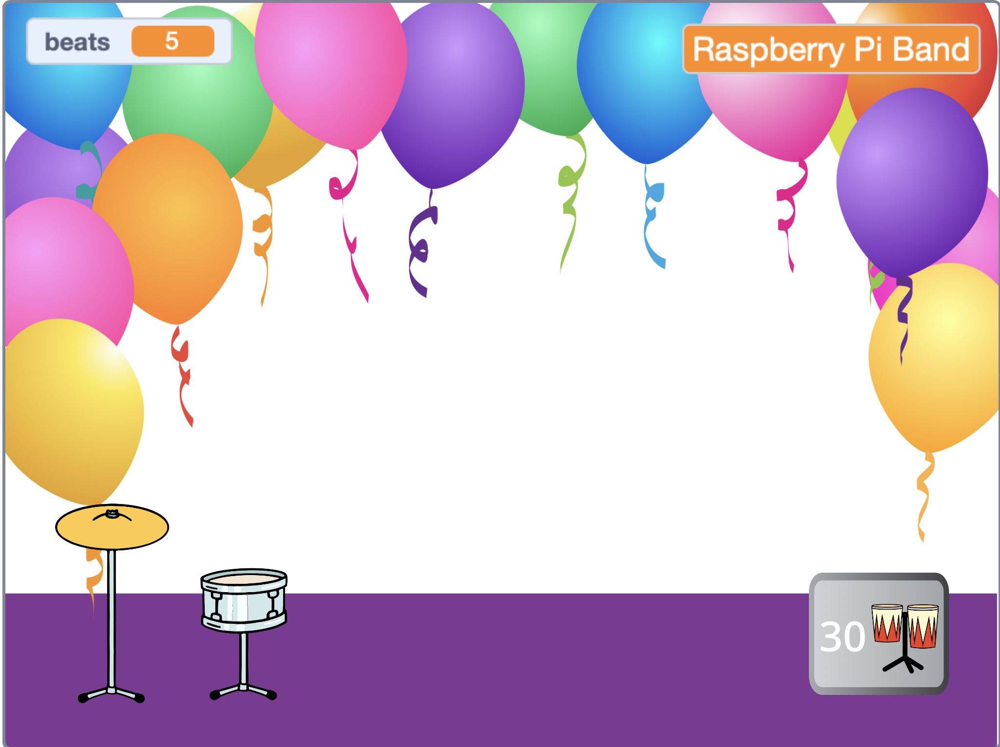
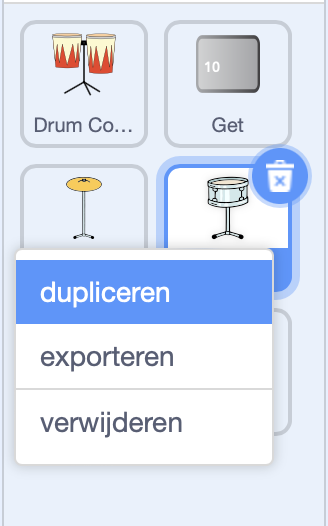
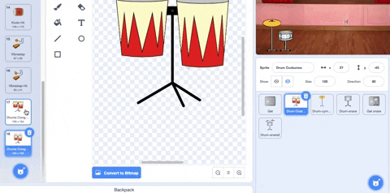
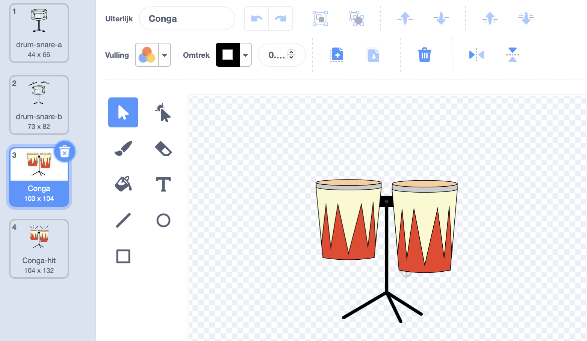
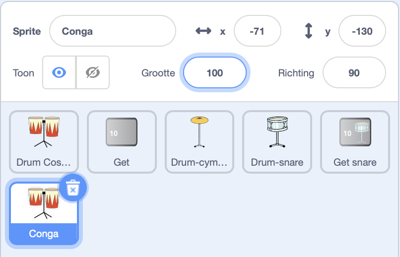
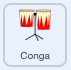
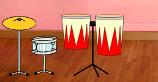
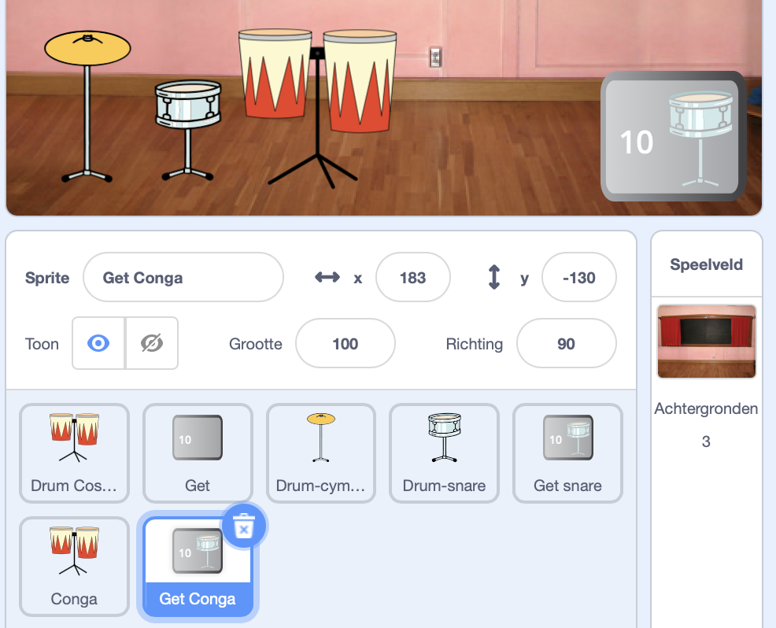
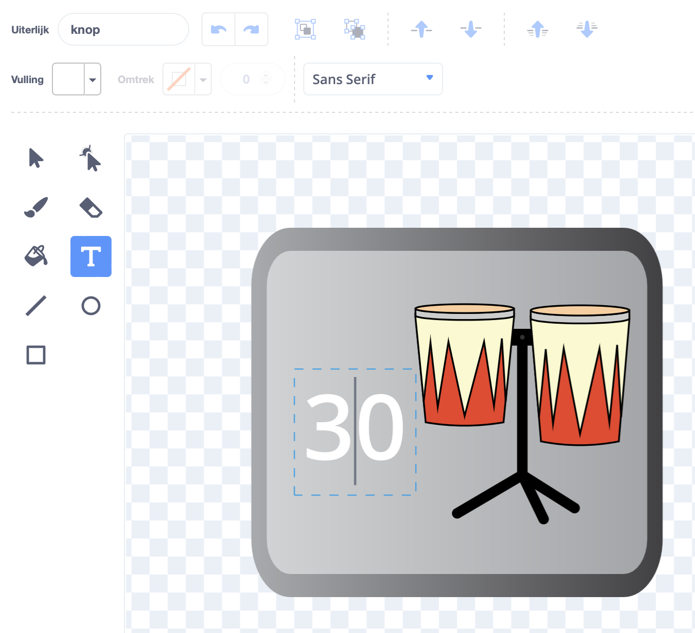
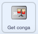

## Nog meer drums!

<div style="display: flex; flex-wrap: wrap">
<div style="flex-basis: 200px; flex-grow: 1; margin-right: 15px;">
In deze stap kies je welke drum je wilt toevoegen.
</div>
<div>
{:width="300px"}
</div>
</div>

--- task ---

Dupliceer de **Drum-snare** sprite:



--- /task ---

--- task ---

Klik op de **Drum Uiterlijken** sprite en selecteer het tabblad **Uiterlijken**.

**Kies:** welke trommel je vervolgens wilt ontgrendelen. We kozen voor **Conga**.


--- /task ---

--- task ---

Sleep de 'geraakt'- en 'niet geraakt'-uiterlijken van de door jou gekozen drum naar je nieuwe **Drum-snare2** sprite:





--- /task ---

--- task ---

Geef je drum een naam die past bij het uiterlijk dat je hebt gekozen.



--- /task ---

--- task ---

Klik op het **Code** tabblad. Wijzig de code om de juiste uiterlijken te gebruiken en kies een geluid voor je nieuwe drum.

Wijzig het aantal slagen dat je verdient door op de nieuwe drum te klikken in `5`:



```blocks3
when this sprite clicked
+change [beats v] by [5] // 5 beats per klik
+switch costume to [ v] // je geraakt uiterlijk
+play drum [ v] for [0.25] beats // je drumgeluid
+switch costume to [ v] // je niet geraakt uiterlijk
```

--- /task ---

--- task ---

Sleep je nieuwe drum naar de juiste positie op het speelveld:



--- /task ---

Voeg een knop toe waarmee spelers de nieuwe drum kunnen ontgrendelen.

--- task ---

Dupliceer de **Get snare** sprite en plaats deze in de rechteronderhoek van het speelveld.

--- /task ---

--- task ---

Wijzig de naam (bijvoorbeeld `Krijg conga`):



--- /task ---

--- task ---

Verwijder de **snare drum** van het nieuwe 'Krijg'-knop uiterlijk.

--- /task ---

--- task ---

Kopieer en plak het 'niet geraakt' uiterlijk van je nieuwe drum in het uiterlijk van je knop.

--- /task ---

--- task ---

Klik op de **Tekst** tool en wijzig het getal in `30` om de kosten van de nieuwe drum weer te geven.



--- /task ---

Je nieuwe 'Krijg'-knop moet `verdwijnen`{:class="block3looks"} aan het begin.

--- task ---



```blocks3
when flag clicked
+ hide
```

--- /task ---

--- task ---

Voeg een `wanneer ik signaal ontvang`{:class="block3events"} script toe, zodat je nieuwe `Krijg`{:class="block3looks"}-knop zal verschijnen wanneer de speler de snare drum ontgrendelt.

```blocks3
when I receive [snare v] // verschijnt wanneer de vorige drum is gekocht
show // toon knop voor volgende beschikbare drum
```

--- /task ---

--- task ---

Wijzig:
- Het aantal slagen dat nodig is om deze trommel te ontgrendelen
- Het aantal slagen dat wordt verwijderd wanneer de speler deze drum ontgrendelt.
- Het bericht dat `wordt uitgezonden`{:class="block3events"} wanneer de speler de nieuwe drum krijgt.

```blocks3
when this sprite clicked
if <(beats)>  [29]> then // verander naar 29
hide
change [beats v] by [-30] // verander naar 30
broadcast (conga v) // verander in je drumnaam
else
say [Niet genoeg beats!] for [2] seconds 
end
```

--- /task ---

--- task ---

Klik op je nieuwe drum-sprite en verander het `wanneer ik snare ontvang`{:class="block3events"}-script zodat het wordt weergegeven wanneer je nieuwe drum is ontgrendeld:

```blocks3
when I receive [conga v] // verander in je drumnaam
show
```

--- /task ---

--- task ---

Voeg de **Feest** achtergrond toe.

--- /task ---

--- task ---

Voeg een script toe aan het speelveld om de achtergrond te veranderen wanneer de speler een upgrade uitvoert naar de nieuwe drum:


```blocks3
when I receive [conga v] // verander in je drumnaam
switch backdrop to (Party v)
```

--- /task ---

--- task ---

**Test:** Klik op de groene vlag om het spel te starten.

Je kunt je nieuwe trommel ontgrendelen als je genoeg slagen verdient.

Wat gebeurt er als je op de knop klikt voordat je genoeg slagen hebt verdiend?

--- /task ---

--- save ---
