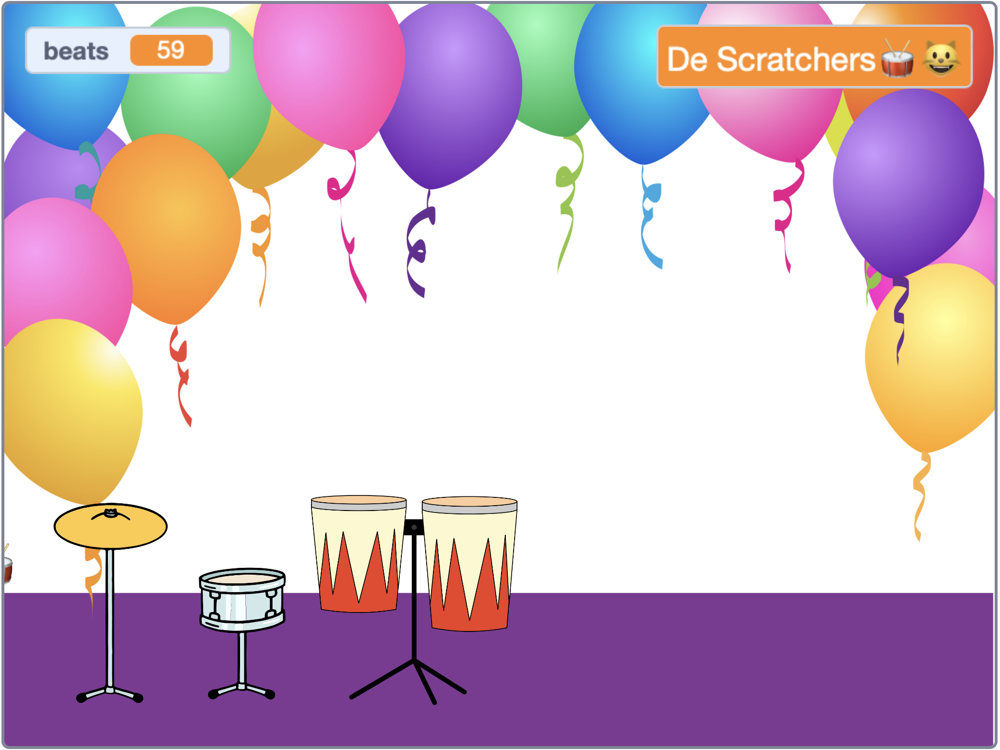

## Speel en pas aan

Het is tijd om je spel precies zoals je wilt te laten werken.

{:width="300px"}

--- task ---

Speel je spel en verdien slagen.

Kijk hoe de `beats`{:class="block3variables"} variabele verandert en zorg ervoor dat je begrijpt hoe de slagen toenemen wanneer je op de drums klikt en afnemen wanneer je een nieuwe drum krijgt.

Ben je blij met hoeveel slagen je voor elke drum verdient? Je kunt dit veranderen als je wilt.

Ben je blij met hoeveel slagen het kost om een nieuwe drum te krijgen?

**Tip:** Test je project regelmatig zodat je eventuele bugs kunt vinden en oplossen.

--- /task ---

--- task ---

Als je het `vraag`{:class="block3sensing"} blok op het speelveld hebt losgemaakt, zet het dan terug en vul de naam van je rockster in.

Merk op dat de naam die wordt weergegeven op het speelveld verandert.

--- /task ---

--- save ---
