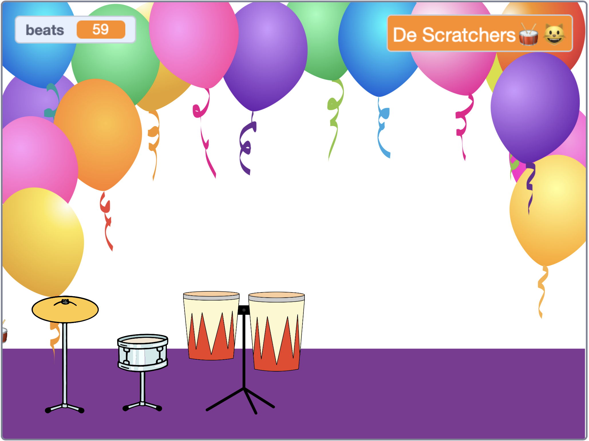

## Speel

Het is tijd om je spel precies zoals je wilt te laten werken.

{:width="300px"}

--- task ---

Als je het `vraag`{:class="block3sensing"} blok op het speelveld hebt losgekoppeld, plaats het dan terug.

**Test:** Klik op de groene vlag en kies je rockster naam!

Je zou moeten zien dat de naam die wordt weergegeven op het speelveld verandert.

--- /task ---

--- save ---
