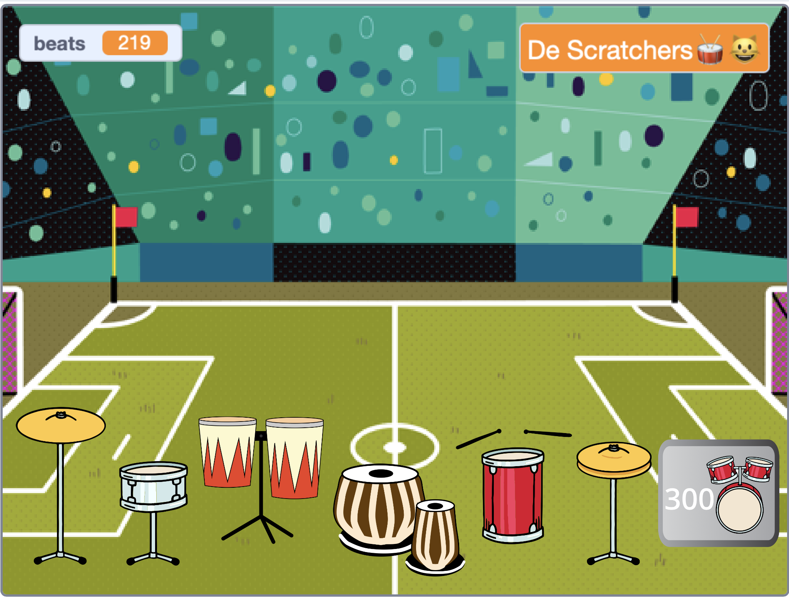

## Verbeter je project

Upgrade je project met meer drums en meer achtergronden terwijl je op meer verbazingwekkende locaties speelt. 

{:width="300px"}

Er zijn veel meer drum uiterlijken om uit te kiezen om meer upgrades aan je project toe te voegen.

Als je nog een drum wilt toevoegen om naar te upgraden, kijk dan terug naar de eerdere stappen van het project.

Voor de **drum** moet je:

--- task ---

Kopieer de vorige **drum** sprite en voeg twee uiterlijken toe.

--- /task ---

--- task ---

Wijzig het `uiterlijk`{:class="block3looks"} en `geluid`{:class="block3sound"} dat wordt gebruikt in het `wanneer op deze sprite wordt geklikt`{:class="block3events"} script.

--- /task ---

--- task ---

Wijzig het aantal `slagen`{:class="block3variables"} dat wordt verdiend in het `wanneer op deze sprite wordt geklikt`{:class="block3events"} script.

--- /task ---

--- task ---

Change the `message`{:class="block3events"} that makes the drum `show`{:class="block3looks"} to a message for the **new drum**.

--- /task ---

Voor de **knop** moet je:

--- task ---

Duplicate the previous **Get** sprite.

--- /task ---

--- task ---

Change the `message`{:class="block3events"} that makes the button appear to the `message`{:class="block3events"} `broadcast`{:class="block3events"} by the **previous drum**.

--- /task ---

--- task ---

Change the `costume`{:class="block3looks"} including the cost of the new drum.

--- /task ---

--- task ---

Change the number of `beats`{:class="block3variables"} you must have to get this drum in the `if`{:class="block3events"} condition. Change the negative number of `beats`{:class="block3variables"} you `change by`{:class="block3variables"} when you get this drum. Change the message that gets `broadcast`{:class="block3events"} to the name of the **new drum**.

--- /task ---

For the **venue**, you will need to:

--- task ---

Voeg een nieuwe achtergrond toe.

--- /task ---

--- task ---

Add a script to the Stage to `switch backdrop to`{:class="block3looks"} the new backdrop when the `message`{:class="block3events"} for this drum is receieved.

--- /task ---

You might find that your drums need to be in a new position on a different backdrop.

--- task ---

Add script starting with `when backdrop changes to`{:class="block3events"} to each **drum** sprite with a `go to`{:class="block3motion"} block to make them change position.

Je moet ook de beginpositie instellen `wanneer op de vlag wordt geklikt`{:class="block3events"}.

--- /task ---

--- task ---

**Tidy:** If you have time, then it's a good idea to make sure the sprites in the sprite list are in a sensible order, starting with the drums in their upgrade order and then the buttons in order.

--- /task ---

--- task ---

**Debug:** First make sure you really understand when the drums and buttons should show and how the `beats`{:class="block3variables"} variable should change. Het is veel gemakkelijker om een project te debuggen als je weet wat het moet doen.

--- collapse ---
---
title: My drum doesn't show/hide correctly
---

Unless it is the first drum, your drum should have a `when flag clicked`{:class="block3events"} script to `hide`{:class="block3looks"}. And it should have a `when I receive`{:class="block3events"} `this drum` script to `show`{:class="block3looks"}.

Check that the **Get** button for this drum `broadcasts`{:class="block3events"} the same message.

--- /collapse ---

--- collapse ---
---
title: My Get button doesn't show/hide correctly
---

Unless the button is for the very first drum, then it should `hide`{:class="block3looks"} `when flag clicked`{:class="block3events"}. And it should `show`{:class="block3looks"} `when I receieve`{:class="block3events"} the message for the **previous drum**. The **Get** button should `show`{:class="block3looks"} to let the player know about the next upgrade they are working towards.

--- /collapse ---

--- collapse ---
---
title: I can buy a drum when I don't have enough beats
---

Check that you have changed the number of `beats`{:class="block3variables"} needed `when this sprite clicked`{:class="block3events"} in the script for the **Get** button for the drum.

--- /collapse ---

--- collapse ---
---
title: The number of beats doesn't change correctly when I get a new drum
---

Check that you have `changed beats by`{:class="block3variables"} a negative number `when this sprite clicked`{:class="block3events"} in the script for the **Get** button for the drum.

Make sure this matches the number on the drum button costume.

--- /collapse ---

--- /task ---

--- collapse ---
---
title: Voltooid project
---

Je kunt het [voltooide project hier](https://scratch.mit.edu/projects/522323676/){:target="_blank"} bekijken.

--- /collapse ---

**Tip:** als je echt in de war raakt, is het goed om de nieuwe drum en de bijbehorende knop te verwijderen en opnieuw te beginnen. Soms is het moeilijk om een bug te vinden.

--- save ---
