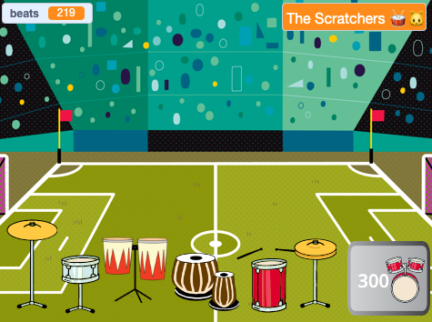

## Uitdaging

<div style="display: flex; flex-wrap: wrap">
<div style="flex-basis: 200px; flex-grow: 1; margin-right: 15px;">
Upgrade je project met meer drums en meer achtergronden terwijl je op meer verbazingwekkende locaties speelt. 
</div>
<div>
{:width="300px"}
</div>
</div>

### Voeg meer trommels toe

Om nog een trommel toe te voegen die ontgrendeld moet worden, ga terug naar de eerdere stappen van het project.

Hier volgen enkele tips, als je die nodig hebt.

--- collapse ---

---
title: Voor de trommel
---

--- task ---

Kopieer de vorige **drum** sprite en voeg twee uiterlijken toe.

--- /task ---

--- task ---

Wijzig het `uiterlijk`{:class="block3looks"} en `geluid`{:class="block3sound"} dat wordt gebruikt in het `wanneer op deze sprite wordt geklikt`{:class="block3events"} script.

--- /task ---

--- task ---

Wijzig het aantal `beats`{:class="block3variables"} dat wordt verdiend in het `wanneer op deze sprite wordt geklikt`{:class="block3events"} script.

--- /task ---

--- task ---

Verander het `bericht`{:class="block3events"} dat de drum laat `verschijnen`{:class="block3looks"} in een bericht voor de **nieuwe drum**.

--- /task ---

--- /collapse ---

--- collapse ---

---
title: Voor de knop 'Krijg'
---

--- task ---

Kopieer de vorige **Get** sprite.

--- /task ---

--- task ---

Wijzig het `bericht`{:class="block3events"} waardoor de knop verschijnt in het `bericht`{:class="block3events"} `verzonden`{:class="block3events"} door de **vorige drum**.

--- /task ---

--- task ---

Verander het `uiterlijk`{:class="block3looks"} inclusief de kosten voor de nieuwe drum.

--- /task ---

--- task ---

Wijzig het aantal `slagen`{:class="block3variables"} dat je nodig hebt om deze drum te ontgrendelen in de `als`{:class="block3events"} voorwaarde. Verander het negatieve aantal `slagen`{:class="block3variables"} je `verandert met`{:class="block3variables"} wanneer je deze drum ontgrendelt. Wijzig het getal waarvan `beats`{:class="block3variables"} moet worden afgetrokken in het `voeg samen`{:class="block3operators"} blok. Wijzig het bericht dat het `zend signaal`{:class="block3events"} blok krijgt in de naam van de **nieuwe drum**.

--- /task ---

--- /collapse ---

--- collapse ---

---
title: Voor de locatie
---

--- task ---

Voeg een nieuwe achtergrond toe.

--- /task ---

--- task ---

Voeg een script toe aan het speelveld om `achtergrond te veranderen naar`{:class="block3looks"} de nieuwe achtergrond wanneer het `bericht`{:class="block3events"} voor deze trommel wordt ontvangen.

--- /task ---

Het kan zijn dat je vindt dat je drums in een nieuwe positie moeten staan op een andere achtergrond.

--- task ---

Voeg een script toe dat begint met `wanneer achtergrond verandert naar`{:class="block3events"} aan elke **drum** sprite met een `ga naar`{:class="block3motion"} blok om de positie te veranderen.

Je moet ook de beginpositie instellen `wanneer op de vlag wordt geklikt`{:class="block3events"}.

--- /task ---

--- /collapse ---

### Verbeter de feedback aan de speler

Vertel de speler precies **hoeveel** beats er nog nodig zijn om de volgende drum te ontgrendelen.

--- task ---

Voeg deze code toe aan het `voeg samen`{:class="block3operators"} blok van het aantal benodigde beats en de tekst die je hebt gebruikt om de speler te laten weten dat ze meer beats nodig hebben (als ze er niet genoeg hebben) om de volgende drum te ontgrendelen:

```blocks3
when this sprite clicked
if <(beats)>  [9]> then //if 10 or more beats
hide
change [beats v] by [-10] //take away the cost of upgrade
else
+ say (join ((10) - (beats)) [beats needed!]) for [2] seconds
end
```

**Opmerking**: Werk de getallen bij zodat ze overeenkomen met de getallen die nodig zijn om elke trommel te ontgrendelen.

--- /task ---

### Schoon je code op

--- task ---

**Opruimen:** als je tijd hebt, dan is het een goed idee om ervoor te zorgen dat de sprites in de sprite-lijst in een logische volgorde staan, te beginnen met de drums in de volgorde waarmee ze ontgrendelen en vervolgens de knoppen in de juiste volgorde.

--- /task ---

--- task ---

### Zit je vast?

**Debug:** Zorg er eerst voor dat je echt begrijpt wanneer de drums en knoppen getoond moeten worden en hoe de `beats`{:class="block3variables"} variabele moet veranderen. Het is veel gemakkelijker om een project te debuggen als je weet wat het moet doen.

--- collapse ---
---
title: Mijn drum verschijnt/verdwijnt niet correct
---

Tenzij het de eerste drum is, zou je drum een `wanneer op de vlag wordt geklikt`{:class="block3events"} script moeten hebben om `te verbergen`{:class="block3looks"}.

Het zou een `wanneer ik signaal`{:class="block3events"} `deze drum` ontvang script moeten hebben om te `verschijnen`{:class="block3looks"}.

Controleer of de **Get** knop voor deze drum `hetzelfde bericht uitzendt`{:class="block3events"}.

--- /collapse ---

--- collapse ---
---
title: Mijn 'Krijg'-knop verschijnt/verdwijnt niet correct
---

Tenzij de knop voor de allereerste drum is, moet deze `verbergen`{:class="block3looks"} `wanneer op de vlag wordt geklikt`{:class="block3events"}.

En `verschijnen`{:class="block3looks"} `wanneer ik`{:class="block3events"} het bericht ontvang voor de **vorige drum**.

De **Krijg** knop zou moeten worden `verschijnen`{:class="block3looks"} om de speler te laten weten welke volgende trommel ze kunnen ontgrendelen.

--- /collapse ---

--- collapse ---
---
title: Ik kan een trommel ontgrendelen terwijl ik niet genoeg beats heb
---

Controleer of je het aantal `beats`{:class="block3variables"} hebt gewijzigd `wanneer deze sprite op`{:class="block3events"} klikt in het script voor de **Get** knop voor de trommel.

--- /collapse ---

--- collapse ---
---
title: Het aantal beats verandert niet correct wanneer ik een nieuwe trommel ontgrendel
---

Controleer of je `de beats hebt veranderd met`{:class="block3variables"} een negatief getal `wanneer op deze sprite wordt geklikt`{:class="block3events"} in het script van de **Get** knop voor de drum.

Zorg ervoor dat dit overeenkomt met het getal op het uiterlijk van de drum knop.

--- /collapse ---

--- /task ---

**Tip:** als je echt in de war raakt, is het goed om de nieuwe drum en de bijbehorende knop te verwijderen en opnieuw te beginnen. Soms is het moeilijk om een bug te vinden.

--- save ---
