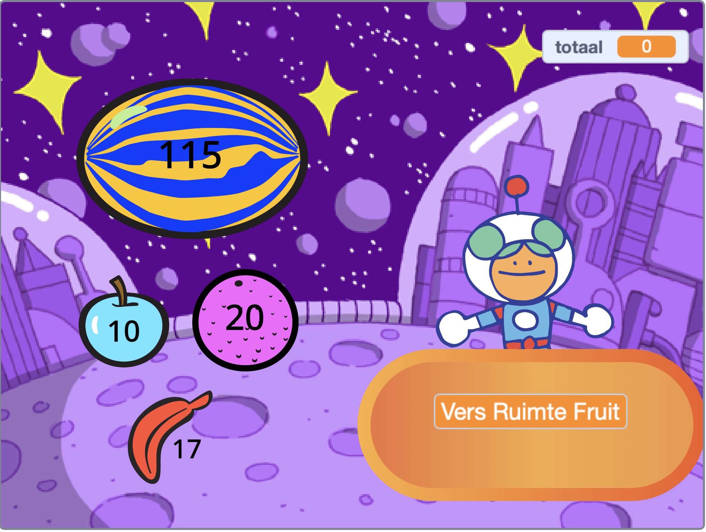

## What can you do now?

Als je het [Meer Scratch](https://projects.raspberrypi.org/en/raspberrypi/more-scratch) pad volgt, kun je naar het [Volgende klant alsjeblieft!](https://projects.raspberrypi.org/en/projects/next-customer-please) project gaan, waar je een winkel gaat maken waar klanten voorwerpen kunnen kopen en uitchecken.

--- print-only ---

--- /print-only ---

--- no-print ---

  <iframe allowtransparency="true" width="485" height="402" src="https://scratch.mit.edu/projects/embed/528696418/?autostart=false" frameborder="0"></iframe>

--- /no-print ---

Als je meer plezier wilt hebben met het verkennen van Scratch, kun je een van de [deze projecten](https://projects.raspberrypi.org/en/projects?software%5B%5D=scratch&curriculum%5B%5D=%201){:target="_blank"} uitproberen.
