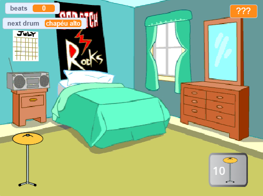

## O que você vai fazer

Faça um jogo clicker onde você ganha batidas para tocar novas baterias em locais maiores.

Você deve:
+ Use `variáveis`{:class="block3variables"} para armazenar e alterar números e texto (palavras)
+ `faça`{:class="block3sensing"} uma pergunta e use a `resposta`{:class="block3sensing"} para personalizar o jogo
+ Use `if...else`{:class="block3control"} para tomar decisões

Existem muitos **jogos clicker** onde você precisa clicar para progredir e comprar atualizações que o ajudam a ir mais rápido. Você já jogou um jogo clicker? Existem também **jogos inativos** que continuam mesmo quando você não está jogando. Esses jogos são divertidos, desde que você não gaste muito tempo jogando!

--- no-print --- --- task ---

### Jogar ▶️

  
Clique no tambor e observe o número de `batidas`{:class="block3variables"} aumentar. Compre um novo tambor quando tiver batidas suficientes. 

Quantas `batidas`{:class="block3variables"} você ganha ao clicar na nova bateria?

  <iframe allowtransparency="true" width="485" height="402" src="https://scratch.mit.edu/projects/embed/522323676/?autostart=false" frameborder="0"></iframe>

--- /task --- --- /no-print ---

--- print-only ---

--- /print-only ---
