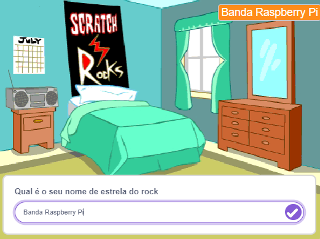
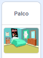
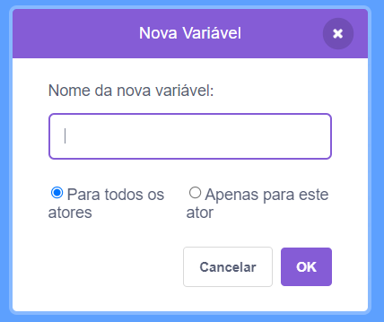
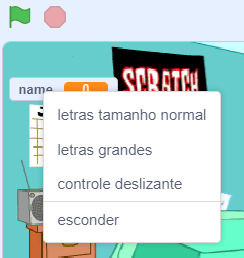

## Prepare o cenário

<div style="display: flex; flex-wrap: wrap">
<div style="flex-basis: 200px; flex-grow: 1; margin-right: 15px;">
Nesta etapa, você preparará o cenário para seu primeiro show e escolherá o nome de uma estrela do rock.
</div>
<div>
{:width="300px"}
</div>
</div>

--- task ---

Abra o [projeto inicial Conversa espacial](https://scratch.mit.edu/projects/535783147/editor){:target="_ blank"}. O Scratch será aberto em outra aba do navegador.

--- /task ---

The drummer starts in a bedroom like a beginner!

--- task ---

Clique em **Escolha um Sprite** e pesquise `cymbal`.

Select a bedroom and add it to your project. Escolhemos `Quarto 3`.


--- /task ---

No Scratch, você pode adicionar código ao Stage.

--- task ---

Clique no cenário do seu quarto no painel Palco e adicione este código:



```blocks3
when flag clicked
switch backdrop to (Bedroom 3 v) //your backdrop name
```

--- /task ---

Todo músico precisa escolher um nome de estrela do rock.

Uma variável **** é uma forma de armazenar números e/ou texto. Seu nome rockstar será armazenado em uma variável ``{:class="block3variables"} para que possa ser usado a qualquer momento.

--- task ---

No menu de blocos `Variables`{:class="block3variables"}, clique no botão **Make a Variable**.

Chame sua nova variável `name`:



**Aviso:** A nova variável `name` aparece no Stage e agora pode ser usada nos blocos `Variable`{:class="block3variables"}.

--- /task ---

--- task ---

No início do projeto, seu nome de rockstar é desconhecido.

Adicione um bloco a `e defina o nome para`{:class="block3variables"} `???`:


```blocks3
when flag clicked
switch backdrop to (Bedroom 3 v) //your backdrop name
+ set [name v] to [???] //your variable
```

--- /task ---

Você pode `fazer`{:class="block3sensing"} uma pergunta no Scratch e depois usar uma `variável`{:class="block3variables"} para armazenar a `resposta`{:class="block3sensing"}.

--- task ---

Clique no menu de blocos `Sensing`{:class="block3sensing"} e adicione um bloco `ask`{:class="block3sensing"} ao seu código:

```blocks3
when flag clicked
switch backdrop to (Bedroom 3 v) //your backdrop name
set [name v] to [???] //your variable
+ ask [What's your rock star name?] and wait //your question
```

--- /task ---

--- task ---

Você pode `fazer`{:class="block3sensing"} uma pergunta no Scratch e depois usar uma `variável`{:class="block3variables"} para armazenar a `resposta`{:class="block3sensing"}.

```blocks3
when flag clicked
switch backdrop to (Bedroom 3 v) //your backdrop name
set [name v] to [???] //your variable
ask [What's your rock star name?] and wait //your question
+ set [name v] to (answer)
```

--- /task ---

--- task ---

Clique com o botão direito novamente na `variável`{:class="block3variables"} exibida no Palco e selecione **mudar o intervalo**:



--- /task ---

--- task ---

Drag your `variable`{:class="block3variables"} to position it top-right of the Stage:


--- /task ---

--- task ---

**Teste:** Execute seu projeto para garantir que a `variável`{:class="block3variables"} comece como `???` então atualiza para sua `resposta`{:class="block3sensing"}.

--- /task ---

You don't want to type an answer every time you test your project.

--- task ---

Drag the last two blocks of code away from the rest of the script.

```blocks3
when flag clicked
switch backdrop to (Bedroom 3 v) //your backdrop name
set [name v] to [???] //your variable
```

```blocks3
ask [What's your rock star name?] and wait //your question
set [name v] to (answer)
```

--- /task ---

--- save ---
