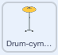

## Tambor inicial

<div style="display: flex; flex-wrap: wrap">
<div style="flex-basis: 200px; flex-grow: 1; margin-right: 15px;">
Você adicionará um sprite de **prato** no qual poderá clicar para ganhar batidas e reproduzir um som.
</div>
<div>
{:width="300px"}
</div>
</div>

--- task ---

Click **Choose a Sprite** and search `cymbal`.


--- /task ---

--- task ---

Add the **Drum-cymbal** sprite and position it on the Stage:


--- /task ---

--- task ---

Clique em **Adicionar Extensão**:

[[[generic-scratch3-add-music-extension]]]

--- /task ---

--- task ---

Adicione um script para fazer o prato `mudar de fantasia`{:class="block3looks"} e `tocar um som de bateria`{:class="block3extensions"}:



```blocks3
when this sprite clicked
switch costume to [drum-cymbal-b v] // hit costume
play drum [(5) Open High-Hat v] for [0.25] beats // drum sound
switch costume to [drum-cymbal-a v]  // not hit costume
```

--- /task ---

--- task ---

**Teste:** Teste seu prato clicando nele.

You should hear a sound and see the costume change.

--- /task ---

O sprite **Drum-cymbal** ganhará uma batida cada vez que você clicar nele.

--- task ---

Create a `variable`{:class="block3variables"} (for all sprites) called `beats`:


--- /task ---

--- task ---

Adicione um bloco a `altere as batidas em 1`{:class="block3variables"} quando o sprite **Drum-cymbal** for clicado:

```blocks3
when this sprite clicked
+change [beats v] by [1]
switch costume to [drum-cymbal-b v]
play drum [(5) Open High-Hat v] for [0.25] beats 
switch costume to [drum-cymbal-a v]
```

--- /task ---

--- task ---

**Test:** Test the **Drum-cymbal** by clicking on it.

You should see the `beats`{:class="block3variables"} increase.

--- /task ---

A variável `batidas`{:class="block3variables"} precisa começar em `0` batidas quando você inicia um novo jogo.

--- task ---

Click on the Stage pane and then the **Code** tab.

Adicione um bloco a `e defina as batidas para`{:class="block3variables"} `0`:


```blocks3
when flag clicked
switch backdrop to (Bedroom 3 v) 
set [name v] to [???] 
+ set [beats v] to [0]
```
--- /task ---

--- task ---

**Teste:** Clique na bandeira verde e certifique-se de que sua variável `batidas`{:class="block3variables"} comece em `0`.

--- /task ---

--- save ---
