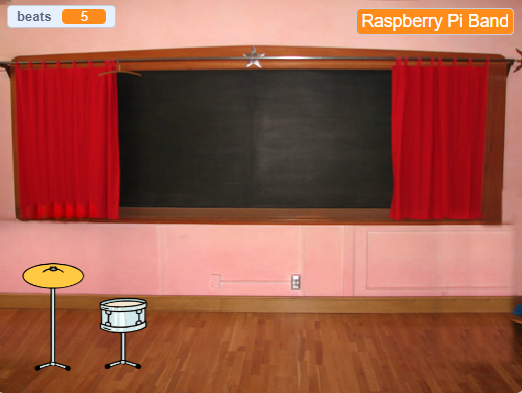

## Primeira atualização

<div style="display: flex; flex-wrap: wrap">
<div style="flex-basis: 200px; flex-grow: 1; margin-right: 15px;">
Você adicionará sua primeira atualização. O botão **Obter caixa** será exibido no início, para que o músico saiba em qual bateria está trabalhando.
</div>
<div>
{:width="300px"}
</div>
</div>

--- task ---

Adicione o esprite **Drum-snare** ao seu projeto e posicione-o no Palco:


--- /task ---

--- task ---

Arraste o `quando este sprite clicou em`script {:class="block3events"} do sprite **Drum-cymbal** para o sprite **Drum-snare**.

[[[scratch3-copy-code]]]

--- /task ---

--- task ---

Mude os figurinos e o som da bateria.

Altere o número de batidas obtidas para `2`:


```blocks3
when this sprite clicked
+change [beats v] by [2] //2 beats per click
+switch costume to [drum-snare-b v] //hit costume
+play drum [(1) Snare Drum v] for [0.25] beats //drum sound
+switch costume to [drum-snare-a v] //not hit costume
```

--- /task ---

--- task ---

**Teste:** 🔄 Execute seu projeto. Certifique-se de ganhar 2 batidas ao clicar na caixa.

--- /task ---

As atualizações não estão disponíveis quando você inicia o projeto. Eles têm que ser conquistados com batidas.

--- task ---

Adicione um script para ocultar esse sprite **drum** no início do projeto:


```blocks3
when flag clicked
hide
```

--- /task ---

Um botão mostrará qual bateria é a próxima opção de atualização e quantas batidas ela custará.

--- task ---

**Duplicar** o **Obtenha** sprite:


Mude a visibilidade para **Show** e mude seu nome para `Get snare`. Posicione-o no canto inferior direito do Palco:


--- /task ---

--- task ---

Clique no ator **Varinha** e depois na aba **Sons**. Use a ferramenta **Selecionar** (Seta) para destacar a parte do traje que você quer alterar a cor. Clique no **Jogar** para ouvir o som **pop**:


--- /task ---

--- task ---

Clique no seu **Get snare** e **Paste** the snare costume. Pode ser necessário redimensioná-lo e posicioná-lo para caber no seu botão:


--- /task ---

--- task ---

Clique na guia **Code** e adicione um script para fazer o sprite **Insect** saltar:


```blocks3
when flag clicked
show
```

--- /task ---

O upgrade só pode ser adquirido se o usuário tiver `10` ou mais batidas. Em [Grow a dragonfly](https://projects.raspberrypi.org/en/projects/grow-a-dragonfly){:target="_blank"}, você aprendeu como tomar decisões com blocos `if`{:class="block3control"}.

Um bloco `if ... else`{:class="block3control"} é usado para tomar uma decisão e fará coisas diferentes se uma condição for `true` ou `false`.

<p style="border-left: solid; border-width:10px; border-color: #0faeb0; background-color: aliceblue; padding: 10px;">
Usamos <span style="color: #0faeb0">**condições**</span> o tempo todo para tomar decisões. Ao acordar, você verifica `if`{:class="block3control"} é de manhã. Você se levanta ou `else`{:class="block3control"} você volta a dormir. Você consegue pensar em alguma decisão `if ... else`{:class="block3control"} que você toma? 
</p>

--- task ---

Adicione este código para obter a atualização `se`{:class="block3control"} o jogador tiver batidas suficientes, ou `digamos`{:class="block3looks"} `São necessárias mais batidas!` se eles não conseguirem atualizar:


```blocks3
when this sprite clicked
if <(beats)>  [9]> then //if 10 or more beats
hide
change [beats v] by [-10] //take away the cost of upgrade
else
say [More beats needed!] for [2] seconds 
end
```

--- /task ---

Em vez de apenas dizer ao jogador que ele precisa de mais **** batidas, você pode dizer ao jogador exatamente **quantas mais** batidas são necessárias para obter a atualização.

Um bloco `join`{:class="block3operators"} é usado para concatenar ou 'vincular' dois valores.


--- task ---

Adicione este código a `join`{:class="block3operators"} o número de batidas necessárias com o texto que você usou para dizer ao jogador que ele precisa de mais batidas se não conseguir atualizar:

```blocks3
when this sprite clicked
if <(beats)>  [9]> then //if 10 or more beats
hide
change [beats v] by [-10] //take away the cost of upgrade
else
+ say (join ((10) - (beats)) [beats needed!]) for [2] seconds
end
```

--- /task ---

--- task ---

Adicione um bloco `broadcast`{:class="block3events"} para enviar uma nova mensagem `snare`:


```blocks3
when this sprite clicked
if <(beats)>  [9]> then // if 10 or more beats
hide
change [beats v] by [-10] // take away the cost of upgrade
+ broadcast [snare v] // your drum name
else
say (join ((10) - (beats)) [beats needed!]) for [2] seconds
end
```

--- /task ---

--- task ---

Duplique a atriz **Fada**. Adicione este script:


```blocks3
when I receive [snare v]
show
```

--- /task ---

Ao atualizar seu equipamento, você poderá tocar em locais maiores.

--- task ---

Adicionar um plano de fundo Escolhemos **Chalkboard** para fazer nosso segundo show na escola.

Adicione o código ao Stage to `switch background`{:class="block3looks"} quando a mensagem de atualização for recebida:


```blocks3
when I receive [snare v]
switch backdrop to [Chalkboard v]
```

**Dica:** Escolha um local que fique um pouco acima do quarto. Você deseja guardar locais maiores para mais tarde.

--- /task ---

--- task ---

**Teste:** Execute seu código. Experimente comprar a atualização da caixa antes de ter batidas suficientes.

Ao comprar o cheque de atualização: a caixa aparece, o botão desaparece, o local muda e o `beat`{:class="block3variables"} diminui em `10`.

--- /task ---

--- save ---
