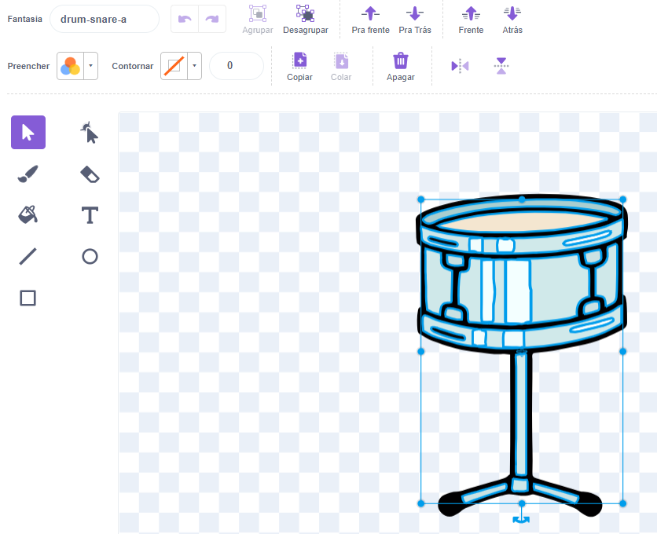

## Next drum

--- task ---

Adicione o esprite **Drum-snare** ao seu projeto e posicione-o no Palco:


--- /task ---

--- task ---

Arraste o `quando este sprite clicou em`script {:class="block3events"} do sprite **Drum-cymbal** para o sprite **Drum-snare**.

--- /task ---

--- task ---

Change the costume and the drum sound for the **Drum-snare** sprite.


```blocks3
when this sprite clicked
+switch costume to [drum-snare-b v] //hit costume
+play drum [(1) Snare Drum v] for [0.25] beats //drum sound
+switch costume to [drum-snare-a v] //not hit costume
```

--- /task ---

--- task ---

Change the number of beats earned to `2`:

```blocks3
when this sprite clicked
+change [beats v] by [2] //2 beats per click
switch costume to [drum-snare-b v] //hit costume
play drum [(1) Snare Drum v] for [0.25] beats //drum sound
switch costume to [drum-snare-a v] //not hit costume
```

--- /task ---

--- task ---

**Teste:** 🔄 Execute seu projeto.

You should you earn 2 beats when you click on the snare drum.

--- /task ---

The next drum is not available when you start the project. It has to be earned with beats.

--- task ---

Add a script to the **Drum-snare** sprite to hide it at the start of the project:

```blocks3
when flag clicked
hide
```

--- /task ---

Add a button to show which drum is the next and how many beats it will cost.

--- task ---

**Duplicar** o **Obtenha** sprite:


--- /task ---

--- task ---

Change the visibility to **Show**. 

--- /task ---

--- task ---

Change its name to `Get snare`.

--- /task ---

--- task ---

Posicione-o no canto inferior direito do Palco:


--- /task ---

--- task ---

Clique no ator **Varinha** e depois na aba **Sons**.


Use the **Select** (arrow) tool to highlight the 'not hit' costume of your drum. Clique no **Jogar** para ouvir o som **pop**:



--- /task ---

--- task ---

Clique no seu **Get snare** e **Paste** the snare costume. Pode ser necessário redimensioná-lo e posicioná-lo para caber no seu botão:


--- /task ---

--- task ---

Clique na guia **Code** e adicione um script para fazer o sprite **Insect** saltar:


```blocks3
when flag clicked
show
```

--- /task ---

The next drum can only be unlocked if the user has `10` or more beats.

--- task ---

Add this code to unlock the next drum `if`{:class="block3control"} the player has enough beats, or `say`{:class="block3looks"} `More beats needed!` if they do not have enough:

```blocks3
when this sprite clicked
if <(beats)>  [9]> then //if 10 or more beats
hide
change [beats v] by [-10] //take away the cost of upgrade
else
say [More beats needed!] for [2] seconds 
end
```

--- /task ---

--- task ---

Adicione um bloco `broadcast`{:class="block3events"} para enviar uma nova mensagem `snare`:

```blocks3
when this sprite clicked
if <(beats)>  [9]> then // if 10 or more beats
hide
change [beats v] by [-10] // take away the cost of upgrade
+ broadcast (snare v) // your drum name
else
say [More beats needed!] for [2] seconds
end
```

--- /task ---

--- task ---

Duplique a atriz **Fada**.


Adicione este script:

```blocks3
when I receive [snare v]
show
```

--- /task ---

--- task ---

**Teste:** Execute seu código.

You should not be able to unlock the next drum before you have enough beats.

--- /task ---

When you unlock new drums, you can play at bigger venues!

--- task ---

Adicionar um plano de fundo Escolhemos **Chalkboard** para fazer nosso segundo show na escola.

**Tip:** Choose a venue that's a small step up from a bedroom. You want to save bigger venues for later!

--- /task ---

--- task ---

Click on the Stage.


Adicione o código ao Stage to `switch background`{:class="block3looks"} quando a mensagem de atualização for recebida:

```blocks3
when I receive [snare v]
switch backdrop to [Chalkboard v]
```

--- /task ---

--- task ---

**Test:** Run your project.

When you unlock the next drum: the snare should appear, the button disappears, the venue changes and the `beats`{:class="block3variables"} go down by `10`.

--- /task ---

--- save ---
