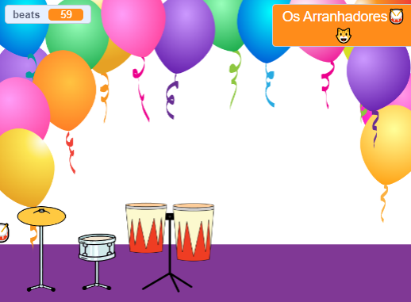

## Jogue e personalize

É hora de fazer seu jogo funcionar do jeito que você deseja.

{:width="300px"}

--- task ---

Jogue seu jogo e ganhe batidas.

Observe a mudança da variável `batidas`{:class="block3variables"} e certifique-se de entender como as batidas aumentam quando você clica na bateria e diminuem quando você obtém uma nova bateria.

Você está satisfeito com quantas batidas ganha por cada bateria? Você pode mudar isso se quiser.

Você está satisfeito com quantas batidas custa para conseguir um novo tambor?

**Dica:** Teste seu projeto regularmente para encontrar e corrigir quaisquer bugs.

--- /task ---

--- task ---

Se você separou o bloco `ask`{:class="block3sensing"} no Palco, coloque-o de volta e defina o nome da sua estrela do rock.

Observe que o nome exibido no Palco muda.

--- /task ---

--- save ---
