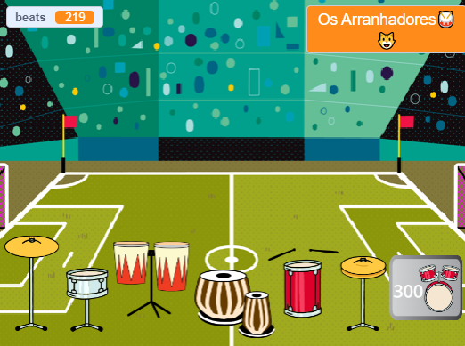

## Melhore o seu projeto

Atualize seu projeto com mais bateria e mais cenários enquanto toca em locais mais incríveis. 

{:width="300px"}

Há muito mais fantasias de bateria para você escolher e adicionar mais atualizações ao seu projeto.

Para adicionar outro tambor para atualizar, reveja as etapas anteriores do projeto.

Para o **tambor**, você precisará:

--- task ---

Duplique o sprite **drum** anterior e adicione duas fantasias.

--- /task ---

--- task ---

Altere o traje ``{:class="block3looks"} e `som`{:class="block3sound"} usado no script `quando este sprite clicou em`{:class="block3events"} script.

--- /task ---

--- task ---

Altere o número de `batidas`{:class="block3variables"} obtidas no script `quando este sprite clicou em`{:class="block3events"}.

--- /task ---

--- task ---

Mude a mensagem ``{:class="block3events"} que faz o tambor `mostrar`{:class="block3looks"} para uma mensagem para o **novo tambor**.

--- /task ---

Para o **tambor**, você precisará:

--- task ---

Duplicar o **Obtenha** sprite.

--- /task ---

--- task ---

Altere a mensagem ``{:class="block3events"} que faz o botão aparecer para a `mensagem`{:class="block3events"} `transmissão`{:class="block3events"} pelo **tambor anterior**.

--- /task ---

--- task ---

Troque a fantasia `por`{:class="block3looks"} incluindo o custo do novo tambor.

--- /task ---

--- task ---

Altere o número de `batidas`{:class="block3variables"} obtidas no script `quando este sprite clicou em`{:class="block3events"}. Mude o número negativo de `batidas`{:class="block3variables"} você `muda em`{:class="block3variables"} quando obtiver esta bateria. Altere o número de `batidas`{:class="block3variables"} obtidas no script `quando este sprite clicou em`{:class="block3events"}. Mude a mensagem que recebe `broadcast`{:class="block3events"} para o nome dos **novos tambores**.

--- /task ---

Para o **tambor**, você precisará:

--- task ---

Adicionar um plano de fundo.

--- /task ---

--- task ---

Adicione um script ao Palco para `mudar o cenário para`{:class="block3looks"} o novo cenário quando a mensagem ``{:class="block3events"} para esta bateria for recebida.

--- /task ---

Você pode descobrir que sua bateria precisa estar em uma nova posição em um cenário diferente.

--- task ---

Adicione um script começando com `quando o cenário mudar para`{:class="block3events"} para cada sprite **tambores** com um bloco `vá para`{:class="block3motion"} para fazê-los mudar de posição.

O ônibus precisa estar na sua posição inicial `quando bandeira verde for clicada em`{: class = "block3events"}.

--- /task ---

--- task ---

**Arrumado:** Se você tiver tempo, então é uma boa ideia certificar-se de que os sprites na lista de sprites estejam em uma ordem sensata, começando com a bateria em sua ordem de atualização e depois os botões em ordem.

--- /task ---

--- task ---

**Debug:** Primeiro certifique-se de realmente entender quando a bateria e os botões devem aparecer e como a variável `beats`{:class="block3variables"} deve mudar. É muito mais fácil depurar um projeto se você tiver certeza do que ele deve fazer.

--- collapse ---
---
Título: Minha bateria não aparece/oculta corretamente
---

A menos que seja o primeiro tambor, seu tambor deve ter um script `quando flag clicado`{:class="block3events"} para `ocultar`{:class="block3looks"}. E deve ter `quando eu receber`{:class="block3events"} `este script de bateria` para `mostrar`{:class="block3looks"}.

Verifique se o botão **Get** para este tambor `transmite`{:class="block3events"} a mesma mensagem.

--- /collapse ---

--- collapse ---
---
Título: Minha bateria não aparece/oculta corretamente
---

A menos que o botão seja para o primeiro tambor, ele deve `ocultar`{:class="block3looks"} `quando o sinalizador for clicado`{:class="block3events"}. E deveria `mostrar`{:class="block3looks"} `quando eu receber`{:class="block3events"} a mensagem da **bateria anterior**. O botão **Get** deve ``{:class="block3looks"} para informar ao jogador sobre a próxima atualização que ele está trabalhando.

--- /collapse ---

--- collapse ---
---
título: Posso comprar uma bateria quando não tenho batidas suficientes
---

Verifique se você alterou o número de `batidas`{:class="block3variables"} necessárias `quando este sprite clicou em`{:class="block3events"} no script para o botão **Get** da bateria.

--- /collapse ---

--- collapse ---
---
título: O número de batidas não muda corretamente quando recebo uma nova bateria
---

Verifique se você alterou o número de `batidas`{:class="block3variables"} necessárias `quando este sprite clicou em`{:class="block3events"} no script para o botão **Get** da bateria.

Certifique-se de que corresponda ao número na fantasia do botão da bateria.

--- /collapse ---

--- /task ---

--- collapse ---
---
title: Projeto concluído
---

Você pode ver o [projeto concluído aqui](https://scratch.mit.edu/projects/522323676/){:target="_blank"}.

--- /collapse ---

**Dica:** Se você ficar realmente confuso, não há problema em excluir o novo tambor e seu botão e começar de novo. Sometimes it is hard to spot a bug.

--- save ---
