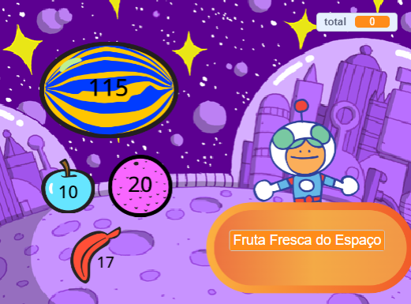

## What can you do now?

Se você estiver seguindo o caminho [Mais Scratch](https://projects.raspberrypi.org/en/raspberrypi/more-scratch), você pode passar para o [Projeto Próximo cliente, por favor!](https://projects.raspberrypi.org/en/projects/next-customer-please), onde você fará uma loja onde os clientes poderão comprar itens e finalizar a compra.

--- print-only ---

--- /print-only ---

--- no-print ---

  <iframe allowtransparency="true" width="485" height="402" src="https://scratch.mit.edu/projects/embed/528696418/?autostart=false" frameborder="0"></iframe>

--- /no-print ---

Se você quiser se divertir mais explorando o Scratch, poderá experimentar qualquer um dos [projetos](https://projects.raspberrypi.org/en/projects?software%5B%5D=scratch&curriculum%5B%5D=%201)"}.
