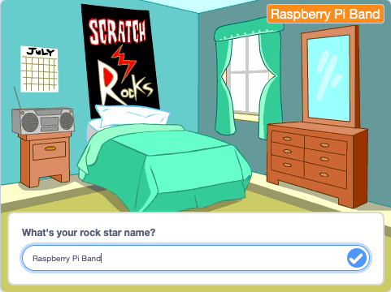
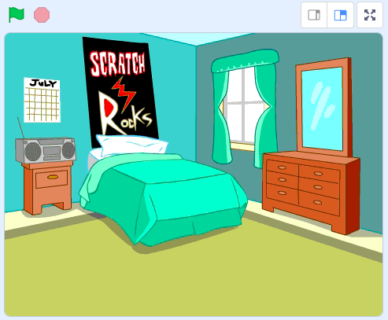
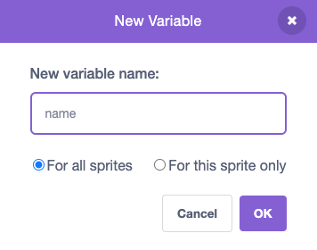

## Stage ను సెట్ చేయండి

<div style="display: flex; flex-wrap: wrap">
<div style="flex-basis: 200px; flex-grow: 1; margin-right: 15px;">
ఈ దశలో, మీరు మీ మొదటి ప్రదర్శనకు stage ను సెట్ చేస్తారు మరియు రాక్ స్టార్ పేరును ఎంచుకుంటారు.
</div>
<div>
{:width="300px"}
</div>
</div>

--- task ---

[డ్రమ్ స్టార్ స్టార్టర్ ప్రాజెక్ట్](https://scratch.mit.edu/projects/535783147/editor){:target="_blank"}ని తెరవండి. Scratch మరొక బ్రౌజర్ ట్యాబ్‌లో తెరవబడుతుంది.

--- /task ---

The drummer starts in a bedroom like a beginner!

--- task ---

**Choose a Backdrop**ని క్లిక్ చేసి, `bedroom` (బెడ్ రూమ్) కోసం శోధించండి.

Select a bedroom and add it to your project. మనము `Bedroom 3` ని ఎంచుకున్నాము.



--- /task ---

Scratchలో, మీరు Stage కి కోడ్‌ని జోడించవచ్చు.

--- task ---

Stage పేన్ నుండి మీ బెడ్‌రూమ్ బ్యాక్‌డ్రాప్‌పై క్లిక్ చేసి, ఈ కోడ్‌ని జోడించండి:


```blocks3
when flag clicked
switch backdrop to (Bedroom 3 v) //your backdrop name
```

--- /task ---

ప్రతి సంగీతకారుడు ఒక రాక్ స్టార్ పేరును ఎంచుకోవాలి.

**వేరియబుల్** అనేది సంఖ్యలు మరియు/లేదా వచనాన్ని పొందుపరిచే మార్గం. మీ రాక్‌స్టార్ పేరు `variable`{:class="block3variables"}లో నిల్వ చేయబడుతుంది కనుక దీనిని ఎప్పుడైనా ఉపయోగించవచ్చు.

--- task ---

`Variables`{:class="block3variables"} బ్లాక్స్ మెను నుండి, **Make a Variable** బటన్ క్లిక్ చేయండి.

మీ కొత్త వేరియబుల్ ను `name` అని పిలవండి:



**సూచన:** కొత్త `name` వేరియబుల్ Stage పై కనిపిస్తుంది మరియు దీనిని ఇప్పుడు `Variable`{:class="block3variables"} బ్లాక్‌లలో ఉపయోగించవచ్చు.

--- /task ---

--- task ---

ప్రాజెక్ట్ ప్రారంభంలో, మీ రాక్‌స్టార్ పేరు తెలియదు.

`set name to`{:class="block3variables"} కు బ్లాక్‌ని జోడించండి `???`:


```blocks3
when flag clicked
switch backdrop to (Bedroom 3 v) //your backdrop name
+ set [name v] to [???] //your variable
```

--- /task ---

మీరు Scratch లో ఒక ప్రశ్నను `ask`{:class="block3sensing"} ఉపయోగించి అడగవచ్చు, ఆపై `answer`{:class="block3sensing"} నిల్వ చేయడానికి `variable`{:class="block3variables"}ని ఉపయోగించవచ్చు.

--- task ---

`Sensing`{:class="block3sensing"} బ్లాక్‌ల మెనుపై క్లిక్ చేసి, మీ `ask`{:class="block3sensing"} బ్లాక్‌ని జోడించండి:

```blocks3
when flag clicked
switch backdrop to (Bedroom 3 v) //your backdrop name
set [name v] to [???] //your variable
+ ask [What's your rock star name?] and wait //your question
```

--- /task ---

--- task ---

`name`{:class="block3variables"} `variable`{:class="block3variables"} ని `answer`{:class="block3sensing"}:కి సెట్ చేయండి

```blocks3
when flag clicked
switch backdrop to (Bedroom 3 v) //your backdrop name
set [name v] to [???] //your variable
ask [What's your rock star name?] and wait //your question
+ set [name v] to (answer)
```

--- /task ---

--- task ---

`variable`{:class="block3variables"} పై రైట్-క్లిక్ చేసి, **large readout**:ని సెలెక్ట్ చేయండి:


--- /task ---

--- task ---

Drag your `variable`{:class="block3variables"} to position it top-right of the Stage:


--- /task ---

--- task ---

**పరీక్ష:** `variable`{:class="block3variables"} `???`గా ప్రారంభమవుతుందని, ఆపై మీ `answer`{:class="block3sensing"} కి అప్ డేట్ అవుతుందని నిర్ధారించుకోవడానికి మీ ప్రాజెక్ట్‌ని అమలు చేయండి. CONTEXTREQUEST.

--- /task ---

You don't want to type an answer every time you test your project.

--- task ---

Drag the last two blocks of code away from the rest of the script.

```blocks3
when flag clicked
switch backdrop to (Bedroom 3 v) //your backdrop name
set [name v] to [???] //your variable
```

```blocks3
ask [What's your rock star name?] and wait //your question
set [name v] to (answer)
```

--- /task ---

--- save ---
