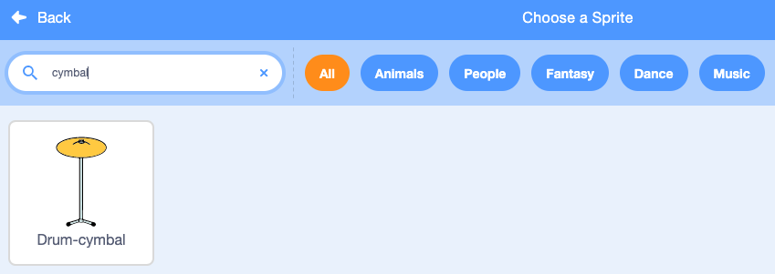

## స్టార్టర్ డ్రమ్

<div style="display: flex; flex-wrap: wrap">
<div style="flex-basis: 200px; flex-grow: 1; margin-right: 15px;">
మీరు బీట్‌లను సంపాదించడానికి మరియు సౌండ్ ప్లే చేయడానికి క్లిక్ చేయగల **cymbal** spriteని జోడిస్తారు.
</div>
<div>
{:width="300px"}
</div>
</div>

--- task ---

**Choose a Sprite**ని క్లిక్ చేసి, `cymbal` కోసం శోధించండి. మీ ప్రాజెక్ట్‌కి **Drum-cymbal** sprite ని జోడించండి.



--- /task ---

--- task ---

మీ cymbal ని Stage పై ఉంచండి:


--- /task ---

--- task ---

**Music extension** ని జోడించండి:

[[[generic-scratch3-add-music-extension]]]

--- /task ---

--- task ---

Cymbal `switch costume`{:class="block3looks"} చేయడానికి, ఇంకా `play a drum sound`{:class="block3extensions"} స్క్రిప్ట్‌ను జోడించండి:


```blocks3
ఈ స్ప్రైట్ ని క్లిక్ చేసినప్పుడు
స్విచ్ కాస్ట్యూమ్‌ టు [drum-cymbal-b v]  // హిట్ costume
ప్లే డ్రమ్ [(5) Open High-Hat v] [0.25] బీట్‌ల కోసం // డ్రమ్ ధ్వని
స్విచ్ కాస్ట్యూమ్‌ టు [drum-cymbal-a v] కి మార్చండి // హిట్ costume కాదు
```

--- /task ---

--- task ---

**పరీక్ష:** మీ cymbal పై క్లిక్ చేయడం ద్వారా పరీక్షించండి. మీరు శబ్దం వినేలా మరియు costume మార్చడం చూసేలా నిర్ధారించుకోండి.

--- /task ---

**Drum-cymbal** sprite మీరు క్లిక్ చేసిన ప్రతిసారీ మీకు ఒక బీట్‌ని సంపాదిస్తుంది.

--- task ---

`beats` అనబడే `variable`{:class="block3variables"}ని సృష్టించండి:


--- /task ---

--- task ---

**Drum-cymbal** sprite పై క్లిక్ చేసినప్పుడు `change beats by`{:class="block3variables"} కు ఒక బ్లాక్‌ను జోడించండి:


```blocks3
when this sprite clicked
+change [beats v] by [1]
switch costume to [drum-cymbal-b v]
play drum [(5) Open High-Hat v] for [0.25] beats 
switch costume to [drum-cymbal-a v]
```

--- /task ---

--- task ---

**పరీక్ష:** **Drum-cymbal** ని క్లిక్ చేయడం ద్వారా `beats`{:class="block3variables"} లో పెరుగుదలను పరీక్షించండి.

--- /task ---

మీరు కొత్త గేమ్‌ని ప్రారంభించినప్పుడు `beats`{:class="block3variables"} వేరియబుల్ `0` బీట్‌ల వద్ద ప్రారంభం కావాలి.

--- task ---

Stage కి కోడ్‌ని జోడించడానికి Stage పేన్‌పై క్లిక్ చేసి ఆపై **Code** ట్యాబ్‌పై క్లిక్ చేయండి.

`set beats to`{:class="block3variables"} `0` కి బ్లాక్‌ని జోడించండి:


```blocks3
when flag clicked
switch backdrop to (Bedroom 3 v) 
set [name v] to [???] 
+ set [beats v] to [0]
```
--- /task ---

--- task ---

**పరీక్ష:** ఆకుపచ్చ జెండాను క్లిక్ చేయండి మరియు మీ `beats`{:class="block3variables"} వేరియబుల్ `0`వద్ద ప్రారంభమవుతుందని నిర్ధారించుకోండి.

--- /task ---

--- save ---
