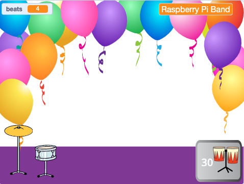

## More drums!

<div style="display: flex; flex-wrap: wrap">
<div style="flex-basis: 200px; flex-grow: 1; margin-right: 15px;">
ఈ దశలో, మీరు ఏ డ్రమ్ జోడించాలో ఎంచుకుంటారు.
</div>
<div>
{:width="300px"}
</div>
</div>

--- task ---

**Drum-snare** sprite ను నకలు చేయండి:


--- /task ---

--- task ---

**Drum Costumes** sprite పై క్లిక్ చేసి, **Costumes** ట్యాబ్‌ను ఎంచుకోండి.

**Choose:** which drum to unlock next. మనము **Conga** ని ఎంచుకున్నాము.


--- /task ---

--- task ---

మీరు ఎంచుకున్న డ్రమ్ యొక్క 'hit' మరియు 'not hit' Costume లను మీ కొత్త **Drum-snare2** sprite కి లాగండి:


--- /task ---

--- task ---

Name the new drum to match the costumes you chose.


--- /task ---

--- task ---

**Code** ట్యాబ్‌పై క్లిక్ చేయండి. సరైన costume లను ఉపయోగించడానికి కోడ్‌ని మార్చండి మరియు మీ కొత్త డ్రమ్ కోసం సౌండ్‌ని ఎంచుకోండి.

కొత్త డ్రమ్‌ని క్లిక్ చేయడం ద్వారా మీరు సంపాదించే బీట్‌ల సంఖ్యను `5`కి మార్చండి:


```blocks3
when this sprite clicked
+change [beats v] by [5] //5 beats per click
+switch costume to [ v] //your hit costume
+play drum [ v] for [0.25] beats //your drum sound
+switch costume to [ v] //your not hit costume
```

--- /task ---

--- task ---

మీ కొత్త డ్రమ్‌ని Stage పై పొజిషన్ లోకి డ్రాగ్ చేయండి:


--- /task ---

Add a button so that players can unlock the new drum.

--- task ---

Duplicate the **Get snare** sprite and position it in the bottom-right corner of the Stage.

--- /task ---

--- task ---

Change its name (for example `Get conga`):


--- /task ---

--- task ---

Delete the **snare drum** from the new 'Get' button costume.

--- /task ---

--- task ---

Copy the 'not hit' costume for your new drum and paste it to the new 'Get' button costume.

--- /task ---

--- task ---

కొత్త డ్రమ్ ధరను చూపడానికి **Text** సాధనంపై క్లిక్ చేసి, సంఖ్యను `30`కి మార్చండి.


--- /task ---

Your new 'Get' button should `hide`{:class="block3looks"} at the start.

--- task ---


```blocks3
when flag clicked
+ hide
```

--- /task ---

--- task ---

Add a `when I receive`{:class="block3events"} script that your new 'Get' button will `show`{:class="block3looks"} when the player unlocks the snare drum.

```blocks3
when I receive [snare v] // appear when previous drum is unlocked
show // show button to get the new drum
```

--- /task ---

--- task ---

Change:
- The number of beats needed to unlock this drum
- The number of beats that are removed when the player unlocks this drum.
- The message that is `broadcast`{:class="block3events"} when the player gets the new drum.

```blocks3
when this sprite clicked
if <(beats)>  [29]> then // change to 29
hide
change [beats v] by [-30] // change to -30
broadcast (conga v) // change to your drum name
else
say [More beats needed!] for [2] seconds 
end
```

--- /task ---

--- task ---

Click your new drum sprite and change the `when I receive snare`{:class="block3events"} script to show it when your new drum is unlocked:

```blocks3
when I receive [conga v] // change to your drum name
show
```

--- /task ---

--- task ---

**Party** బ్యాక్‌డ్రాప్‌ను జోడించండి.

--- /task ---

--- task ---

ప్లేయర్ కొత్త డ్రమ్‌కి అప్‌గ్రేడ్ చేసినప్పుడు బ్యాక్‌డ్రాప్‌ను మార్చడానికి Stage కి స్క్రిప్ట్‌ను జోడించండి:


```blocks3
when I receive [conga v] // change to your drum name
switch backdrop to (Party v)
```

--- /task ---

--- task ---

**Test:** Click the green flag to start the game.

You should get unlock your new drum if you earn enough beats.

What happens if you click the button before you have earned enough beats?

--- /task ---

--- save ---
